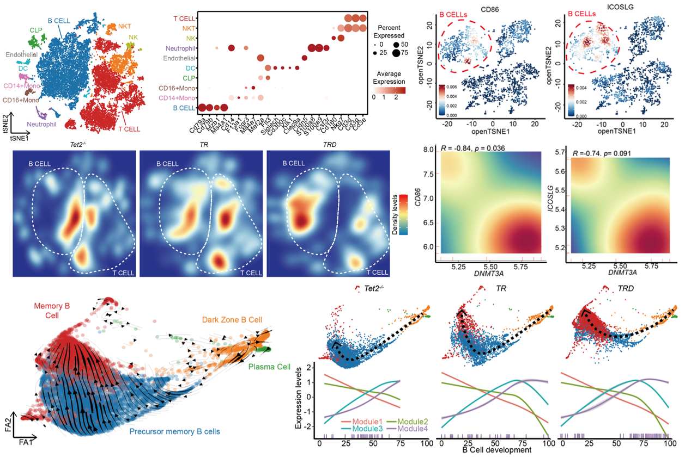

# ***DNMT3A R882H* accelerates angioimmunoblastic T-cell lymphoma in mice**

This page recorded the codes and data used and mentioned in [*XXX*](). And you could downloaded this paper by clicking [here]()

DNA methylation-related genes, including *TET2*, *IDH2*, and *DNMT3A* are highly frequently mutated in angioimmunoblastic T-cell lymphoma (AITL), an aggressive malignancy of follicular helper T (Tfh) cells associated with aberrant immune features. It has been shown that *TET2* loss cooperates with *RHOA G17V* to promote AITL in mice but the functional role of *DNMT3A* mutations in AITL remains unknown. Here, we report that *DNMT3A R882H*, the most common mutation of *DNMT3A* in AITL, accelerates the development of *Tet2-/-*; *RHOA G17V* AITL in mice, indicated by the expansion of malignant Tfh cells and aberrant B cells, skin rash, and significantly shortened disease-free survival. To understand the underlying cellular and molecular mechanisms, we performed single-cell transcriptome analyses of lymph nodes of mice transplanted with *Tet2-/-*, *Tet2-/-*; *RHOA G17V* or *DNMT3A R882H*; *Tet2-/-*; *RHOA G17V* hematopoietic stem and progenitor cells. These single-cell landscapes reveal that *DNMT3A* mutation further activates Tfh cells and leads to rapid and terminal differentiation of B cells, probably through enhancing the interacting PD1/PD-L1, ICOS/ICOSL CD28/CD86 and ICAM1/ITGAL pairs. Our study establishes the functional roles of *DNMT3A* mutation in AITL and sheds light on the molecular mechanisms of this disease.

# **Codes of analyzing and visualization**

## Codes of Single cell RNA-seq analysis

To further investigate the role of *DNMT3A* in AITL, single-cell RNA-seq (scRNA-seq) is performed to analyze the lymph nodes generated from the *Tet2-/-*, *TR* and *TRD* mice. The mitoQC maps show the distributions of a unique gene detected and mitochondrial genes detected in every single cell. After the quality control, a total of 23,805 cells (7576 of *Tet2-/-*, 7913 of *TR*, and 8316 of *TRD*) are used for clustering and further analysis.

To show how we analysis scRNA-seq steps by steps, we collected detail processed information and stored in Markdown files, recorded the quality controling, batch effect reducing, dimension reducing, cells clustering, pseudo time constructing, dynamics expression genes identifying and pathways enriching.

[Chapter1](scRNA-seq_Chapter1.md) is the code of scRNA of murine AITL data analysis. And you could access this code by click [here](scRNA-seq_Chapter1.md).

[Chapter2](scRNA-seq_Chapter2.md) is the code of scRNA of human AITL data analysis. And you could access this code by click [here](scRNA-seq_Chapter2.md).

## Codes of AITL patients mutation data analysis

The code of bulk mutation and transcription data of AITL analysis is recorded and stored.  And you could access this code by click [here](bulk_analysis.md).

# **Citation**

Our paper has been published on [*XXX*]()

You could downloaded raw data from [GEO Database GSE218137](https://www.ncbi.nlm.nih.gov/geo/query/acc.cgi?acc=GSE218137)

