# The code of bulk mutation and transcription data of AITL 

The mutation of *RHOA*, *TET2*, and *DNMT3A* in AITL are collected from 39 patients of cohort1, 30 patients of cohort2, and 48 patients of cohort3. The transcriptome data are collected, including 6 AITL patients and 20 normal samples from GSE6338, 20 AITL patients from GSE51521, and 337 normal blood samples from GTEx. The scRNA-seq data of AITL patients was collected from GSE197188. 

## 1. download the array data of AITL.

~~~R
library('Biobase')
library('GEOquery')
gset <- getGEO("GSE6338", GSEMatrix =TRUE, AnnotGPL=TRUE )
show(gset)
data1 <- gset[[1]]
write.csv(exprs(data1),"/mnt/data/user_data/xiangyu/workshop/scRNA/10X_52_WZW_AML_rhoag17_20220824_3samples/clincal/GSE6338_exprs.csv")
write.csv(pData(data1),"/mnt/data/user_data/xiangyu/workshop/scRNA/10X_52_WZW_AML_rhoag17_20220824_3samples/clincal/GSE6338_pData.csv")
write.csv(fData(data1),"/mnt/data/user_data/xiangyu/workshop/scRNA/10X_52_WZW_AML_rhoag17_20220824_3samples/clincal/GSE6338_fData.csv")

gset <- getGEO("GSE51521", GSEMatrix =TRUE, AnnotGPL=TRUE )
show(gset)
data1 <- gset[[1]]
write.csv(exprs(data1),"/mnt/data/user_data/xiangyu/workshop/scRNA/10X_52_WZW_AML_rhoag17_20220824_3samples/clincal/GSE51521_exprs.csv")
write.csv(pData(data1),"/mnt/data/user_data/xiangyu/workshop/scRNA/10X_52_WZW_AML_rhoag17_20220824_3samples/clincal/GSE51521_pData.csv")
write.csv(fData(data1),"/mnt/data/user_data/xiangyu/workshop/scRNA/10X_52_WZW_AML_rhoag17_20220824_3samples/clincal/GSE51521_fData.csv")
~~~

## 2. Figure1 making.

~~~R
Mut_info <- read.csv("/mnt/data/user_data/xiangyu/workshop/scRNA/10X_52_WZW_AML_rhoag17_20220824_3samples/clincal/Mut_info.csv")
mat <- Mut_info
mat$sample <- paste0("AITL",1:nrow(mat))
rownames(mat) <- mat$sample
mat <- mat[,c("TET2","RHOA","DNMT3A","IDH2")]
mat <- as.matrix(t(mat))
mat <- gsub("Non"," ",mat)
col = c("Mut" = "#f8766d")
alter_fun = list(background = function(x, y, w, h) {grid.rect(x, y, w-unit(2, "pt"), h-unit(2, "pt"),gp = gpar(fill = "#CCCCCC", col = NA))},
    Mut = function(x, y, w, h) {grid.rect(x, y, w-unit(2, "pt"), h*0.8, gp = gpar(fill = col["Mut"], col = NA))})
heatmap_legend_param = list(title = "Alternations", at = c("Mut"), labels = c("Mutation"))
library(ComplexHeatmap)
pdf("/mnt/data/user_data/xiangyu/workshop/scRNA/10X_52_WZW_AML_rhoag17_20220824_3samples/result/oncoPrint.pdf")
oncoPrint(mat,alter_fun = alter_fun, col = col, column_title = "Mut.in.AITL.cohort.all", heatmap_legend_param = heatmap_legend_param)
dev.off()
~~~

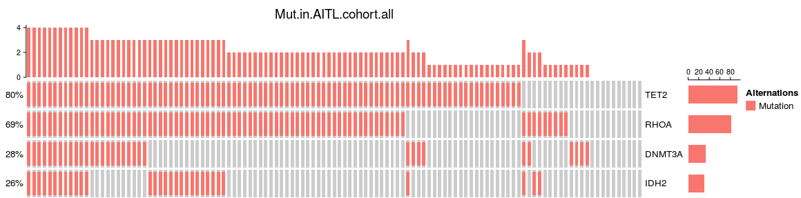

~~~R

library(discover)
library(reshape2)
Mut_info <- read.csv("/mnt/data/user_data/xiangyu/workshop/scRNA/10X_52_WZW_AML_rhoag17_20220824_3samples/clincal/Mut_info.csv")
rownames(Mut_info) <- paste0(Mut_info$cohort,"_",Mut_info$sample)
mat <- as.matrix(t(Mut_info[,-c(1,2)]))
mat <- mat[c(1:3),]
mat <- gsub("Non","0",mat)
mat <- gsub("Mut","1",mat)
mat1 <- t(apply(mat,1,as.numeric))
colnames(mat1) <- colnames(mat)
events <- discover.matrix(mat1)
# result.mutex <- pairwise.discover.test(events,g=rownames(mat1),alternative = c("less", "greater"),fdr.method = c("DBH", "BH"))
result.mutex <- pairwise.discover.test(events,g=rownames(mat1),alternative = c("less"),fdr.method = c("BH"))
result.mutex$p.values
plot(events)
p.values <- melt(result.mutex$p.values)
write.csv(result.mutex$p.values,"/mnt/data/user_data/xiangyu/workshop/scRNA/10X_52_WZW_AML_rhoag17_20220824_3samples/result/Fig1.p.values.csv")
co_p <- -log(result.mutex$p.values,10)
co_p[is.na(co_p)] <- NA
library(pheatmap)
library(corrplot)
break1=seq(0.65, 1.5, length.out=50)
break2=seq(1.5, 2.21, length.out=51)
the_break<-c(break1,break2[-1])
library(scales)
library(BuenColors)
aa <- jdb_palette("brewer_yes")[(length(jdb_palette("brewer_yes"))/2):length(jdb_palette("brewer_yes"))]
pdf("/mnt/data/user_data/xiangyu/workshop/scRNA/10X_52_WZW_AML_rhoag17_20220824_3samples/result/coOccur.pdf")
pheatmap(co_p,border_color=NA,cluster_cols=FALSE,breaks=the_break,
  color = colorRampPalette(aa)(100),show_rownames=T,cluster_rows=FALSE,main="Co-Occur")
dev.off()
~~~

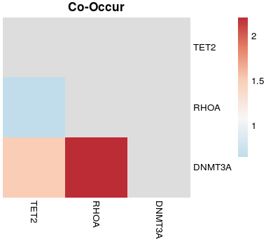

~~~R

GSEA_AITL.vs.Normal_gsva.v1 <- mcreadRDS("/mnt/data/user_data/xiangyu/workshop/scRNA/10X_52_WZW_AML_rhoag17_20220824_3samples/clincal/GSEA_AITL.vs.Normal_gsva.v1.rds",mc.cores=20)
Only_Counts.v1 <- mcreadRDS("/mnt/data/user_data/xiangyu/workshop/scRNA/10X_52_WZW_AML_rhoag17_20220824_3samples/clincal/Only_Counts.v1.rds",mc.cores=20)
Only_Counts.v1_t <- as.data.frame(t(Only_Counts.v1))
sel_data1.v1 <- data.frame(AITL.UP.Sig=as.numeric(as.character(GSEA_AITL.vs.Normal_gsva.v1["PICCALUGA_ANGIOIMMUNOBLASTIC_LYMPHOMA_UP",])), Only_Counts.v1_t)
sel_data_cor.v1 <- future_lapply(2:ncol(sel_data1.v1),function(x) {
    tmp <- cor(x=sel_data1.v1[,1],y = sel_data1.v1[,x],method = c("pearson"))
    tmp_test <- cor.test(x=sel_data1.v1[,1],y = sel_data1.v1[,x])
    cor_tmp <- data.frame(cor_num=tmp,pval=tmp_test$p.value,row.names=colnames(sel_data1.v1)[x])
    return(cor_tmp)
})
sel_data_cor.v1 <- as.data.frame(rbindlist(sel_data_cor.v1))
rownames(sel_data_cor.v1) <- colnames(sel_data1.v1)[-1]
colnames(sel_data_cor.v1)[1] <- "Cor_AITL.UP.Sig"
sel_data_cor.v1$sig.group <- ifelse(sel_data_cor.v1$pval < 1e-9 , "Sig","No.Sig")
sel_data_cor.v1$sig.group[abs(sel_data_cor.v1$Cor_AITL.UP.Sig) <= 0.5] <- "No.Sig"
sel_data_cor.v1$sig.group[sel_data_cor.v1$Cor_AITL.UP.Sig > 0.5] <- "Pos"
sel_data_cor.v1$sig.group[sel_data_cor.v1$Cor_AITL.UP.Sig < -0.5] <- "Neg"
AILT_cor_all <- data.frame(row.names=rownames(sel_data_cor.v1),gene=rownames(sel_data_cor.v1),
   Cor_AITL.UP.Sig=sel_data_cor.v1$Cor_AITL.UP.Sig,p_AITL.UP.Sig=sel_data_cor.v1$pval)
AILT_cor_all <- AILT_cor_all[c("DNMT1","DNMT3L","DNMT3A","DNMT3B","TET1","TET2","TET3","IDH1","IDH2","IDH3A","IDH3B","IDH3G"),]
AILT_cor_all$baseMean <- rowMeans(Only_Counts.v1[intersect(rownames(Only_Counts.v1),rownames(AILT_cor_all)),])
AILT_cor_all <- AILT_cor_all[order(AILT_cor_all$Cor_AITL.UP.Sig,decreasing=TRUE),]
AILT_cor_all$rank <- 1:nrow(AILT_cor_all)
AILT_cor_all["DNMT3A",]
AILT_cor_all1 <- as.data.frame(melt(AILT_cor_all[,c("gene","Cor_AITL.UP.Sig")]))
AILT_cor_all1$gene <- factor(AILT_cor_all1$gene,levels=c(as.character(AILT_cor_all$gene)))
AILT_cor_all1$variable <- factor(AILT_cor_all1$variable,levels=c("Cor_AITL.UP.Sig"))
AILT_cor_all1 <- AILT_cor_all1[order(AILT_cor_all1$gene,AILT_cor_all1$variable),]
write.csv(AILT_cor_all1,"/mnt/data/user_data/xiangyu/workshop/scRNA/10X_52_WZW_AML_rhoag17_20220824_3samples/result/Fig1.cor.cohort1.csv")
plot <- ggplot(data=AILT_cor_all1, aes(x=gene, y=value, fill=variable)) +
  geom_bar(stat="identity")+
  theme_classic()+coord_flip()
ggsave("/mnt/data/user_data/xiangyu/workshop/scRNA/10X_52_WZW_AML_rhoag17_20220824_3samples/result/cor_DNA_ERG.svg", plot=plot,width = 7, height = 6,dpi=1080)
~~~

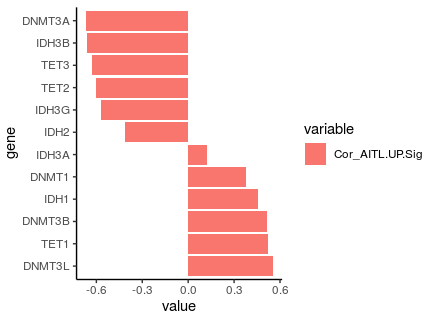

~~~R
All_data.merge_all <- mcreadRDS("/mnt/data/user_data/xiangyu/workshop/scRNA/10X_52_WZW_AML_rhoag17_20220824_3samples/clincal/GSE6338_AITL.vs.Normal_all.rds",mc.cores=20)
GSE6338.pData <- mcreadRDS("/mnt/data/user_data/xiangyu/workshop/scRNA/10X_52_WZW_AML_rhoag17_20220824_3samples/clincal/GSE6338.pData.rds")
rownames(GSE6338.pData) <- GSE6338.pData$X
AITL_sample <- c("ALCL_AV_003","AILD-01","ALCL_AV_004","AILD-02","AILD-03", "AILD_006")
Normal_sample <- as.character(GSE6338.pData[grep("^TC",GSE6338.pData$title,value=FALSE),]$title)
DNA_METH <- All_data.merge_all[c("DNMT1","DNMT3L","DNMT3A","DNMT3B","TET1","TET2","TET3","IDH1","IDH2","IDH3A","IDH3B","IDH3G"),]
DNA_METH["DNMT3A",]
DNA_METH <- DNA_METH[rownames(DNA_METH),c(Normal_sample,AITL_sample)]
meta <- data.frame(samples=c(Normal_sample,AITL_sample),
    row.names=c(Normal_sample,AITL_sample),
    group=c(rep("Normal",length(Normal_sample)),rep("AITL",length(AITL_sample))))
meta$group <- factor(meta$group,levels=c("Normal","AITL"))
new_seurat <- CreateSeuratObject(counts = DNA_METH,assay = 'RNA',project = 'RNA',min.cells = 0,meta.data = meta)
pdf("/mnt/data/user_data/xiangyu/workshop/scRNA/10X_52_WZW_AML_rhoag17_20220824_3samples/result/cohort1_DNA_ERG_heatmap.pdf")
XY_heatmap(seurat_obj=new_seurat,group="group",genes=rownames(new_seurat),all_num=FALSE,new_names=NULL,labels_rot=90,
  assay_sel="RNA",color=colorRampPalette(brewer.pal(10, "RdBu"))(101),min_and_max_cut=2,show_row_names=TRUE,mark_gene=NULL,label_size=0,scale=TRUE)
dev.off()
~~~

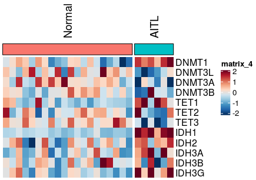

~~~R
DNMT3A_d <- as.data.frame(All_data.merge_all["DNMT3A",c(Normal_sample,AITL_sample)])
DNMT3A_d <- as.data.frame(t(DNMT3A_d))
DNMT3A_d$group <- c(rep("Normal",length(Normal_sample)),rep("AITL",length(AITL_sample)))
library(BuenColors)
my_pal <- jdb_palette("corona")
plot <- ggplot(DNMT3A_d, aes(x = group, y = DNMT3A, color = group, fill = group)) +
  geom_boxplot(width = .2, fill = "white",size = 1, outlier.shape = NA) +
  ggdist::stat_halfeye(adjust = 1,width = .2, color = NA,position = position_nudge(x = .15)) +
  gghalves::geom_half_point(side = "l", range_scale = .3, alpha = .5, size = 0.5) +
  coord_flip() + labs(title="DNMT3A.in.Nor.AITL.v2")+
  scale_x_discrete(expand = c(.07, .07)) +
  scale_color_manual(values = my_pal, guide = "none") +
  scale_fill_manual(values = my_pal, guide = "none")+ theme_classic()
ggsave("/mnt/data/user_data/xiangyu/workshop/scRNA/10X_52_WZW_AML_rhoag17_20220824_3samples/result/DNMT3A_exp_cohort1.svg", plot=plot,width = 7, height = 6,dpi=1080)
~~~

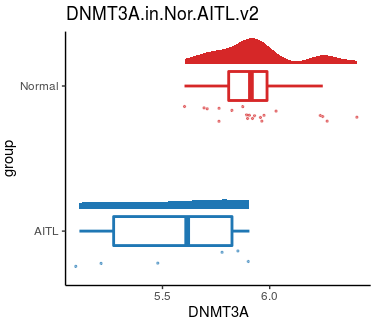

~~~R

All_data.merge_all <- mcreadRDS("/mnt/data/user_data/xiangyu/workshop/scRNA/10X_52_WZW_AML_rhoag17_20220824_3samples/clincal/GSEA_AITL.vs.Normal_all.rds",mc.cores=20)
Normal_sample <- grep("Normal",colnames(All_data.merge_all),value=TRUE)
AITL_sample <- grep("AITL",colnames(All_data.merge_all),value=TRUE)
cell_name <- Normal_sample
cell_name <- sample(cell_name,length(cell_name))
cell.sets1 <- split(cell_name, sort(1:length(cell_name)%%50))
profile.set1 = matrix(, nrow = nrow(All_data.merge_all), ncol = length(cell.sets1))
for (i in 1:length(cell.sets1)) {
this.set <- cell.sets1[[i]]
sub.matrix <- All_data.merge_all[, this.set]
if (length(this.set) > 1) {
  this.profile <- as.numeric(apply(sub.matrix, 1, function(x) mean(x)))
  profile.set1[, i] <- this.profile
} else {
  profile.set1[, i] <- sub.matrix
}
}
rownames(profile.set1) <- rownames(All_data.merge_all)
colnames(profile.set1) <- paste("Normal", 1:length(cell.sets1),sep="_")
All_data.merge_all_DS <- cbind(profile.set1,All_data.merge_all[,c(AITL_sample)])
DNA_METH <- All_data.merge_all_DS[c("DNMT1","DNMT3L","DNMT3A","DNMT3B","TET1","TET2","TET3","IDH1","IDH2","IDH3A","IDH3B","IDH3G"),]
DNA_METH <- DNA_METH[rownames(DNA_METH),c(colnames(profile.set1),AITL_sample)]
meta <- data.frame(samples=c(colnames(profile.set1),AITL_sample),
    row.names=c(colnames(profile.set1),AITL_sample),
    group=c(rep("Normal",length(colnames(profile.set1))),rep("AITL",length(AITL_sample))))
meta$group <- factor(meta$group,levels=c("Normal","AITL"))
new_seurat <- CreateSeuratObject(counts = DNA_METH,assay = 'RNA',project = 'RNA',min.cells = 0,meta.data = meta)
pdf("/mnt/data/user_data/xiangyu/workshop/scRNA/10X_52_WZW_AML_rhoag17_20220824_3samples/result/cohort2_DNA_ERG_heatmap.pdf")
XY_heatmap(seurat_obj=new_seurat,group="group",genes=rownames(new_seurat),all_num=FALSE,new_names=NULL,labels_rot=90,
  assay_sel="RNA",color=colorRampPalette(brewer.pal(10, "RdBu"))(101),min_and_max_cut=2,show_row_names=TRUE,mark_gene=NULL,label_size=0,scale=TRUE)
dev.off()
~~~

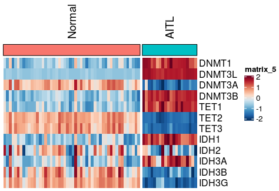

~~~R

DNMT3A_d <- as.data.frame(All_data.merge_all_DS["DNMT3A",])
DNMT3A_d <- as.data.frame(t(DNMT3A_d))
DNMT3A_d$group <- c(rep("Normal",length(colnames(profile.set1))),rep("AITL",length(AITL_sample)))
library(BuenColors)
my_pal <- jdb_palette("corona")
plot <- ggplot(DNMT3A_d, aes(x = group, y = DNMT3A, color = group, fill = group)) +
  geom_boxplot(width = .2, fill = "white",size = 1, outlier.shape = NA) +
  ggdist::stat_halfeye(adjust = 1,width = .5, color = NA,position = position_nudge(x = .15)) +
  gghalves::geom_half_point(side = "l", range_scale = .3, alpha = .5, size = 0.5) +
  coord_flip() + labs(title="DNMT3A.in.Nor.AITL.v1")+
  scale_x_discrete(expand = c(.07, .07)) +
  scale_color_manual(values = my_pal, guide = "none") +
  scale_fill_manual(values = my_pal, guide = "none")+ theme_classic()
ggsave("/mnt/data/user_data/xiangyu/workshop/scRNA/10X_52_WZW_AML_rhoag17_20220824_3samples/result/DNMT3A_exp_cohort2.svg", plot=plot,width = 7, height = 6,dpi=1080)
~~~

~~~R

GSEA_AITL.vs.Normal_gsva.v1 <- mcreadRDS("/mnt/data/user_data/xiangyu/workshop/scRNA/10X_52_WZW_AML_rhoag17_20220824_3samples/clincal/GSEA_AITL.vs.Normal_gsva.v1.rds",mc.cores=20)
Only_Counts.v1 <- mcreadRDS("/mnt/data/user_data/xiangyu/workshop/scRNA/10X_52_WZW_AML_rhoag17_20220824_3samples/clincal/Only_Counts.v1.rds",mc.cores=20)
GSEA_AITL.vs.Normal_gsva.v1 <- as.data.frame(t(GSEA_AITL.vs.Normal_gsva.v1))
sel_data1 <- data.frame(DNMT3A=as.numeric(as.character(Only_Counts.v1["DNMT3A",])),GSEA_AITL.vs.Normal_gsva.v1)
sel_data_cor <- future_lapply(2:ncol(sel_data1),function(x) {
    tmp <- cor(x=sel_data1[,1],y = sel_data1[,x],method = c("spearman"))
    tmp_test <- cor.test(x=sel_data1[,1],y = sel_data1[,x])
    cor_tmp <- data.frame(cor_num=tmp,pval=tmp_test$p.value,row.names=colnames(sel_data1)[x])
    return(cor_tmp)
})
sel_data_cor <- as.data.frame(rbindlist(sel_data_cor))
rownames(sel_data_cor) <- colnames(sel_data1)[-1]
colnames(sel_data_cor)[1] <- "Cor_DNMT3A"
sel_data_cor1 <- subset(sel_data_cor,pval < 0.05 & Cor_DNMT3A < -0.5)
sel_data1_tmp <- sel_data1[,c("PICCALUGA_ANGIOIMMUNOBLASTIC_LYMPHOMA_UP","DNMT3A")]
colnames(sel_data1_tmp) <- c("AITL.Sig","DNMT3A")
sel_data1_tmp$group <- c(rep("Normal",50),rep("AITL",20))
write.csv(sel_data1_tmp,"/mnt/data/user_data/xiangyu/workshop/scRNA/10X_52_WZW_AML_rhoag17_20220824_3samples/result/Fig1.cor.cohort2.csv")
aa <- jdb_palette("brewer_spectra",type = "continuous")
plot <- ggscatter(sel_data1_tmp, x = "DNMT3A", y = "AITL.Sig",color="group",
  add = "reg.line", conf.int = TRUE,
  alpha=0.5, fullrange = TRUE, rug = TRUE,size=1,
  title="DNMT3A and AITL", legend="none",add.params=list(color = "red", fill = "lightgray")) + 
geom_density_2d(aes(alpha = ..nlevel..),colour="#BB2933", size = 1) + 
stat_cor(color="black", method = c("pearson"))+xlim(7,10)+ylim(-0.65,0.65)
ggsave("/mnt/data/user_data/xiangyu/workshop/scRNA/10X_52_WZW_AML_rhoag17_20220824_3samples/result/DNMT3A_exp_and_AITL.UP.svg", plot=plot,width = 7, height = 6,dpi=1080)
~~~

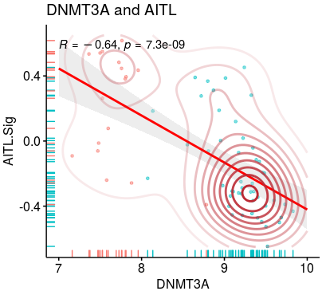

~~~R

GSEA_AITL.vs.Normal_GSEA.v1 <- mcreadRDS("/mnt/data/user_data/xiangyu/workshop/scRNA/10X_52_WZW_AML_rhoag17_20220824_3samples/clincal/GSEA_AITL.vs.Normal_GSEA.v1.rds",mc.cores=20)
GSEA_DNMT3A.lo.vs.DNMT3A.hi_GSEA <- mcreadRDS("/mnt/data/user_data/xiangyu/workshop/scRNA/10X_52_WZW_AML_rhoag17_20220824_3samples/clincal/GSEA_AITL_DNMT3A.lo.vs.DNMT3A.hi_GSEA.v1.rds",mc.cores=20)
df1 <- as.data.frame(GSEA_AITL.vs.Normal_GSEA.v1)
df2 <- as.data.frame(GSEA_DNMT3A.lo.vs.DNMT3A.hi_GSEA)
KEGG1 <- df1[grep("KEGG",df1$ID,value=FALSE),]
KEGG2 <- df2[grep("KEGG",df2$ID,value=FALSE),]
KEGG_ <- lapply(1:length(KEGG1$ID),function(x) {
   tmp <- data.frame(ID=KEGG1$ID[x],enrichmentScore=subset(KEGG1,ID==KEGG1$ID[x])$enrichmentScore+subset(KEGG2,ID==KEGG1$ID[x])$enrichmentScore,
      pvalue=min(c(subset(KEGG1,ID==KEGG1$ID[x])$pvalue+subset(KEGG2,ID==KEGG1$ID[x])$pvalue)),
      AITL.vs.Nor_v1=subset(KEGG1,ID==KEGG1$ID[x])$NES,DNMT3A.lo.vs.DNMT3A.hi=subset(KEGG2,ID==KEGG1$ID[x])$NES
      )
   return(tmp)
   })
KEGG <- do.call(rbind,KEGG_)
KEGG$group <- ifelse(KEGG$AITL.vs.Nor_v1 > 0 & KEGG$DNMT3A.lo.vs.DNMT3A.hi > 0, "UP", "None")
KEGG$group[which(KEGG$AITL.vs.Nor_v1 < 0 & KEGG$DNMT3A.lo.vs.DNMT3A.hi < 0)] <- "DN"
KEGG$enrichmentScore <- abs(KEGG$enrichmentScore)
KEGG$enrichmentScore[KEGG$group=="None"] <- KEGG$enrichmentScore[KEGG$group=="None"]/10
KEGG$DNMT3A.lo.vs.DNMT3A.hi[KEGG$DNMT3A.lo.vs.DNMT3A.hi > 2] <- 2
KEGG$DNMT3A.lo.vs.DNMT3A.hi[KEGG$DNMT3A.lo.vs.DNMT3A.hi < -2] <- -2
KEGG$AITL.vs.Nor_v1[KEGG$AITL.vs.Nor_v1 > 2] <- 2
KEGG$AITL.vs.Nor_v1[KEGG$AITL.vs.Nor_v1 < -2] <- -2
write.csv(KEGG,"/mnt/data/user_data/xiangyu/workshop/scRNA/10X_52_WZW_AML_rhoag17_20220824_3samples/result/Fig1.cor.KEGG.csv")

label_data <- KEGG[order(KEGG$enrichmentScore,decreasing=TRUE),]
label_data[grep("CAN",label_data$ID,value=FALSE),]
label_data[grep("B_CELL",label_data$ID,value=FALSE),]
label_data <- label_data[label_data$ID %in% c("KEGG_INTESTINAL_IMMUNE_NETWORK_FOR_IGA_PRODUCTION","KEGG_CELL_CYCLE","KEGG_HOMOLOGOUS_RECOMBINATION",
   "KEGG_TOLL_LIKE_RECEPTOR_SIGNALING_PATHWAY","KEGG_CHEMOKINE_SIGNALING_PATHWAY","KEGG_CYTOKINE_CYTOKINE_RECEPTOR_INTERACTION","KEGG_PATHWAYS_IN_CANCER",
   "KEGG_ACUTE_MYELOID_LEUKEMIA","KEGG_NOTCH_SIGNALING_PATHWAY"),]
label_data$ID <- factor(label_data$ID,levels=c("KEGG_INTESTINAL_IMMUNE_NETWORK_FOR_IGA_PRODUCTION","KEGG_CELL_CYCLE","KEGG_HOMOLOGOUS_RECOMBINATION",
   "KEGG_TOLL_LIKE_RECEPTOR_SIGNALING_PATHWAY","KEGG_CHEMOKINE_SIGNALING_PATHWAY","KEGG_CYTOKINE_CYTOKINE_RECEPTOR_INTERACTION","KEGG_PATHWAYS_IN_CANCER",
   "KEGG_ACUTE_MYELOID_LEUKEMIA","KEGG_NOTCH_SIGNALING_PATHWAY"))
label_data <- label_data[order(label_data$ID),]
label_data$ID <- c("IMMUNE_NETWORK_FOR_IGA_PRODUCTION","CELL_CYCLE","HOMOLOGOUS_RECOMBINATION","TOLL_LIKE_RECEPTOR_SIGNALING","CHEMOKINE_SIGNALING",
   "CYTOKINE_RECEPTOR_INTERACTION","PATHWAYS_IN_CANCER","ACUTE_MYELOID_LEUKEMIA","NOTCH_SIGNALING")
plot <- ggplot(data = KEGG, aes(DNMT3A.lo.vs.DNMT3A.hi, AITL.vs.Nor_v1)) + 
geom_point(aes(size = enrichmentScore,colour = group, fill = group,alpha=enrichmentScore)) + 
  labs(title = "KEGG-path", x = "DNMT3A.lo.vs.DNMT3A.hi", y = "AITL.vs.Nor_v1") + 
  theme(plot.title = element_text(size = 10, face = "plain")) + 
  theme(axis.line.x = element_line(size = 0.25), axis.line.y = element_line(size = 0.25)) + 
  geom_vline(xintercept = 0, color = 'lightgrey', size = 1) +
  geom_hline(yintercept = 0, color = 'lightgrey', size = 1)+ theme_classic()+
  ggrepel::geom_text_repel(data = label_data,mapping = aes(label = ID), size = 3, show.legend = F,
            segment.size = 0.2, segment.alpha = 0.5)+ xlim(-2,2)+ylim(-2,2)+scale_size(range=c(0.5, 5))
ggsave("/mnt/data/user_data/xiangyu/workshop/scRNA/10X_52_WZW_AML_rhoag17_20220824_3samples/result/KEGG_common.svg", plot=plot,width = 7, height = 6,dpi=1080)
~~~

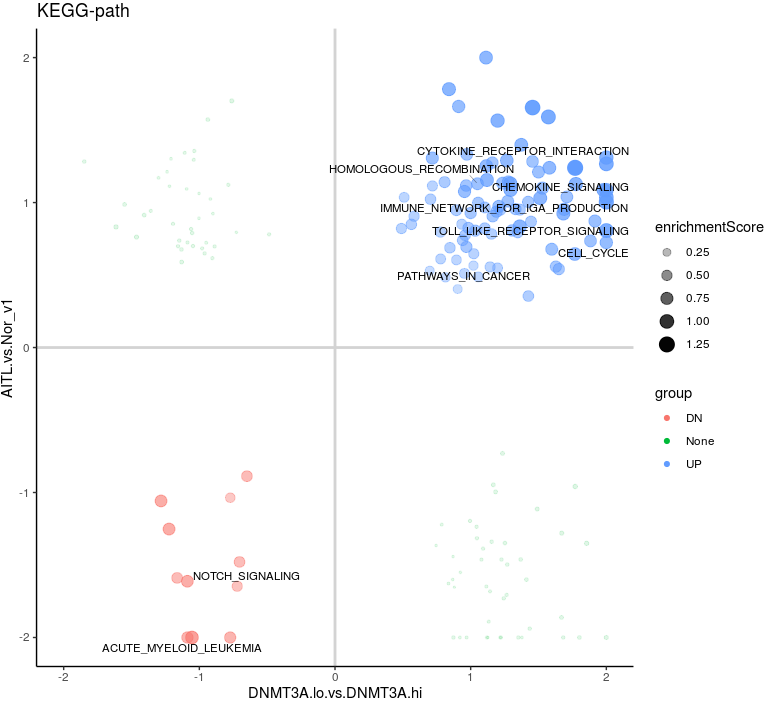

## 2. Ex.Figure1 making.

~~~R
library(ComplexHeatmap )
Mut_info <- read.csv("/mnt/data/user_data/xiangyu/workshop/scRNA/10X_52_WZW_AML_rhoag17_20220824_3samples/clincal/Mut_info.csv")
mat <- subset(Mut_info,cohort=="cohort1")
rownames(mat) <- mat$sample
mat <- mat[,c("TET2","RHOA","DNMT3A","IDH2")]
mat <- as.matrix(t(mat))
mat <- gsub("Non"," ",mat)
col = c("Mut" = "red")
alter_fun = list(background = function(x, y, w, h) {grid.rect(x, y, w-unit(2, "pt"), h-unit(2, "pt"),gp = gpar(fill = "#CCCCCC", col = NA))},
    Mut = function(x, y, w, h) {grid.rect(x, y, w-unit(2, "pt"), h*0.8, gp = gpar(fill = col["Mut"], col = NA))})
heatmap_legend_param = list(title = "Alternations", at = c("Mut"), labels = c("Mutation"))
pt1 <- oncoPrint(mat,alter_fun = alter_fun, col = col, column_title = "Mut.in.AITL.cohort1", heatmap_legend_param = heatmap_legend_param)
mat <- subset(Mut_info,cohort=="cohort2")
rownames(mat) <- mat$sample
mat <- mat[,c("TET2","RHOA","DNMT3A","IDH2")]
mat <- as.matrix(t(mat))
mat <- gsub("Non"," ",mat)
col = c("Mut" = "red")
alter_fun = list(background = function(x, y, w, h) {grid.rect(x, y, w-unit(2, "pt"), h-unit(2, "pt"),gp = gpar(fill = "#CCCCCC", col = NA))},
    Mut = function(x, y, w, h) {grid.rect(x, y, w-unit(2, "pt"), h*0.8, gp = gpar(fill = col["Mut"], col = NA))})
heatmap_legend_param = list(title = "Alternations", at = c("Mut"), labels = c("Mutation"))
pt2 <- oncoPrint(mat,alter_fun = alter_fun, col = col, column_title = "Mut.in.AITL.cohort2", heatmap_legend_param = heatmap_legend_param)
mat <- subset(Mut_info,cohort=="cohort3")
rownames(mat) <- mat$sample
mat <- mat[,c("TET2","RHOA","DNMT3A","IDH2")]
mat <- as.matrix(t(mat))
mat <- gsub("Non"," ",mat)
col = c("Mut" = "red")
alter_fun = list(background = function(x, y, w, h) {grid.rect(x, y, w-unit(2, "pt"), h-unit(2, "pt"),gp = gpar(fill = "#CCCCCC", col = NA))},
    Mut = function(x, y, w, h) {grid.rect(x, y, w-unit(2, "pt"), h*0.8, gp = gpar(fill = col["Mut"], col = NA))})
heatmap_legend_param = list(title = "Alternations", at = c("Mut"), labels = c("Mutation"))
pt3 <- oncoPrint(mat,alter_fun = alter_fun, col = col, column_title = "Mut.in.AITL.cohort3", heatmap_legend_param = heatmap_legend_param)
pdf("/mnt/data/user_data/xiangyu/workshop/scRNA/10X_52_WZW_AML_rhoag17_20220824_3samples/result/Ex.Figure1.oncoPrint.pdf")
draw(pt1+pt2+pt3, merge_legend = TRUE,heatmap_legend_side = "bottom", annotation_legend_side = "bottom")
dev.off()
~~~

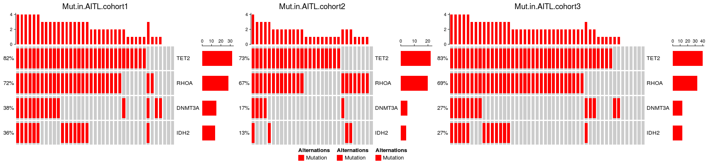

~~~R

GSEA_AITL.vs.Normal_GSEA.v1 <- mcreadRDS("/mnt/data/user_data/xiangyu/workshop/scRNA/10X_52_WZW_AML_rhoag17_20220824_3samples/clincal/GSEA_AITL.vs.Normal_GSEA.v1.rds",mc.cores=20)
GSEA_DNMT3A.lo.vs.DNMT3A.hi_GSEA <- mcreadRDS("/mnt/data/user_data/xiangyu/workshop/scRNA/10X_52_WZW_AML_rhoag17_20220824_3samples/clincal/GSEA_AITL_DNMT3A.lo.vs.DNMT3A.hi_GSEA.v1.rds",mc.cores=20)
df1 <- as.data.frame(GSEA_AITL.vs.Normal_GSEA.v1)
df2 <- as.data.frame(GSEA_DNMT3A.lo.vs.DNMT3A.hi_GSEA)
HALLMAR1 <- df1[grep("HALLMAR",df1$ID,value=FALSE),]
HALLMAR2 <- df2[grep("HALLMAR",df2$ID,value=FALSE),]
HALLMAR_ <- lapply(1:length(HALLMAR1$ID),function(x) {
   tmp <- data.frame(ID=HALLMAR1$ID[x],enrichmentScore=subset(HALLMAR1,ID==HALLMAR1$ID[x])$enrichmentScore+subset(HALLMAR2,ID==HALLMAR1$ID[x])$enrichmentScore,
      pvalue=min(c(subset(HALLMAR1,ID==HALLMAR1$ID[x])$pvalue+subset(HALLMAR2,ID==HALLMAR1$ID[x])$pvalue)),
      AITL.vs.Nor_v1=subset(HALLMAR1,ID==HALLMAR1$ID[x])$NES,DNMT3A.lo.vs.DNMT3A.hi=subset(HALLMAR2,ID==HALLMAR1$ID[x])$NES
      )
   return(tmp)
   })
HALLMAR <- do.call(rbind,HALLMAR_)
HALLMAR$group <- ifelse(HALLMAR$AITL.vs.Nor_v1 > 0 & HALLMAR$DNMT3A.lo.vs.DNMT3A.hi > 0, "UP", "None")
HALLMAR$group[which(HALLMAR$AITL.vs.Nor_v1 < 0 & HALLMAR$DNMT3A.lo.vs.DNMT3A.hi < 0)] <- "DN"
HALLMAR$enrichmentScore <- abs(HALLMAR$enrichmentScore)
HALLMAR$enrichmentScore[HALLMAR$group=="None"] <- HALLMAR$enrichmentScore[HALLMAR$group=="None"]/10
HALLMAR$DNMT3A.lo.vs.DNMT3A.hi[HALLMAR$DNMT3A.lo.vs.DNMT3A.hi > 2] <- 2
HALLMAR$DNMT3A.lo.vs.DNMT3A.hi[HALLMAR$DNMT3A.lo.vs.DNMT3A.hi < -2] <- -2
HALLMAR$AITL.vs.Nor_v1[HALLMAR$AITL.vs.Nor_v1 > 2] <- 2
HALLMAR$AITL.vs.Nor_v1[HALLMAR$AITL.vs.Nor_v1 < -2] <- -2
write.csv(HALLMAR,"/mnt/data/user_data/xiangyu/workshop/scRNA/10X_52_WZW_AML_rhoag17_20220824_3samples/result/Ex.Figure1.HALLMAR.csv")
label_data <- HALLMAR[order(HALLMAR$enrichmentScore,decreasing=TRUE),]
label_data <- label_data[label_data$ID %in% c("HALLMARK_E2F_TARGETS","HALLMARK_G2M_CHECKPOINT","HALLMARK_MYC_TARGETS_V1","HALLMARK_IL6_JAK_STAT3_SIGNALING","HALLMARK_OXIDATIVE_PHOSPHORYLATION","HALLMARK_DNA_REPAIR"),]
label_data$ID <- c("E2F_TARGETS","G2M_CHECKPOINT","MYC_TARGETS_V1","IL6_JAK_STAT3_SIGNALING","OXIDATIVE_PHOSPHORYLATION","DNA_REPAIR")
label_data <- label_data[order(label_data$ID),]
plot <- ggplot(data = HALLMAR, aes(DNMT3A.lo.vs.DNMT3A.hi, AITL.vs.Nor_v1)) + 
geom_point(aes(size = enrichmentScore,colour = group, fill = group,alpha=enrichmentScore)) + 
  labs(title = "HALLMAR-path", x = "DNMT3A.lo.vs.DNMT3A.hi", y = "AITL.vs.Nor_v1") + 
  theme(plot.title = element_text(size = 10, face = "plain")) + 
  theme(axis.line.x = element_line(size = 0.25), axis.line.y = element_line(size = 0.25)) + 
  geom_vline(xintercept = 0, color = 'lightgrey', size = 1) +
  geom_hline(yintercept = 0, color = 'lightgrey', size = 1)+ theme_classic()+
  ggrepel::geom_text_repel(data = label_data,mapping = aes(label = ID), size = 3, show.legend = F,
            segment.size = 0.2, segment.alpha = 0.5)+ xlim(-2,2)+ylim(-2,2)+scale_size(range=c(0.5, 5))
ggsave("/mnt/data/user_data/xiangyu/workshop/scRNA/10X_52_WZW_AML_rhoag17_20220824_3samples/result/Ex.Figure1.HALLMAR_common.svg", plot=plot,width = 7, height = 6,dpi=1080)
~~~

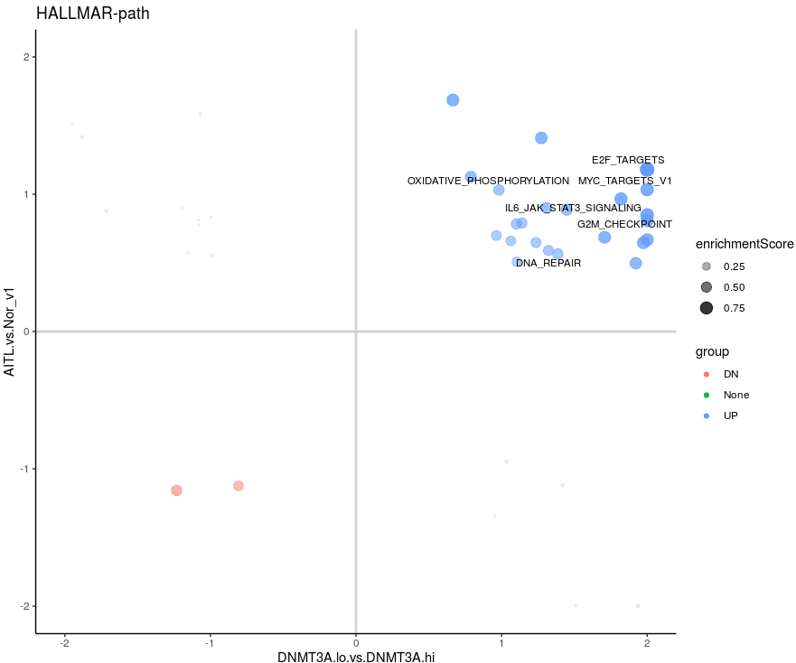

~~~R

AITL.vs.Nor <- mcreadRDS("/mnt/data/user_data/xiangyu/workshop/scRNA/10X_52_WZW_AML_rhoag17_20220824_3samples/clincal/GSEA_AITL.vs.Normal_all.rds",mc.cores=20)
AITL.vs.Nor$symbol <- rownames(AITL.vs.Nor)
AITL.vs.Nor1 <- subset(AITL.vs.Nor,p_values < 0.05 & abs(logFC) > 1)
AITL.vs.Nor_res_DGEs <- AITL.vs.Nor1[order(AITL.vs.Nor1$logFC,decreasing=TRUE),]
AITL.vs.Nor_res_DGEs1 <- AITL.vs.Nor_res_DGEs[,c("logFC","symbol")]
AITL.vs.Nor_res_DGEs1 <- na.omit(AITL.vs.Nor_res_DGEs1)
colnames(AITL.vs.Nor_res_DGEs1) <- c("logFC","X")
UP <- subset(AITL.vs.Nor_res_DGEs1,logFC>0)
DN <- subset(AITL.vs.Nor_res_DGEs1,logFC<0)
UP <- UP[order(UP$logFC,decreasing=TRUE),]
DN <- DN[order(DN$logFC,decreasing=FALSE),]
UP_new_gmt_ <- future_lapply(c(50,100,200,300,400,500),function(i) {
  if (length(UP$X) > i) {
    new_gmt_tmp <- data.frame(gene=UP$X[1:i])
    new_gmt_tmp$ont <- paste0("UP_",i)
  } else {
    new_gmt_tmp <- data.frame(gene=UP$X)
    new_gmt_tmp$ont <- paste0("UP_",length(UP$X))
  }
    return(new_gmt_tmp)
  })
UP_new_gmt <- do.call(rbind,UP_new_gmt_)
DN_new_gmt_ <- future_lapply(c(50,100,200,300,400,500),function(i) {
  if (length(DN$X) > i) {
    new_gmt_tmp <- data.frame(gene=DN$X[1:i])
    new_gmt_tmp$ont <- paste0("DN_",i)
  } else {
    new_gmt_tmp <- data.frame(gene=DN$X)
    new_gmt_tmp$ont <- paste0("DN_",length(DN$X))
  }
    return(new_gmt_tmp)
  })
DN_new_gmt <- do.call(rbind,DN_new_gmt_)
all_gmt_tmp <- rbind(UP_new_gmt,DN_new_gmt)
gmt_making_all <- all_gmt_tmp[,c("ont","gene")]
AITL_UP <- gmt_making_all[grep("UP",gmt_making_all$ont,value=FALSE),]
AITL_DN <- gmt_making_all[grep("DN",gmt_making_all$ont,value=FALSE),]
AITL_DNMT3A.lo.vs.DNMT3A.hi_all <- mcreadRDS("/mnt/data/user_data/xiangyu/workshop/scRNA/10X_52_WZW_AML_rhoag17_20220824_3samples/clincal/AITL_DNMT3A.lo.vs.DNMT3A.hi_all.rds",mc.cores=20)
AITL_DNMT3A.lo.vs.DNMT3A.hi_all <- AITL_DNMT3A.lo.vs.DNMT3A.hi_all[order(AITL_DNMT3A.lo.vs.DNMT3A.hi_all$logFC,decreasing=TRUE),]
gene_lis <- AITL_DNMT3A.lo.vs.DNMT3A.hi_all[!is.na(AITL_DNMT3A.lo.vs.DNMT3A.hi_all$logFC),]
All_data.merge_all_genelist <- gene_lis$logFC
names(All_data.merge_all_genelist) <- rownames(gene_lis)
Sel_top500 <- AITL_UP[grep("50",AITL_UP$ont,value=FALSE),]
Sel_top50 <- subset(AITL_UP,ont=="UP_50")
GSEA_res_DNMT3A.lo.vs.DNMT3A.hi_Sel_top50 <- GSEA(All_data.merge_all_genelist, TERM2GENE=Sel_top50, verbose=FALSE,pvalueCutoff=1,minGSSize=0,maxGSSize=5000)
library(enrichplot)
plot <- gseaplot2(GSEA_res_DNMT3A.lo.vs.DNMT3A.hi_Sel_top50, geneSetID = 1:length(unique(GSEA_res_DNMT3A.lo.vs.DNMT3A.hi_Sel_top50$ID)), pvalue_table = TRUE)
ggsave("/mnt/data/user_data/xiangyu/workshop/scRNA/10X_52_WZW_AML_rhoag17_20220824_3samples/result/Ex.Figure1.GSEA.svg", plot=plot,width = 7, height = 6,dpi=1080)
~~~

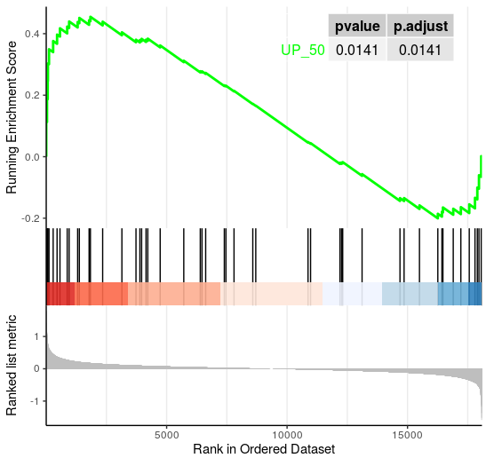

## 2. Figure5 making.

~~~R
AITL.vs.Nor <- mcreadRDS("/mnt/data/user_data/xiangyu/workshop/scRNA/10X_52_WZW_AML_rhoag17_20220824_3samples/clincal/GSEA_AITL.vs.Normal_all.rds",mc.cores=20)
AITL.vs.Nor$gene <- rownames(AITL.vs.Nor)
AITL.vs.Nor = AITL.vs.Nor %>% mutate(mouse_gene = convert_human_to_mouse_symbols(gene))
AITL.vs.Nor <- AITL.vs.Nor[!duplicated(AITL.vs.Nor$mouse_gene),]
AITL.vs.Nor <- AITL.vs.Nor[!is.na(AITL.vs.Nor$mouse_gene),]
rownames(AITL.vs.Nor) <- AITL.vs.Nor$mouse_gene
AITL_sample <- grep("AITL",colnames(AITL.vs.Nor),value=TRUE)
Normal_sample <- grep("Normal",colnames(AITL.vs.Nor),value=TRUE)
AITL.vs.Nor_c <- AITL.vs.Nor[,c(Normal_sample,AITL_sample)]
egm_AITL.vs.Normal_all <- mcreadRDS("/mnt/data/user_data/xiangyu/workshop/scRNA/10X_52_WZW_AML_rhoag17_20220824_3samples/clincal/egm_AITL.vs.Normal_all.T.rds")
decon_res <- egm_AITL.vs.Normal_all@result_cell_proportion%>% melt(varnames = c("sample", "cell_type"), value.name = "Freq.")
decon_res$group <- "Normal"
decon_res$group[grep("AITL",decon_res$sample,value=FALSE)] <- "AITL"
write.csv(decon_res,"/mnt/data/user_data/xiangyu/workshop/scRNA/10X_52_WZW_AML_rhoag17_20220824_3samples/result/Fig5.decon_res.csv")

decon_res1 <- subset(decon_res,cell_type=="Tfh")
library(ggpubr)
decon_res1$Dnmt3a <- as.numeric(as.character(AITL.vs.Nor_c["Dnmt3a",]))
plot <- ggscatter(decon_res1, x = "Dnmt3a", y = "Freq.",color="group",
  add = "reg.line", conf.int = TRUE,
  alpha=0.5, fullrange = TRUE, rug = TRUE,size=1,
  title="DNMT3A and Mem.B", legend="none",add.params=list(color = "red", fill = "lightgray")) + 
geom_density_2d(aes(alpha = ..nlevel..),colour="#BB2933", size = 1) + 
stat_cor(color="black", method = c("pearson"))+xlim(6,11)
ggsave("/mnt/data/user_data/xiangyu/workshop/scRNA/10X_52_WZW_AML_rhoag17_20220824_3samples/result/DNMT3A.cor.Tfh.svg", plot=plot,width = 7, height = 7,dpi=1080)
~~~

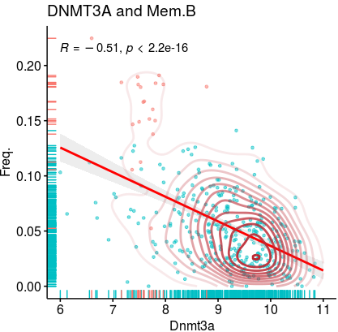

~~~R
Only_Counts.v2 <- mcreadRDS("/mnt/data/user_data/xiangyu/workshop/scRNA/10X_52_WZW_AML_rhoag17_20220824_3samples/clincal/Only_Counts.v2.rds",mc.cores=20)
Only_Counts.v2_t <- as.data.frame(t(Only_Counts.v2))
GSE6338.pData <- mcreadRDS("/mnt/data/user_data/xiangyu/workshop/scRNA/10X_52_WZW_AML_rhoag17_20220824_3samples/clincal/GSE6338.pData.rds")
rownames(GSE6338.pData) <- GSE6338.pData$X
AITL_sample <- c("ALCL_AV_003","AILD-01","ALCL_AV_004","AILD-02","AILD-03", "AILD_006")
Normal_sample <- as.character(GSE6338.pData[grep("^TC",GSE6338.pData$title,value=FALSE),]$title)
Sel_G <- c("DNMT3A","ICOSLG","CD86")
AITL.vs.Nor_c.v2 <- Only_Counts.v2_t[c(Normal_sample,AITL_sample),Sel_G]
AITL.vs.Nor_c.v2 <- as.data.frame(AITL.vs.Nor_c.v2)
AITL.vs.Nor_c.v2$group <- "Normal"
AITL.vs.Nor_c.v2[AITL_sample,]$group <- "AITL"
AITL.vs.Nor_c.v2 <- subset(AITL.vs.Nor_c.v2,group=="AITL")
aa <- jdb_palette("brewer_spectra",type = "continuous")
plot1 <- ggscatter(AITL.vs.Nor_c.v2, x = "DNMT3A", y = "CD86",color="group",ylim=c(5.8,8),alpha=0.5, fullrange = TRUE, rug = TRUE,size=1,
   title=paste0("CD86.and.AITLDNMT3A"), legend="none",add.params=list(color = "red", fill = "lightgray"))+ 
stat_density_2d(geom = "tile", aes(fill = ..density..), contour = FALSE, n =500) + scale_fill_gradientn(colours=alpha(aa,1))+stat_cor(color="black", method = c("pearson"))
plot4 <- ggscatter(AITL.vs.Nor_c.v2, x = "DNMT3A", y = "ICOSLG",color="group",ylim=c(5.15,5.7),alpha=0.5, fullrange = TRUE, rug = TRUE,size=1,
   title=paste0("ICOSLG.and.AITLDNMT3A"), legend="none",add.params=list(color = "red", fill = "lightgray"))+ 
stat_density_2d(geom = "tile", aes(fill = ..density..), contour = FALSE, n =500) + scale_fill_gradientn(colours=alpha(aa,1))+stat_cor(color="black", method = c("pearson"))
All_plot <- list(plot1,plot4)
plot <- CombinePlots(All_plot,ncol=2)
ggsave("/mnt/data/user_data/xiangyu/workshop/scRNA/10X_52_WZW_AML_rhoag17_20220824_3samples/result/AITL_patient.correlation.DNMT3A.svg", plot=plot,width = 11, height = 6,dpi=1080)
~~~

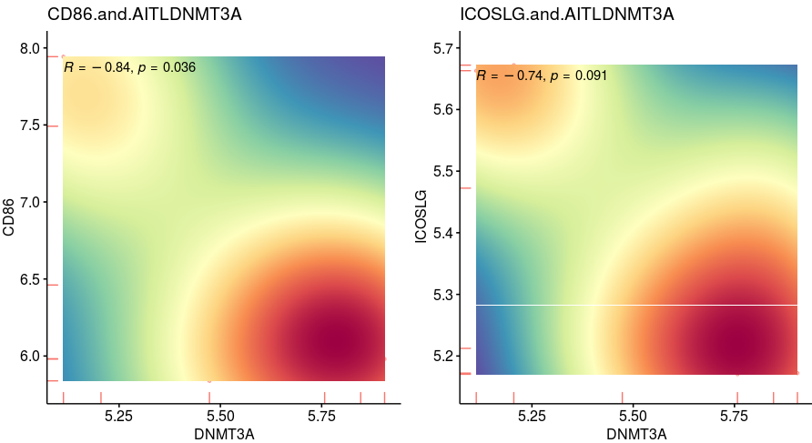
