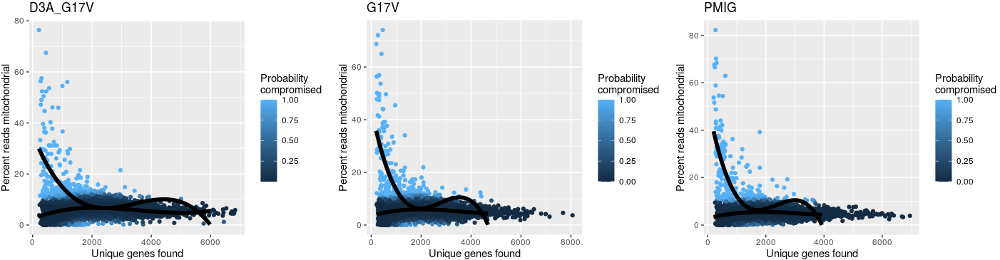

# scRNA of murine AITL data analysis

In this pipeline, we showed the detail codes of scRNA-seq analyzing in murine AITL , including quality control, dimension reducing, population clustering, differentiation genes expression identifying, trajectory constructing, dynamics expression genes identification and pathways enrichments. To make reproducible results from our code, the raw data and processed data were totally submitted. Besides, we generate Markdowns files to record all steps. 

## 1. build the foreigner sequence in reference

~~~R
# 1. check the integrity of raw data by md5 files. 
cd /mnt/data/sequencedata/scRNA/10X_52_WZW_AML_rhoag17_20220824_3samples/BMK_DATA_20220824142102_1/Data
md5sum -c data_md5.txt
# 2. add the foreigner sequence and annotation 
cd /mnt/data/user_data/xiangyu/programme/genome_index/cellranger_ref_10x
vim exo_seq.fa
>RHOAG17V_GFP
ctcgaggaaggactcggattcgttgcctgagcaatggctgccatccggaagaaactggtgattgttggtgatggagcctgtgtaaagacatgcttgctcatagtcttcagcaaggaccagttcccagaggtgtatgtgcccacagtgtttgagaactatgtggcagatatcgaggtggatggaaagcaggtagagttggctttgtgggacacagctgggcaggaagattatgatcgcctgaggcccctctcctacccagataccgatgttatactgatgtgtttttccatcgacagccctgatagtttagaaaacatcccagaaaagtggaccccagaagtcaagcatttctgtcccaacgtgcccatcatcctggttgggaataagaaggatcttcggaatgatgagcacacaaggcgggagctagccaagatgaagcaggagccggtgaaacctgaagaaggcagagatatggcaaacaggattggcgcttttgggtacatggagtgttcagcaaagaccaaagatggagtgagagaggtttttgaaatggctacgagagctgctctgcaagctagacgtgggaagaaaaaatctgggtgccttgtcttgtgaaaccttgctgcaagcactatggaattccgccccccccccctaacgttactggccgaagccgcttggaataaggccggtgtgcgtttgtctatatgttattttccaccatattgccgtcttttggcaatgtgagggcccggaaacctggccctgtcttcttgacgagcattcctaggggtctttcccctctcgccaaaggaatgcaaggtctgttgaatgtcgtgaaggaagcagttcctctggaagcttcttgaagacaaacaacgtctgtagcgaccctttgcaggcagcggaaccccccacctggcgacaggtgcctctgcggccaaaagccacgtgtataagatacacctgcaaaggcggcacaaccccagtgccacgttgtgagttggatagttgtggaaagagtcaaatggctctcctcaagcgtattcaacaaggggctgaaggatgcccagaaggtaccccattgtatgggatctgatctggggcctcggtgcacatgctttacatgtgtttagtcgaggttaaaaaaacgtctaggccccccgaaccacggggacgtggttttcctttgaaaaacacgatgataatatggccacaaccatggtgagcaagggcgaggagctgttcaccggggtggtgcccatcctggtcgagctggacggcgacgtaaacggccacaagttcagcgtgtccggcgagggcgagggcgatgccacctacggcaagctgaccctgaagttcatctgcaccaccggcaagctgcccgtgccctggcccaccctcgtgaccaccctgacctacggcgtgcagtgcttcagccgctaccccgaccacatgaagcagcacgacttcttcaagtccgccatgcccgaaggctacgtccaggagcgcaccatcttcttcaaggacgacggcaactacaagacccgcgccgaggtgaagttcgagggcgacaccctggtgaaccgcatcgagctgaagggcatcgacttcaaggaggacggcaacatcctggggcacaagctggagtacaactacaacagccacaacgtctatatcatggccgacaagcagaagaacggcatcaaggtgaacttcaagatccgccacaacatcgaggacggcagcgtgcagctcgccgaccactaccagcagaacacccccatcggcgacggccccgtgctgctgcccgacaaccactacctgagcacccagtccgccctgagcaaagaccccaacgagaagcgcgatcacatggtcctgctggagttcgtgaccgccgccgggatcactctcggcatggacgagctgtacaag
>PMIG_GFP
aattccgccccccccccctaacgttactggccgaagccgcttggaataaggccggtgtgcgtttgtctatatgttattttccaccatattgccgtcttttggcaatgtgagggcccggaaacctggccctgtcttcttgacgagcattcctaggggtctttcccctctcgccaaaggaatgcaaggtctgttgaatgtcgtgaaggaagcagttcctctggaagcttcttgaagacaaacaacgtctgtagcgaccctttgcaggcagcggaaccccccacctggcgacaggtgcctctgcggccaaaagccacgtgtataagatacacctgcaaaggcggcacaaccccagtgccacgttgtgagttggatagttgtggaaagagtcaaatggctctcctcaagcgtattcaacaaggggctgaaggatgcccagaaggtaccccattgtatgggatctgatctggggcctcggtgcacatgctttacatgtgtttagtcgaggttaaaaaaacgtctaggccccccgaaccacggggacgtggttttcctttgaaaaacacgatgataatatggccacaaccatggtgagcaagggcgaggagctgttcaccggggtggtgcccatcctggtcgagctggacggcgacgtaaacggccacaagttcagcgtgtccggcgagggcgagggcgatgccacctacggcaagctgaccctgaagttcatctgcaccaccggcaagctgcccgtgccctggcccaccctcgtgaccaccctgacctacggcgtgcagtgcttcagccgctaccccgaccacatgaagcagcacgacttcttcaagtccgccatgcccgaaggctacgtccaggagcgcaccatcttcttcaaggacgacggcaactacaagacccgcgccgaggtgaagttcgagggcgacaccctggtgaaccgcatcgagctgaagggcatcgacttcaaggaggacggcaacatcctggggcacaagctggagtacaactacaacagccacaacgtctatatcatggccgacaagcagaagaacggcatcaaggtgaacttcaagatccgccacaacatcgaggacggcagcgtgcagctcgccgaccactaccagcagaacacccccatcggcgacggccccgtgctgctgcccgacaaccactacctgagcacccagtccgccctgagcaaagaccccaacgagaagcgcgatcacatggtcctgctggagttcgtgaccgccgccgggatcactctcggcatggacgagctgtacaagtaa
>PMIC_mCherry
aattccgccccccccccctaacgttactggccgaagccgcttggaataaggccggtgtgcgtttgtctatatgttattttccaccatattgccgtcttttggcaatgtgagggcccggaaacctggccctgtcttcttgacgagcattcctaggggtctttcccctctcgccaaaggaatgcaaggtctgttgaatgtcgtgaaggaagcagttcctctggaagcttcttgaagacaaacaacgtctgtagcgaccctttgcaggcagcggaaccccccacctggcgacaggtgcctctgcggccaaaagccacgtgtataagatacacctgcaaaggcggcacaaccccagtgccacgttgtgagttggatagttgtggaaagagtcaaatggctctcctcaagcgtattcaacaaggggctgaaggatgcccagaaggtaccccattgtatgggatctgatctggggcctcggtgcacatgctttacatgtgtttagtcgaggttaaaaaacgtctaggccccccgaaccacggggacgtggttttcctttgaaaaacacgatgataatatggccacaaccatggtgagcaagggcgaggaggataacatggccatcatcaaggagttcatgcgcttcaaggtgcacatggagggctccgtgaacggccacgagttcgagatcgagggcgagggcgagggccgcccctacgagggcacccagaccgccaagctgaaggtgaccaagggtggccccctgcccttcgcctgggacatcctgtcccctcagttcatgtacggctccaaggcctacgtgaagcaccccgccgacatccccgactacttgaagctgtccttccccgagggcttcaagtgggagcgcgtgatgaacttcgaggacggcggcgtggtgaccgtgacccaggactcctccctgcaggacggcgagttcatctacaaggtgaagctgcgcggcaccaacttcccctccgacggccccgtaatgcagaagaagaccatgggctgggaggcctcctccgagcggatgtaccccgaggacggcgccctgaagggcgagatcaagcagaggctgaagctgaaggacggcggccactacgacgctgaggtcaagaccacctacaaggccaagaagcccgtgcagctgcccggcgcctacaacgtcaacatcaagttggacatcacctcccacaacgaggactacaccatcgtggaacagtacgaacgcgccgagggccgccactccaccggcggcatggacgagctgtacaagtaa

vim exo_region.gtf
RHOAG17V_GFP	cclab	exon	1	1938	.	+	.	gene_id "RHOAG17V_GFP"; gene_version "1"; transcript_id "RHOAG17V_GFP"; transcript_version "1"; exon_number "1"; gene_name "RHOAG17V_GFP"; gene_source "cclab"; gene_biotype "mark"
PMIG_GFP	cclab	exon	1	1304	.	+	.	gene_id "PMIG_GFP"; gene_version "1"; transcript_id "PMIG_GFP"; transcript_version "1"; exon_number "1"; gene_name "PMIG_GFP"; gene_source "cclab"; gene_biotype "mark"
PMIC_mCherry	cclab	exon	1	1294	.	+	.	gene_id "PMIC_mCherry"; gene_version "1"; transcript_id "PMIC_mCherry"; transcript_version "1"; exon_number "1"; gene_name "PMIC_mCherry"; gene_source "cclab"; gene_biotype "mark"

cat /mnt/data/public_data/refdata-cellranger-mm10-1.2.0/fasta/genome.fa \
/mnt/data/user_data/xiangyu/programme/genome_index/cellranger_ref_10x/exo_seq.fa > \
/mnt/data/user_data/xiangyu/programme/genome_index/cellranger_ref_10x/genome_exo.fa

cat /mnt/data/public_data/refdata-cellranger-mm10-1.2.0/genes/genes.gtf \
/mnt/data/user_data/xiangyu/programme/genome_index/cellranger_ref_10x/exo_region.gtf > \
/mnt/data/user_data/xiangyu/programme/genome_index/cellranger_ref_10x/genes_exo.gtf
# 3. index the reference with foreigner sequence and annotation 
/mnt/data/user_data/xiangyu/programme/cellranger-5.0.1/cellranger mkref \
--genome=refdata-cellranger-mm10-1.2.0-with-exo \
--fasta=/mnt/data/user_data/xiangyu/programme/genome_index/cellranger_ref_10x/genome_exo.fa \
--genes=/mnt/data/user_data/xiangyu/programme/genome_index/cellranger_ref_10x/genes_exo.gtf
# 4. fix the name of raw data
cd /mnt/data/sequencedata/scRNA/10X_52_WZW_AML_rhoag17_20220824_3samples/BMK_DATA_20220824142102_1/Data
mv Unknown_AZ087-01X0001_good_1.fq.gz PMIC_S1_L001_R1_001.fastq.gz
mv Unknown_AZ087-01X0001_good_2.fq.gz PMIC_S1_L001_R2_001.fastq.gz
mv Unknown_AZ087-01X0002_good_1.fq.gz G17V_S1_L001_R1_001.fastq.gz
mv Unknown_AZ087-01X0002_good_2.fq.gz G17V_S1_L001_R2_001.fastq.gz
mv Unknown_AZ087-01X0003_good_1.fq.gz D3A_G17V_S1_L001_R1_001.fastq.gz
mv Unknown_AZ087-01X0003_good_2.fq.gz D3A_G17V_S1_L001_R2_001.fastq.gz
# 5. align the scRNA-seq data
mkdir /mnt/data/user_data/xiangyu/workshop/scRNA/10X_52_WZW_AML_rhoag17_20220824_3samples/
cd /mnt/data/user_data/xiangyu/workshop/scRNA/10X_52_WZW_AML_rhoag17_20220824_3samples/

vim cellranger_all_v1.sh
mkdir /mnt/data/user_data/xiangyu/workshop/scRNA/10X_52_WZW_AML_rhoag17_20220824_3samples/PMIC
cd /mnt/data/user_data/xiangyu/workshop/scRNA/10X_52_WZW_AML_rhoag17_20220824_3samples/PMIC
/mnt/data/user_data/xiangyu/programme/cellranger-5.0.1/cellranger count \
--id=PMIC \
--localcores 25 \
--transcriptome=/mnt/data/user_data/xiangyu/programme/genome_index/cellranger_ref_10x/refdata-cellranger-mm10-1.2.0-with-exo \
--fastqs=/mnt/data/sequencedata/scRNA/10X_52_WZW_AML_rhoag17_20220824_3samples/BMK_DATA_20220824142102_1/Data/ \
--sample=PMIC --nosecondary
mkdir /mnt/data/user_data/xiangyu/workshop/scRNA/10X_52_WZW_AML_rhoag17_20220824_3samples/G17V
cd /mnt/data/user_data/xiangyu/workshop/scRNA/10X_52_WZW_AML_rhoag17_20220824_3samples/G17V
/mnt/data/user_data/xiangyu/programme/cellranger-5.0.1/cellranger count \
--id=G17V \
--localcores 25 \
--transcriptome=/mnt/data/user_data/xiangyu/programme/genome_index/cellranger_ref_10x/refdata-cellranger-mm10-1.2.0-with-exo \
--fastqs=/mnt/data/sequencedata/scRNA/10X_52_WZW_AML_rhoag17_20220824_3samples/BMK_DATA_20220824142102_1/Data/ \
--sample=G17V --nosecondary
mkdir /mnt/data/user_data/xiangyu/workshop/scRNA/10X_52_WZW_AML_rhoag17_20220824_3samples/D3A_G17V
cd /mnt/data/user_data/xiangyu/workshop/scRNA/10X_52_WZW_AML_rhoag17_20220824_3samples/D3A_G17V
/mnt/data/user_data/xiangyu/programme/cellranger-5.0.1/cellranger count \
--id=D3A_G17V \
--localcores 25 \
--transcriptome=/mnt/data/user_data/xiangyu/programme/genome_index/cellranger_ref_10x/refdata-cellranger-mm10-1.2.0-with-exo \
--fastqs=/mnt/data/sequencedata/scRNA/10X_52_WZW_AML_rhoag17_20220824_3samples/BMK_DATA_20220824142102_1/Data/ \
--sample=D3A_G17V --nosecondary
bash cellranger_all_v1.sh
~~~

## 2. RNA velocity calculation in scRNA-seq

~~~R
# 1. decompress the barcode files.
cd /mnt/data/user_data/xiangyu/workshop/scRNA/10X_52_WZW_AML_rhoag17_20220824_3samples
gunzip /mnt/data/user_data/xiangyu/workshop/scRNA/10X_52_WZW_AML_rhoag17_20220824_3samples/D3A_G17V/D3A_G17V/outs/filtered_feature_bc_matrix/barcodes.tsv.gz
gunzip /mnt/data/user_data/xiangyu/workshop/scRNA/10X_52_WZW_AML_rhoag17_20220824_3samples/G17V/G17V/outs/filtered_feature_bc_matrix/barcodes.tsv.gz
gunzip /mnt/data/user_data/xiangyu/workshop/scRNA/10X_52_WZW_AML_rhoag17_20220824_3samples/PMIC/PMIC/outs/filtered_feature_bc_matrix/barcodes.tsv.gz
gunzip /mnt/data/user_data/xiangyu/programme/genome_index/cellranger_ref_10x/refdata-cellranger-mm10-1.2.0-with-exo/genes/genes.gtf.gz
# 2. calculate the RNA velocity.
ref_gtf=/mnt/data/user_data/xiangyu/programme/genome_index/cellranger_ref_10x/refdata-cellranger-mm10-1.2.0-with-exo/genes/genes.gtf
repeat_msk=/mnt/data/user_data/xiangyu/workshop/scRNA/velocity_file/mm10_rmsk.gtf
/opt/python3.7/bin/velocyto run -@ 25 -m $repeat_msk \
/mnt/data/user_data/xiangyu/workshop/scRNA/10X_52_WZW_AML_rhoag17_20220824_3samples/D3A_G17V/D3A_G17V/outs/possorted_genome_bam.bam \
-b /mnt/data/user_data/xiangyu/workshop/scRNA/10X_52_WZW_AML_rhoag17_20220824_3samples/D3A_G17V/D3A_G17V/outs/filtered_feature_bc_matrix/barcodes.tsv \
-o /mnt/data/user_data/xiangyu/workshop/scRNA/10X_52_WZW_AML_rhoag17_20220824_3samples/D3A_G17V/D3A_G17V/ $ref_gtf

/opt/python3.7/bin/velocyto run -@ 25 -m $repeat_msk \
/mnt/data/user_data/xiangyu/workshop/scRNA/10X_52_WZW_AML_rhoag17_20220824_3samples/G17V/G17V/outs/possorted_genome_bam.bam \
-b /mnt/data/user_data/xiangyu/workshop/scRNA/10X_52_WZW_AML_rhoag17_20220824_3samples/G17V/G17V/outs/filtered_feature_bc_matrix/barcodes.tsv \
-o /mnt/data/user_data/xiangyu/workshop/scRNA/10X_52_WZW_AML_rhoag17_20220824_3samples/G17V/G17V/ $ref_gtf

/opt/python3.7/bin/velocyto run -@ 25 -m $repeat_msk \
/mnt/data/user_data/xiangyu/workshop/scRNA/10X_52_WZW_AML_rhoag17_20220824_3samples/PMIC/PMIC/outs/possorted_genome_bam.bam \
-b /mnt/data/user_data/xiangyu/workshop/scRNA/10X_52_WZW_AML_rhoag17_20220824_3samples/PMIC/PMIC/outs/filtered_feature_bc_matrix/barcodes.tsv \
-o /mnt/data/user_data/xiangyu/workshop/scRNA/10X_52_WZW_AML_rhoag17_20220824_3samples/PMIC/PMIC/ $ref_gtf
# 3. compress the barcode files.
gzip /mnt/data/user_data/xiangyu/workshop/scRNA/10X_52_WZW_AML_rhoag17_20220824_3samples/D3A_G17V/D3A_G17V/outs/filtered_feature_bc_matrix/barcodes.tsv
gzip /mnt/data/user_data/xiangyu/workshop/scRNA/10X_52_WZW_AML_rhoag17_20220824_3samples/G17V/G17V/outs/filtered_feature_bc_matrix/barcodes.tsv
gzip /mnt/data/user_data/xiangyu/workshop/scRNA/10X_52_WZW_AML_rhoag17_20220824_3samples/PMIC/PMIC/outs/filtered_feature_bc_matrix/barcodes.tsv
gzip /mnt/data/user_data/xiangyu/programme/genome_index/cellranger_ref_10x/refdata-cellranger-mm10-1.2.0-with-exo/genes/genes.gtf
# 3. merge multiple .loom files.
mkdir /mnt/data/user_data/xiangyu/workshop/scRNA/10X_52_WZW_AML_rhoag17_20220824_3samples/velocity
cd /mnt/data/user_data/xiangyu/workshop/scRNA/10X_52_WZW_AML_rhoag17_20220824_3samples/velocity
import loompy
import os
import numpy as np
from scipy.io import mmread
files = ["/mnt/data/user_data/xiangyu/workshop/scRNA/10X_52_WZW_AML_rhoag17_20220824_3samples/D3A_G17V/D3A_G17V/possorted_genome_bam_69WQS.loom",
"/mnt/data/user_data/xiangyu/workshop/scRNA/10X_52_WZW_AML_rhoag17_20220824_3samples/G17V/G17V/possorted_genome_bam_WWEK3.loom",
"/mnt/data/user_data/xiangyu/workshop/scRNA/10X_52_WZW_AML_rhoag17_20220824_3samples/PMIC/PMIC/possorted_genome_bam_KJV5W.loom"]
loompy.combine(files, "AITL_all_merged.loom", key="Accession")
# 3. convert the loom file into seurat object.
sample <- c("D3A_G17V","G17V","PMIG")
library(velocyto.R)
ldat <- read.loom.matrices("/mnt/data/user_data/xiangyu/workshop/scRNA/10X_52_WZW_AML_rhoag17_20220824_3samples/velocity/AITL_all_merged.loom")
emat <- ldat$spliced
nmat <- ldat$unspliced
ambiguous <- ldat$ambiguous
all_files <- list(emat,nmat,ambiguous)
all_files_ <- lapply(1:length(all_files),function(x) {
    sel_f <- all_files[[x]]
    col_sel_f <- colnames(sel_f)
    col_sel_f <- gsub("possorted_genome_bam_KJV5W:","PMIG_",col_sel_f)
    col_sel_f <- gsub("possorted_genome_bam_WWEK3:","G17V_",col_sel_f)
    col_sel_f <- gsub("possorted_genome_bam_69WQS:","D3A_G17V_",col_sel_f)
    col_sel_f <- gsub("x","-1",col_sel_f)
    colnames(sel_f) <- col_sel_f
    return(sel_f)
    })
ldat1 <- ldat
ldat1$spliced <- all_files_[[1]]
ldat1$unspliced <- all_files_[[2]]
ldat1$ambiguous <- all_files_[[3]]
emat <- ldat1$spliced
nmat <- ldat1$unspliced
ambiguous <- ldat1$ambiguous
library(trqwe)
mcsaveRDS(nmat,"/mnt/data/user_data/xiangyu/workshop/scRNA/10X_52_WZW_AML_rhoag17_20220824_3samples/velocity/AITL_all_merged_nmat_RNA_velocity.rds",mc.cores=20)
mcsaveRDS(emat,"/mnt/data/user_data/xiangyu/workshop/scRNA/10X_52_WZW_AML_rhoag17_20220824_3samples/velocity/AITL_all_merged_emat_RNA_velocity.rds",mc.cores=20)
mcsaveRDS(ambiguous,"/mnt/data/user_data/xiangyu/workshop/scRNA/10X_52_WZW_AML_rhoag17_20220824_3samples/velocity/AITL_all_merged_emat_RNA_velocity.rds",mc.cores=20)
library(Seurat)
library(SeuratWrappers)
AITL_scVel_seurat <- as.Seurat(x = ldat1)
mcsaveRDS(AITL_scVel_seurat,"/mnt/data/user_data/xiangyu/workshop/scRNA/10X_52_WZW_AML_rhoag17_20220824_3samples/velocity/AITL_all_merged_all_RNA_velocity.rds",mc.cores=20)
~~~

## 3. miQC was used to quality control of each sample

~~~R
suppressPackageStartupMessages({
    library(dplyr)
    library(Seurat)
    library(Matrix)
    library(proxy)
    library(gplots)
    library(Rtsne)
    library(densityClust)
    library(irlba)
    library(monocle)
    library(plyr)
    library(DOSE)
    library(clusterProfiler)
    library(topGO)
    library(pathview)
    library(AnnotationDbi)
    library(cowplot)
    library(ggplot2)
    library(velocyto.R)
    library(trqwe)
    library(Rsamtools)
    library(GenomicFeatures)
    library(GenomicAlignments)
    library(BiocParallel)
    library(pheatmap)
    library(RColorBrewer)
    library(PoiClaClu)
    library(org.Mm.eg.db)
    library(org.Hs.eg.db)
    library(DESeq2)
    library(data.table)
    library(stringr)
    library(iTALK)
    library(nichenetr)
    library(tidyr)
    library(GenomicRanges)
    library(viridis)
    library(chromVAR)
    library(ggpubr)
    library(corrplot)
    library(SingleCellExperiment)
    library(scater)
    library(flexmix)
    library(splines)
    library(biomaRt)
    library(miQC)
    library(scales)
    library(BuenColors)
    library(PCAtools)
})
source("/mnt/data/user_data/xiangyu/programme/R_PACKAGES/my_code/MyBestFunction_scRNA.R")
source("/mnt/data/user_data/xiangyu/programme/R_PACKAGES/my_code/Pseudo_CNV_series.R")
library(future)
library(future.apply)
options(future.globals.maxSize = 300 * 1024^3)
plan("multiprocess", workers = 15)
plan()

dir.create("/mnt/data/user_data/xiangyu/workshop/scRNA/10X_52_WZW_AML_rhoag17_20220824_3samples/output")
AITL_data <- list.files(path = "/mnt/data/user_data/xiangyu/workshop/scRNA/10X_52_WZW_AML_rhoag17_20220824_3samples",full.names = TRUE)
exo <- grep("exo",AITL_data,value=TRUE)
AITL_data <- setdiff(AITL_data,exo)
AITL_data <- setdiff(AITL_data,grep("output",HLH_data,value=TRUE))
Sel_files <- AITL_data
sample <- c("D3A_G17V","G17V","PMIG")
names(Sel_files) <- sample
names <- c("D3A_G17V","G17V","PMIG")

All_raw <- future_lapply(1:length(Sel_files),function(x) {
    tmp_path <- paste0(Sel_files[x],"/",gsub("/mnt/data/user_data/xiangyu/workshop/scRNA/10X_52_WZW_AML_rhoag17_20220824_3samples/","",Sel_files[x]),"/outs/filtered_feature_bc_matrix")
    tmp.data <- Read10X(data.dir = tmp_path)
    colnames(tmp.data) <- paste(names(Sel_files)[x],colnames(tmp.data),sep="_")
    return(tmp.data)
    })

All_exo <- future_lapply(1:length(exo),function(x) {
    tmp_path <- paste0(exo[x],"/",gsub("/mnt/data/user_data/xiangyu/workshop/scRNA/10X_52_WZW_AML_rhoag17_20220824_3samples/","",Sel_files[x]),"/outs/raw_feature_bc_matrix")
    tmp.data <- Read10X(data.dir = tmp_path)
    colnames(tmp.data) <- paste(names(Sel_files)[x],colnames(tmp.data),sep="_")
    return(tmp.data)
    })

common_carcode1 <- intersect(colnames(All_exo[[1]]),colnames(All_raw[[1]]))
common_carcode2 <- intersect(colnames(All_exo[[2]]),colnames(All_raw[[2]]))
common_carcode3 <- intersect(colnames(All_exo[[3]]),colnames(All_raw[[3]]))

All_data <- list()
All_data[[1]] <- rbind(All_exo[[1]][,common_carcode1],All_raw[[1]][,common_carcode1])
All_data[[2]] <- rbind(All_exo[[2]][,common_carcode2],All_raw[[2]][,common_carcode2])
All_data[[3]] <- rbind(All_exo[[3]][,common_carcode3],All_raw[[3]][,common_carcode3])

All_filter_miQC <- future_lapply(1:length(Sel_files),function(x) {
    tmp.data <- All_data[[x]]
    tmp <- CreateSeuratObject(counts = tmp.data, min.cells = 3, min.features = 200,project = names(Sel_files)[x])
    mito.features <- grep(pattern = "^mt-", x = rownames(x = tmp), value = TRUE)
    percent.mito <- Matrix::colSums(x = GetAssayData(object = tmp, slot = "counts")[mito.features,])/Matrix::colSums(x = GetAssayData(object = tmp, slot = "counts"))
    tmp[["percent.mito"]] <- percent.mito
    sim <- as.SingleCellExperiment(tmp)
    MT_genes <- grepl("^mt-",  rownames(sim))
    feature_ctrls <- list(mito = rownames(sim)[MT_genes])
    sce <- addPerCellQC(sim, subsets = feature_ctrls)
    model2 <- mixtureModel(sce, model_type = "spline")
    plot_Model <- plotModel(sce, model2) + labs(title=names(Sel_files)[x])
    plot_Filter <- plotFiltering(sce, model2, posterior_cutoff = 0.75) + labs(title=names(Sel_files)[x])
    miQC.keep <- miQC.keep_info(sce, model2)
    tmp$miQC.keep <- miQC.keep[rownames(tmp[[]]),]$keep
    tmp_filter <- subset(tmp,miQC.keep=="TRUE")
    tmp_filter$group <- names[x]
    tmp_filter$sample <- names(Sel_files)[x]
    all_obj <- list(plot_Model,plot_Filter,tmp_filter)
    message(names[x]," ", names(Sel_files)[x]," "," is done")
    return(all_obj)
    })
mcsaveRDS(All_filter_miQC,"/mnt/data/user_data/xiangyu/workshop/scRNA/10X_52_WZW_AML_rhoag17_20220824_3samples/output/All_filter_miQC.rds",mc.cores=20)
# Removing 241 out of 8557 cells.D3A_G17V D3A_G17V  is done
# Removing 248 out of 8161 cells.G17V G17V  is done
# Removing 248 out of 7824 cells.PMIG PMIG  is done
~~~

## 4. visualize the quality control of each sample.

~~~R
sample <- c("D3A_G17V","G17V","PMIG")
All_filter_miQC <- mcreadRDS("/mnt/data/user_data/xiangyu/workshop/scRNA/10X_52_WZW_AML_rhoag17_20220824_3samples/output/All_filter_miQC.rds",mc.cores=20)
plot_Model_all <- list(All_filter_miQC[[1]][[1]],All_filter_miQC[[2]][[1]],All_filter_miQC[[3]][[1]])
CombinePlots(plot_Model_all,ncol=3)

plot_Filter_all <- list(All_filter_miQC[[1]][[2]],All_filter_miQC[[2]][[2]],All_filter_miQC[[3]][[2]])
CombinePlots(plot_Filter_all,ncol=3)

All_sum_ <- lapply(1:length(All_filter_miQC),function(x) {
    tmp_df <- as.data.frame(FetchData(object = All_filter_miQC[[x]][[3]], vars = c("nFeature_RNA","nCount_RNA","percent.mito","sample","group"),slot="data"))
    return(tmp_df)
    })
All_sum <- do.call(rbind,All_sum_)
All_sum$log2_nCount_RNA <- log(All_sum$nCount_RNA+1,2)
Sel_g <- c("nFeature_RNA","log2_nCount_RNA","percent.mito")
All_sum$sample <- factor(All_sum$sample,levels=c("D3A_G17V","G17V","PMIG"))
plot <- list()
for (i in 1:length(Sel_g)){
  plot[[i]] <- ggviolin(All_sum, "sample", Sel_g[i], fill = "sample",legend = "none",rotate=TRUE,
   add = "boxplot", add.params = list(fill = "white"),title=paste0(Sel_g[i]," in All"))
}
CombinePlots(plot,ncol=3)
plot <- list()
for (i in 1:length(Sel_g)){
  plot[[i]] <- ggbarplot(All_sum, x = "sample", y = Sel_g[i],
    add = c("mean_se"),legend = "none",rotate=TRUE,
    color = "sample", fill = "sample", alpha = 1,title=paste0(Sel_g[i]," in All"))
}
CombinePlots(plot,ncol=3)

sample_num <- as.data.frame(table(All_sum$sample))
ggbarplot(sample_num, x = "Var1", y = "Freq",
    add = c("mean_se"),legend = "none",rotate=TRUE,
    color = "Var1", fill = "Var1", alpha = 1,title="Cell num in All")

seurat_obj <- lapply(1:length(All_filter_miQC),function(x) {
    tmp <- All_filter_miQC[[x]][[3]]
    return(tmp)
    })
ALL_MERGE_DATA <- merge(seurat_obj[[1]],seurat_obj[2:length(seurat_obj)])
table(ALL_MERGE_DATA$group)
table(ALL_MERGE_DATA$sample)
head(ALL_MERGE_DATA[[]])
mcsaveRDS(ALL_MERGE_DATA,"/mnt/data/user_data/xiangyu/workshop/scRNA/10X_52_WZW_AML_rhoag17_20220824_3samples/output/ALL_MERGE_DATA.rds",mc.cores=20)
~~~

## 5. Merge all samples and complete the population identification. 

~~~R
library(reticulate)
library(ReductionWrappers)
library(s2a)
ALL_MERGE_DATA <- ALL_MERGE_DATA %>%
    NormalizeData(verbose = FALSE) %>%
    FindVariableFeatures(selection.method = "vst", nfeatures = 4000) %>% 
    ScaleData(verbose = TRUE)
ALL_MERGE_DATA_seurat <- ALL_MERGE_DATA %>% 
    RunPCA(pc.genes = ALL_MERGE_DATA_seurat@var.genes, npcs = 30, verbose = FALSE) %>% 
    RunUMAP(dims = 1:25) %>% 
    RunTSNE(dims = 1:25) %>% 
    FindNeighbors(dims = 1:25) %>% 
    FindClusters(resolution = c(0.1,0.2,0.4,1)) %>%
    DoopenTSNE(reduction_save = "openTSNE",dims_use = 1:25)
mcsaveRDS(ALL_MERGE_DATA_seurat,"/mnt/data/user_data/xiangyu/workshop/scRNA/10X_52_WZW_AML_rhoag17_20220824_3samples/output/ALL_MERGE_DATA_DS_nothing.rds", mc.cores = 20)

ALL_MERGE_DATA_seurat <- mcreadRDS("/mnt/data/user_data/xiangyu/workshop/scRNA/10X_52_WZW_AML_rhoag17_20220824_3samples/output/ALL_MERGE_DATA_DS_nothing.rds", mc.cores = 20)
ALL_MERGE_DATA_seurat$group <- factor(ALL_MERGE_DATA_seurat$group,levels=c("PMIG","G17V","D3A_G17V"))
DimPlot(object = ALL_MERGE_DATA_seurat, reduction = "tsne",group.by="RNA_snn_res.1",label=FALSE,split.by="group") +labs(title="AITL")

aa <- as.data.frame(table(ALL_MERGE_DATA_seurat$RNA_snn_res.1,ALL_MERGE_DATA_seurat$group))
aa_all <- c()
for (i in unique(aa$Var2)){
  group_sel <- subset(aa,Var2==i)
  group_sel$sum_number <- sum(group_sel$Freq)
  aa_all <- rbind(aa_all,group_sel)
}
all_group_normalised<- c()
for (i in unique(aa_all$Var1)){
  tmp_group <- subset(aa_all,Var1==i)
  tmp_group$cluster_all <- (tmp_group$Freq/tmp_group$sum_number)
  tmp_group$normal_ratio <- (tmp_group$cluster_all/sum(tmp_group$cluster_all))*100
  tmp_group$normal_ratio <- round(tmp_group$normal_ratio,2)
  all_group_normalised <- rbind(all_group_normalised,tmp_group)
}
all_group_normalised <- all_group_normalised[order(all_group_normalised$Var2,all_group_normalised$normal_ratio,decreasing=TRUE),]
all_group_normalised$Var1 <- factor(all_group_normalised$Var1,levels=as.character(subset(all_group_normalised,Var2=="PMIG")$Var1))
ggplot(data=all_group_normalised, aes(x=Var1, y=normal_ratio, fill=Var2)) +
  geom_bar(stat="identity") + coord_flip()

XY_FeaturePlot(object = ALL_MERGE_DATA_seurat, features = c("RHOAG17V","IRES","GFP","mCherry","UTR3","RHOAG17V-GFP","PMIC-mCherry"),pt.size=.1,reduction="tsne",ncol=4,
    label=F,cols = CustomPalette(low ="#007BBF", mid = "#FFF485",high = "#FF0000"))

ALL_MERGE_DATA_seurat <- mcreadRDS("/mnt/data/user_data/xiangyu/workshop/scRNA/10X_52_WZW_AML_rhoag17_20220824_3samples/output/ALL_MERGE_DATA_DS_nothing.rds", mc.cores = 20)
Idents(ALL_MERGE_DATA_seurat) <- ALL_MERGE_DATA_seurat$RNA_snn_res.1
DimPlot(object = ALL_MERGE_DATA_seurat, reduction = "tsne",label=TRUE,group.by="RNA_snn_res.1") +NoLegend()

T_CELL <- c("Cd3e","Cd8a","Cd4","Ccr7","Tcf7")
B_CELL <- c("Ms4a1","Cd79a")
Plasma <- c("Cd27", "Slamf7")
CD14_Mono <- c("Cd14","Lyz1")
CD16_Mono <- c("Fcgr3","Ms4a7")
Neutrophil <- c("S100a8","S100a9")
NK <- c("Tyrobp","Ncam1","Cd160","Gnly", "Nkg7")
DC <- c("Fcer1a", "Cst3")
Platelet <- c("Ppbp")
Erythroid <- c("Hbb-bh1","Hba-a2")
Sel_g <- c(T_CELL,B_CELL,CD14_Mono,CD16_Mono,Neutrophil,NK,DC,Platelet,Erythroid)
DotPlot(ALL_MERGE_DATA_seurat, features = Sel_g, 
  cols=c("#ffffff", "#B30000"),scale = TRUE,col.min = 0,col.max = 5) + RotatedAxis()+ labs(title="All")

HSPC_MPP <- c("Cd34","Hoxb5","Hoxa7","Mecom","Avp","Klf2","Spink2","Hopx","Hesx1")
CLP <- c("Mef2a","Mafk","Il7r","Ada","Trbc2","Satb1","Flt3")
MEP <- c("Klf1","Itga2b","Gata1","Hbd","Apoc1","Ca1")
GMP <- c("Elane","Mpo","Cfd","Ctsg","Azu1","Ms4a3","Prtn3")
Eo_Bosin <- c("Ms4a2")
T <- c("Ptprc","Cd3g","Cd8a","Cd8b","Cd4")
Effector <- c("Nkg7","Gzmk","Gzmb")
Naive_CD4 <- c("Cd44","Ccr7","Sell","Cd4")
Conv_CD4 <- c("Cd69","Ltb","Socs3","Pbxip1","Cd44","Cd34","Cd38","Flt3","Kit","Irf8","Foxp3")
DCs <- c("Cd1d","Cd1e")
Eryth <- c("Hba1","Hba2","Hbb")
B <- c("Cd79a","Cd79b","Vpreb1")
Neutro <- c("S100a8","S100a9")
Sel_g <- c(HSPC_MPP,CLP,MEP,GMP,Eo_Bosin,T,Effector,Naive_CD4,Conv_CD4,DCs,Eryth,B,Neutro)
DotPlot(ALL_MERGE_DATA_seurat, features = unique(Sel_g), 
  cols=c("#ffffff", "#B30000"),scale = TRUE,col.min = 0,col.max = 5) + RotatedAxis()+ labs(title="All")

SCLC <- c("Ascl1","Chga","Ddc","Nfib")
Club <- c("Scgb3a2", "Cyp2f2", "Cckar")
Ciliated <- c("Foxj1", "Ccdc78", "Fam183b")
AT2 <- c("Sftpc", "Muc1", "Etv5")
Fibroblast <- c("Col3a1","Cd81","Vim","Sparc")
Endothelial <- c("Cldn5")
Smooth_Muscle <- c("Acta2", "Cnn1", "Tagln")
Exogenous <- c("V2TC","CAS9","LUCI2LTR")
Monocyte <- c("Cd14", "F13a1", "Ly6c2")
Macrophage <- c("Cd68","Fcgr3","Fcgr1")
Neutrophil <- c("S100a8","S100a9","Cebpb","Csf3r")
Basophil <- c("Cpa3", "Ms4a2", "Mcpt8")
DC <- c("Siglech", "Cd300c", "Klk1", "Cd24a", "Clec9a","Sirpa", "Itgam")
T <- c("Cd3d","Cd3g","Cd28","Cd3e")
NKT <- c("Nkg7", "Cxcr6","Ncam1")
NK <- c("Klrb1a", "Tyrobp", "Gzma")
B <- c("Cd79a","Cd74","Cd79b","Mzb1")
Plasma <- c("Cd27", "Slamf7")
AT1 <- c("Ager", "Pdpn")
Sel_marker <- c(SCLC,Exogenous,Club,Ciliated,AT2,AT1,Fibroblast,Endothelial,Smooth_Muscle,Monocyte,Macrophage,Neutrophil,Basophil,DC,T,NKT,NK,B,Plasma)
DotPlot(ALL_MERGE_DATA_seurat, features = Sel_marker, cols=c("#ffffff", "#B30000"),scale = TRUE,
    col.min = 0,col.max = 5,group.by="RNA_snn_res.1") + RotatedAxis()

Idents(ALL_MERGE_DATA_seurat) <- ALL_MERGE_DATA_seurat$RNA_snn_res.1
ALL_MERGE_DATA_seurat_markers <- FindAllMarkers(object = ALL_MERGE_DATA_seurat, only.pos = TRUE, min.pct = 0.1,logfc.threshold = 0.1)
mcsaveRDS(ALL_MERGE_DATA_seurat_markers,"/mnt/data/user_data/xiangyu/workshop/scRNA/10X_52_WZW_AML_rhoag17_20220824_3samples/output/ALL_MERGE_DATA_seurat_markers.rds")

ALL_MERGE_DATA_seurat_markers1 <- subset(ALL_MERGE_DATA_seurat_markers,avg_logFC > 1 & cluster=="22")
ALL_MERGE_DATA_seurat_markers1

ALL_MERGE_DATA_seurat$v2_Cell_annotation <- as.character(ALL_MERGE_DATA_seurat$RNA_snn_res.1)
ALL_MERGE_DATA_seurat$v2_Cell_annotation[which(ALL_MERGE_DATA_seurat$v2_Cell_annotation=="0")] <- "B_CELL"
ALL_MERGE_DATA_seurat$v2_Cell_annotation[which(ALL_MERGE_DATA_seurat$v2_Cell_annotation=="1")] <- "CD4T"
ALL_MERGE_DATA_seurat$v2_Cell_annotation[which(ALL_MERGE_DATA_seurat$v2_Cell_annotation=="2")] <- "B_CELL"
ALL_MERGE_DATA_seurat$v2_Cell_annotation[which(ALL_MERGE_DATA_seurat$v2_Cell_annotation=="3")] <- "CD8T"
ALL_MERGE_DATA_seurat$v2_Cell_annotation[which(ALL_MERGE_DATA_seurat$v2_Cell_annotation=="4")] <- "NKT"
ALL_MERGE_DATA_seurat$v2_Cell_annotation[which(ALL_MERGE_DATA_seurat$v2_Cell_annotation=="5")] <- "B_CELL"
ALL_MERGE_DATA_seurat$v2_Cell_annotation[which(ALL_MERGE_DATA_seurat$v2_Cell_annotation=="6")] <- "CD8T"
ALL_MERGE_DATA_seurat$v2_Cell_annotation[which(ALL_MERGE_DATA_seurat$v2_Cell_annotation=="7")] <- "CD4T"
ALL_MERGE_DATA_seurat$v2_Cell_annotation[which(ALL_MERGE_DATA_seurat$v2_Cell_annotation=="8")] <- "CD4T"
ALL_MERGE_DATA_seurat$v2_Cell_annotation[which(ALL_MERGE_DATA_seurat$v2_Cell_annotation=="9")] <- "B_CELL"
ALL_MERGE_DATA_seurat$v2_Cell_annotation[which(ALL_MERGE_DATA_seurat$v2_Cell_annotation=="10")] <- "B_CELL"
ALL_MERGE_DATA_seurat$v2_Cell_annotation[which(ALL_MERGE_DATA_seurat$v2_Cell_annotation=="11")] <- "B_CELL"
ALL_MERGE_DATA_seurat$v2_Cell_annotation[which(ALL_MERGE_DATA_seurat$v2_Cell_annotation=="12")] <- "Th17"
ALL_MERGE_DATA_seurat$v2_Cell_annotation[which(ALL_MERGE_DATA_seurat$v2_Cell_annotation=="13")] <- "NKT"
ALL_MERGE_DATA_seurat$v2_Cell_annotation[which(ALL_MERGE_DATA_seurat$v2_Cell_annotation=="14")] <- "CLP"
ALL_MERGE_DATA_seurat$v2_Cell_annotation[which(ALL_MERGE_DATA_seurat$v2_Cell_annotation=="15")] <- "B_CELL"
ALL_MERGE_DATA_seurat$v2_Cell_annotation[which(ALL_MERGE_DATA_seurat$v2_Cell_annotation=="16")] <- "Neutrophil"
ALL_MERGE_DATA_seurat$v2_Cell_annotation[which(ALL_MERGE_DATA_seurat$v2_Cell_annotation=="17")] <- "CD14+Mono"
ALL_MERGE_DATA_seurat$v2_Cell_annotation[which(ALL_MERGE_DATA_seurat$v2_Cell_annotation=="18")] <- "CD16+Mono"
ALL_MERGE_DATA_seurat$v2_Cell_annotation[which(ALL_MERGE_DATA_seurat$v2_Cell_annotation=="19")] <- "NK"
ALL_MERGE_DATA_seurat$v2_Cell_annotation[which(ALL_MERGE_DATA_seurat$v2_Cell_annotation=="20")] <- "B_CELL"
ALL_MERGE_DATA_seurat$v2_Cell_annotation[which(ALL_MERGE_DATA_seurat$v2_Cell_annotation=="21")] <- "B_CELL"
ALL_MERGE_DATA_seurat$v2_Cell_annotation[which(ALL_MERGE_DATA_seurat$v2_Cell_annotation=="22")] <- "B_CELL"
ALL_MERGE_DATA_seurat$v2_Cell_annotation[which(ALL_MERGE_DATA_seurat$v2_Cell_annotation=="23")] <- "B_CELL"
ALL_MERGE_DATA_seurat$v2_Cell_annotation[which(ALL_MERGE_DATA_seurat$v2_Cell_annotation=="24")] <- "DC"
ALL_MERGE_DATA_seurat$v2_Cell_annotation[which(ALL_MERGE_DATA_seurat$v2_Cell_annotation=="25")] <- "B_CELL"
ALL_MERGE_DATA_seurat$v2_Cell_annotation[which(ALL_MERGE_DATA_seurat$v2_Cell_annotation=="26")] <- "DC"
ALL_MERGE_DATA_seurat$v2_Cell_annotation[which(ALL_MERGE_DATA_seurat$v2_Cell_annotation=="27")] <- "CD4T"
ALL_MERGE_DATA_seurat$v2_Cell_annotation[which(ALL_MERGE_DATA_seurat$v2_Cell_annotation=="28")] <- "NK"
ALL_MERGE_DATA_seurat$v2_Cell_annotation[which(ALL_MERGE_DATA_seurat$v2_Cell_annotation=="29")] <- "Endothelial"
ALL_MERGE_DATA_seurat$Cell_annotation <- ALL_MERGE_DATA_seurat$v2_Cell_annotation
ALL_MERGE_DATA_seurat$Cell_annotation[grep("CD8T",ALL_MERGE_DATA_seurat$Cell_annotation,value=FALSE)] <- "T_CELL"
ALL_MERGE_DATA_seurat$Cell_annotation[grep("CD4T",ALL_MERGE_DATA_seurat$Cell_annotation,value=FALSE)] <- "T_CELL"
ALL_MERGE_DATA_seurat$Cell_annotation[grep("Th17",ALL_MERGE_DATA_seurat$Cell_annotation,value=FALSE)] <- "T_CELL"

B_CELL <- c("Cd79a","Cd79b","Mzb1","Ms4a1")
CD14_Mono <- c("Cd14", "F13a1")
CD16_Mono <- c("Fcgr3","Ms4a7")
CLP <- c("Mef2a","Flt3")
DC  <- c("Siglech", "Cd300c", "Klk1", "Clec9a")
Endothelial <- c("Cldn5")
Neutrophil <- c("S100a8","S100a9","Csf3r")
NK <- c("Cd160", "Nkg7")
T_CELL <- c("Cd3d","Cd3g","Cd3e")
Sel_marker <- c(B_CELL,CD14_Mono,CD16_Mono,CLP,DC,Endothelial,Neutrophil,NK,T_CELL)
ALL_MERGE_DATA_seurat$Cell_annotation <- factor(ALL_MERGE_DATA_seurat$Cell_annotation,
    levels=c("B_CELL","CD14+Mono","CD16+Mono","CLP","DC","Endothelial","Neutrophil","NK","NKT","T_CELL"))
DotPlot(ALL_MERGE_DATA_seurat, features = unique(Sel_marker), cols=c("#ffffff", "#B30000"),scale = TRUE,
    col.min = 0,col.max = 5,group.by="Cell_annotation") + RotatedAxis()
mcsaveRDS(ALL_MERGE_DATA_seurat,"/mnt/data/user_data/xiangyu/workshop/scRNA/10X_52_WZW_AML_rhoag17_20220824_3samples/output/ALL_MERGE_DATA_DS_nothing.rds", mc.cores = 20)
~~~

## 6. Figure 4 making. 

~~~R
ALL_MERGE_DATA_seurat <- mcreadRDS("/mnt/data/user_data/xiangyu/workshop/scRNA/10X_52_WZW_AML_rhoag17_20220824_3samples/output/ALL_MERGE_DATA_DS_nothing.rds", mc.cores = 20)
library(paletteer)
library(ggsci)
pal <- jdb_palette("corona")
pal <- pal[1:length(unique(ALL_MERGE_DATA_seurat$Cell_annotation))]
names(pal) <- unique(ALL_MERGE_DATA_seurat$Cell_annotation)
p1 <- DimPlot(object = ALL_MERGE_DATA_seurat, reduction = "tsne",repel=TRUE,label=FALSE,group.by="Cell_annotation",cols= pal) +labs(title="tsne")
ggsave("/mnt/data/user_data/xiangyu/workshop/scRNA/10X_52_WZW_AML_rhoag17_20220824_3samples/result/scRNA_landscape.svg", plot=p1,width = 8, height = 6,dpi=1080)
~~~

~~~R
B_CELL <- c("Cd79a","Cd79b","Mzb1","Ms4a1")
CD14_Mono <- c("Cd14", "F13a1")
CD16_Mono <- c("Fcgr3","Ms4a7")
CLP <- c("Mef2a","Flt3")
DC  <- c("Siglech", "Cd300c", "Klk1", "Clec9a")
Endothelial <- c("Cldn5")
Neutrophil <- c("S100a8","S100a9","Csf3r")
NK <- c("Cd160", "Nkg7")
T_CELL <- c("Cd3d","Cd3g","Cd3e")
Sel_marker <- c(B_CELL,CD14_Mono,CD16_Mono,CLP,DC,Endothelial,Neutrophil,NK,T_CELL)
ALL_MERGE_DATA_seurat$Cell_annotation <- factor(ALL_MERGE_DATA_seurat$Cell_annotation,
    levels=c("B_CELL","CD14+Mono","CD16+Mono","CLP","DC","Endothelial","Neutrophil","NK","NKT","T_CELL"))
p1 <- DotPlot(ALL_MERGE_DATA_seurat, features = unique(Sel_marker), cols=c("#ffffff", "#B30000"),scale = TRUE,
    col.min = 0,col.max = 5,group.by="Cell_annotation") + RotatedAxis()
ggsave("/mnt/data/user_data/xiangyu/workshop/scRNA/10X_52_WZW_AML_rhoag17_20220824_3samples/result/dotplot.svg", plot=p1,width = 8, height = 6,dpi=1080)
~~~

~~~R
p1 <- XY_FeaturePlot(object = ALL_MERGE_DATA_seurat, features = c("Cd79a","Cd3e","Cd4","Cd8a"),pt.size=.1,reduction="tsne",ncol=2,
    label=F,cols = CustomPalette(low ="#007BBF", mid = "#FFF485",high = "#FF0000"))
ggsave("/mnt/data/user_data/xiangyu/workshop/scRNA/10X_52_WZW_AML_rhoag17_20220824_3samples/result/projection_marker.svg", plot=p1,width = 10, height = 9,dpi=1080)
~~~

~~~R
tsne_pos <- as.data.frame(ALL_MERGE_DATA_seurat[["tsne"]]@cell.embeddings)
tsne_pos <- tsne_pos[rownames(ALL_MERGE_DATA_seurat[[]]),]
tsne_pos$Cell_annotation <- ALL_MERGE_DATA_seurat$Cell_annotation
tsne_pos$group <- ALL_MERGE_DATA_seurat$group
tsne_pos <- tsne_pos[order(tsne_pos$group,decreasing=F),]
tsne_pos_PMIG <- subset(tsne_pos,group=="PMIG")
tsne_pos_G17V <- subset(tsne_pos,group=="G17V")
tsne_pos_D3A_G17V <- subset(tsne_pos,group=="D3A_G17V")
aa <- jdb_palette("brewer_celsius")
sp <- ggplot(tsne_pos_PMIG, aes(x=tSNE_1, y=tSNE_2)) + geom_point(colour="grey50",alpha=0.1) + theme_bw()
sp1 <- sp + stat_density_2d(geom = "tile", aes(fill = ..density..), contour = FALSE, n =500) +
  scale_fill_gradientn(colours=alpha(aa,1)) + labs(title="PMIG")+xlim(min(tsne_pos$tSNE_1),max(tsne_pos$tSNE_1))+ylim(min(tsne_pos$tSNE_2),max(tsne_pos$tSNE_2))
sp <- ggplot(tsne_pos_G17V, aes(x=tSNE_1, y=tSNE_2)) + geom_point(colour="grey50",alpha=0.1) + theme_bw()
sp2 <- sp + stat_density_2d(geom = "tile", aes(fill = ..density..), contour = FALSE, n =500) +
  scale_fill_gradientn(colours=alpha(aa,1)) + labs(title="G17V")+xlim(min(tsne_pos$tSNE_1),max(tsne_pos$tSNE_1))+ylim(min(tsne_pos$tSNE_2),max(tsne_pos$tSNE_2))
sp <- ggplot(tsne_pos_D3A_G17V, aes(x=tSNE_1, y=tSNE_2)) + geom_point(colour="grey50",alpha=0.1) + theme_bw()
sp3 <- sp + stat_density_2d(geom = "tile", aes(fill = ..density..), contour = FALSE, n =500) +
  scale_fill_gradientn(colours=alpha(aa,1)) + labs(title="D3A_G17V")+xlim(min(tsne_pos$tSNE_1),max(tsne_pos$tSNE_1))+ylim(min(tsne_pos$tSNE_2),max(tsne_pos$tSNE_2))
all_plot <- plot_grid(sp1,sp2,sp3,ncol=3)
ggsave("/mnt/data/user_data/xiangyu/workshop/scRNA/10X_52_WZW_AML_rhoag17_20220824_3samples/result/scRNA_landscape_density.png", plot=all_plot,width = 17, height = 5,dpi=1080)
~~~

~~~R
aa <- as.data.frame(table(ALL_MERGE_DATA_seurat$group,ALL_MERGE_DATA_seurat$Cell_annotation))
aa$Var2 <- factor(aa$Var2,levels=c("B_CELL","CD14+Mono","CD16+Mono","CLP","DC","Endothelial","Neutrophil","NK","NKT","T_CELL"))
aa <- aa[order(aa$Var2),]
aa$Var1 <- as.character(aa$Var1)
aa_all <- c()
for (i in unique(aa$Var1)){
  group_sel <- subset(aa,Var1==i)   
  group_sel$sum_number <- sum(group_sel$Freq)
  group_sel$normal_ratio <- (group_sel$Freq/group_sel$sum_number)*100
  group_sel$normal_ratio <- round(group_sel$normal_ratio,2)
  aa_all <- rbind(aa_all,group_sel)
}
library(ggalluvial)
aa_all$Var1 <- factor(aa_all$Var1,levels=c("PMIG","G17V","D3A_G17V"))
aa_all <- aa_all[order(aa_all$Var1),]
p1 <- ggplot(aa_all, aes(x = Var1, y = normal_ratio, fill = Var2, 
    stratum = Var2, alluvium = Var2)) +
geom_stratum(width = 0.75) +  #代替 geom_col() 绘制堆叠柱形图
geom_flow(alpha = 0.5) +  #绘制同类别之间的连接线
theme_classic() +
scale_fill_manual(values = pal)+
labs(x = '', y = 'Relative Abundance(%)',title="percentage of subpop")+ theme(axis.text.x  = element_text(angle=45, vjust=1,size=8,hjust = 1))
ggsave("/mnt/data/user_data/xiangyu/workshop/scRNA/10X_52_WZW_AML_rhoag17_20220824_3samples/result/scRNA_proporation_density.svg", plot=p1,width = 6, height = 6,dpi=1080)
~~~

~~~r
ALL_MERGE_DATA_seurat_markers <- mcreadRDS("/mnt/data/user_data/xiangyu/workshop/scRNA/10X_52_WZW_AML_rhoag17_20220824_3samples/output/ALL_markers_with_anno.rds")
write.csv(ALL_MERGE_DATA_seurat_markers,"/mnt/data/user_data/xiangyu/workshop/scRNA/10X_52_WZW_AML_rhoag17_20220824_3samples/result/Fig4.top.marker.csv")
~~~

## 7. Figure 5 making. 

~~~R
Only_T_filter_seurat <- mcreadRDS("/mnt/data/user_data/xiangyu/workshop/scRNA/10X_52_WZW_AML_rhoag17_20220824_3samples/output/Only_T_filter_seurat.rds", mc.cores = 20)
library(paletteer)
library(ggsci)
pal <- jdb_palette("corona")
pal <- pal[1:length(unique(Only_T_filter_seurat$v2_Cell_annotation))]
names(pal) <- unique(Only_T_filter_seurat$v2_Cell_annotation)
p1 <- DimPlot(object = Only_T_filter_seurat, reduction = "fa2",repel=TRUE,label=FALSE,group.by="v2_Cell_annotation",cols= pal,pt.size=1.5) +labs(title="fa2")
ggsave("/mnt/data/user_data/xiangyu/workshop/scRNA/10X_52_WZW_AML_rhoag17_20220824_3samples/result/scRNA_landscape.T.cell.svg", plot=p1,width = 9, height = 6,dpi=1080)
~~~

~~~r
p1 <- DimPlot(object = Only_T_filter_seurat, reduction = "fa2",repel=TRUE,label=FALSE,group.by="v2_Cell_annotation",cols= pal,split.by="group",pt.size=1.5) +labs(title="fa2")
ggsave("/mnt/data/user_data/xiangyu/workshop/scRNA/10X_52_WZW_AML_rhoag17_20220824_3samples/result/scRNA_landscape.T.cell.svg", plot=p1,width = 18, height = 6,dpi=1080)
~~~

~~~R
Only_T_filter_seurat_markers <- mcreadRDS("/mnt/data/user_data/xiangyu/workshop/scRNA/10X_52_WZW_AML_rhoag17_20220824_3samples/output/Only_T_filter_with_anno.rds")
write.csv(Only_T_filter_seurat_markers,"/mnt/data/user_data/xiangyu/workshop/scRNA/10X_52_WZW_AML_rhoag17_20220824_3samples/result/Fig5.top.marker.csv")

library(paletteer)
library(ggsci)
pal <- jdb_palette("corona")
pal <- pal[1:length(unique(Only_T_filter_seurat$v2_Cell_annotation))]
names(pal) <- unique(Only_T_filter_seurat$v2_Cell_annotation)
col <- c(pal,"#efefef")
names(col)[length(col)] <- "OTS"
Sel_Group <- c("PMIG","G17V","D3A_G17V")
All_plot <- lapply(1:length(Sel_Group),function(x) {
    Only_T_filter_seurat$new_anno5 <- "OTS"
    Only_T_filter_seurat$v2_Cell_annotation <- as.character(Only_T_filter_seurat$v2_Cell_annotation)
    Only_T_filter_seurat$new_anno5[Only_T_filter_seurat$v2_Cell_annotation%in%c("Tnfsf8+Tfh","Mki67+Tfh")] <- Only_T_filter_seurat$v2_Cell_annotation[Only_T_filter_seurat$v2_Cell_annotation%in%c("Tnfsf8+Tfh","Mki67+Tfh")]
    Only_T_filter_seurat$new_anno5[Only_T_filter_seurat$group!=Sel_Group[x]] <- "OTS"
    Only_T_filter_seurat$new_anno5 <- factor(Only_T_filter_seurat$new_anno5,levels=c("OTS","Tnfsf8+Tfh","Mki67+Tfh"))
    plot <- XY_DimPlot(Only_T_filter_seurat, reduction = 'fa2', label = FALSE,repel=FALSE, pt.size = .5,group.by="new_anno5",cols=col[levels(Only_T_filter_seurat$new_anno5)]) + 
    NoLegend()+labs(title=Sel_Group[x])
    return(plot)
    })
plot <- CombinePlots(All_plot,ncol=3)
ggsave("/mnt/data/user_data/xiangyu/workshop/scRNA/10X_52_WZW_AML_rhoag17_20220824_3samples/result/Fig5.FA2.split.svg", plot=plot,width = 18, height = 6,dpi=1080)
~~~

~~~R
library(paletteer)
library(ggsci)
pal <- jdb_palette("corona")
pal <- pal[1:length(unique(Only_T_filter_seurat$v2_Cell_annotation))]
names(pal) <- unique(Only_T_filter_seurat$v2_Cell_annotation)
aa <- as.data.frame(table(Only_T_filter_seurat$group,Only_T_filter_seurat$v2_Cell_annotation))
aa$Var2 <- factor(aa$Var2,levels=c("Lef1+Naive.CD4T", "Il17a+Th17", "Il17f+Th17", "Tnfrsf4+Treg", "Tnfsf8+Tfh", "Mki67+Tfh", 
    "Naive.CD8T", "Mif+CD8Tm", "Klrd1+CD8Tem", "Ly6c2+CD8Tem", "Ifit1+CD8Tem", "Eomes+Tm", "Nkg7+NKT", "Klrb1b+NK", "Xcl1+NK"))
aa <- aa[order(aa$Var2),]
aa$Var1 <- as.character(aa$Var1)
aa_all <- c()
for (i in unique(aa$Var1)){
  group_sel <- subset(aa,Var1==i)   
  group_sel$sum_number <- sum(group_sel$Freq)
  group_sel$normal_ratio <- (group_sel$Freq/group_sel$sum_number)*100
  group_sel$normal_ratio <- round(group_sel$normal_ratio,2)
  aa_all <- rbind(aa_all,group_sel)
}
library(ggalluvial)
aa_all$Var1 <- factor(aa_all$Var1,levels=c("PMIG","G17V","D3A_G17V"))
aa_all <- aa_all[order(aa_all$Var1),]
p1 <- ggplot(aa_all, aes(x = Var1, y = normal_ratio, fill = Var2, 
    stratum = Var2, alluvium = Var2)) +
geom_stratum(width = 0.75) +  #代替 geom_col() 绘制堆叠柱形图
geom_flow(alpha = 0.5) +  #绘制同类别之间的连接线
theme_classic() +
scale_fill_manual(values = pal)+
labs(x = '', y = 'Relative Abundance(%)',title="percentage of subpop")+ theme(axis.text.x  = element_text(angle=45, vjust=1,size=8,hjust = 1))
ggsave("/mnt/data/user_data/xiangyu/workshop/scRNA/10X_52_WZW_AML_rhoag17_20220824_3samples/result/scRNA_proporation_density.T.svg", plot=p1,width = 6, height = 6,dpi=1080)
~~~

~~~R
aa_all1 <- aa_all[aa_all$Var2 %in% grep("Tfh",aa_all$Var2,value=TRUE),]
Sel_g <- c("PMIG","G17V","D3A_G17V")
aa_all2_ <- lapply(1:length(Sel_g),function(x) {
    tmp <- aa_all1[aa_all1$Var1 %in% Sel_g[x],]
    tmp$normal_ratio <- sum(tmp$normal_ratio)
    return(tmp[1,])
    })
aa_all2 <- do.call(rbind,aa_all2_)
p1 <- ggbarplot(aa_all2, x = "Var1", y = "normal_ratio",
    add = c("mean_se"),legend = "none",rotate=FALSE,
    color = "Var1", fill = "Var1", alpha = 1,title="Cell num in All")
ggsave("/mnt/data/user_data/xiangyu/workshop/scRNA/10X_52_WZW_AML_rhoag17_20220824_3samples/result/scRNA_proporation_density.all.T.svg", plot=p1,width = 6, height = 6,dpi=1080)
~~~

~~~R
EffectorMemory <- c("Gzma","Gzmk","Nkg7","Cd8a","Cd8b1","Ctsw","Gzmb","Ccl5","Cst7","Prf1","Abi3","Fasl","Itm2c","1500009L16Rik","Eomes","Chst12","Ccr5","Hcst","Aoah","Hopx","Slamf7","Cxcr3","Oasl1","F2r","Cxcr6")
EffectorMemory <- intersect(EffectorMemory,rownames(Only_T_filter_seurat))
speci_raw <- FetchData(object = Only_T_filter_seurat, vars = EffectorMemory,slot="data")
Only_T_filter_seurat[["EffectorMemory"]] <- (rowSums(speci_raw))/length(EffectorMemory)
EarlyActiv <- c("Gzmk","Fos","Cd69","Zfp36","Fosb","Ccl5","Gzmm","Dusp2","Lyar","Samd3","Cxcr4","Ctsw","Cd8a","Anxa1","Klrg1","Cd8b1","Aoah","Tagap","Klrd1","Ier2","Gzma","Cst7","Itm2c","Parp8","Btg2")
EarlyActiv <- intersect(EarlyActiv,rownames(Only_T_filter_seurat))
speci_raw <- FetchData(object = Only_T_filter_seurat, vars = EarlyActiv,slot="data")
Only_T_filter_seurat[["EarlyActiv"]] <- (rowSums(speci_raw))/length(EarlyActiv)
Naive <- c("Ccr7","Il7r","Sell","Tcf7","Txk","S1pr1","Lef1","Satb1")
Naive <- intersect(Naive,rownames(Only_T_filter_seurat))
speci_raw <- FetchData(object = Only_T_filter_seurat, vars = Naive,slot="data")
Only_T_filter_seurat[["Naive"]] <- (rowSums(speci_raw))/length(Naive)
Exhuasted <- c("Lag3","Prf1","Cd8a","Havcr2","Gzmb","Nkg7","Cd8b1","Ctsd","Klrd1","Id2","Cst7","Pdcd1","Tnfrsf9","Tigit","Ctsw","Ccl4","Cd63","Ccl3","Ifng","Cxcr6","Fasl","Rbpj","Chst12","Fam3c","Csf1")
Exhuasted <- intersect(Exhuasted,rownames(Only_T_filter_seurat))
speci_raw <- FetchData(object = Only_T_filter_seurat, vars = Exhuasted,slot="data")
Only_T_filter_seurat[["Exhuasted"]] <- (rowSums(speci_raw))/length(Exhuasted)
p1 <- XY_FeaturePlot(object = Only_T_filter_seurat, features = c("Naive","EarlyActiv","EffectorMemory","Exhuasted"),pt.size=.1,reduction="fa2",label=T,cols = CustomPalette(low ="#007BBF", mid = "#FFF485",high = "#FF0000"))
ggsave("/mnt/data/user_data/xiangyu/workshop/scRNA/10X_52_WZW_AML_rhoag17_20220824_3samples/result/projection_marker.only.T.svg", plot=p1,width = 12, height = 9,dpi=1080)
~~~

~~~R
HLH_T1_OFF_HIGH_GO <- mcreadRDS(file="/mnt/data/user_data/xiangyu/workshop/scRNA/10X_52_WZW_AML_rhoag17_20220824_3samples/output/Only_Tnfsf8_Tfh.GO.rds",mc.cores=20) 
write.csv(HLH_T1_OFF_HIGH_GO,"/mnt/data/user_data/xiangyu/workshop/scRNA/10X_52_WZW_AML_rhoag17_20220824_3samples/result/Fig5.Only_Tnfsf8_Tfh.GO.csv")
plot <- clusterProfiler::dotplot(HLH_T1_OFF_HIGH_GO,showCategory=5,includeAll=FALSE) + 
  theme(axis.text.x  = element_text(angle=45, vjust=1,size=8,hjust = 1)) + labs(title = "GO BP")
ggsave("/mnt/data/user_data/xiangyu/workshop/scRNA/10X_52_WZW_AML_rhoag17_20220824_3samples/result/GO_BP.only.Tfh.svg", plot=plot,width = 10, height = 7,dpi=1080)
~~~

~~~R
ALL_GSEA_GMT <- read.gmt("/mnt/data/user_data/xiangyu/programme/gsea/msigdb_v7.1/msigdb_v7.1_GMTs/all_merge/msigdb.v7.1.symbols.gmt")
ALL_GSEA_GMT$ont <- as.character(ALL_GSEA_GMT$ont)
AILT.UP.Sig <- ALL_GSEA_GMT[ALL_GSEA_GMT$ont %in% c("PICCALUGA_ANGIOIMMUNOBLASTIC_LYMPHOMA_UP"),]
AILT.UP.Sig = AILT.UP.Sig %>% mutate(mouse_gene = convert_human_to_mouse_symbols(gene))
AILT.UP.Sig <- intersect(AILT.UP.Sig$mouse_gene,rownames(Only_T_filter_seurat))
speci_raw <- FetchData(object = Only_T_filter_seurat, vars = AILT.UP.Sig,slot="data")
Only_T_filter_seurat[["AILT.UP.Sig"]] <- (rowSums(speci_raw))/length(AILT.UP.Sig)
Sel_sig <- c("AILT.UP.Sig","Dnmt3a")
All_sum <- as.data.frame(FetchData(object = Only_T_filter_seurat, vars = c(Sel_sig,"sample","group","v2_Cell_annotation"),slot="data"))
All_sum <- All_sum[All_sum$v2_Cell_annotation %in% c("Tnfsf8+Tfh","Mki67+Tfh"),]
plot <- ggboxplot(All_sum, x = "group", y = "AILT.UP.Sig", fill="group",ylim=c(0,0.06),
        title=paste0("AILT.UP.Sig"," in Tnfsf8+Tfh"), legend = "none",outlier.shape = NA,notch = FALSE) +
    rotate_x_text(angle = 45)+stat_compare_means(comparisons =list(c("PMIG","G17V"),c("PMIG","D3A_G17V"),c("G17V","D3A_G17V")),
    label = "p.signif", method = "wilcox.test",label.y=c(0.03,0.04,0.05))
ggsave("/mnt/data/user_data/xiangyu/workshop/scRNA/10X_52_WZW_AML_rhoag17_20220824_3samples/result/AILT.UP.Sig.only.Tfh.svg", plot=plot,width = 7, height = 7,dpi=1080)
~~~

~~~R
Tnfsf8_Tfh_markers <- mcreadRDS("/mnt/data/user_data/xiangyu/workshop/scRNA/10X_52_WZW_AML_rhoag17_20220824_3samples/output/v2_Tnfsf8_Tfh_markers.rds")
Tnfsf8_Tfh_markers_sig <- subset(Tnfsf8_Tfh_markers,avg_logFC > 0.2 & p_val < 0.05)
write.csv(Tnfsf8_Tfh_markers_sig,"/mnt/data/user_data/xiangyu/workshop/scRNA/10X_52_WZW_AML_rhoag17_20220824_3samples/result/Fig5.top.marker.Tfh.csv")
~~~

## 7. Figure 6 making. 

~~~R
Only_B_filter_seurat <- mcreadRDS("/mnt/data/user_data/xiangyu/workshop/scRNA/10X_52_WZW_AML_rhoag17_20220824_3samples/output/Only_B_filter_seurat.rds", mc.cores = 20)
Only_B_filter_seurat$v3_Cell_annotation <- as.character(Only_B_filter_seurat$v2_Cell_annotation)
Only_B_filter_seurat$v3_Cell_annotation[grep("pre",Only_B_filter_seurat$v3_Cell_annotation,value=FALSE)] <- "pre.B"
Only_B_filter_seurat$v3_Cell_annotation[grep("DZ",Only_B_filter_seurat$v3_Cell_annotation,value=FALSE)] <- "DZ.B"
Only_B_filter_seurat$v3_Cell_annotation[grep("Mem",Only_B_filter_seurat$v3_Cell_annotation,value=FALSE)] <- "Mem.B"
library(paletteer)
library(ggsci)
pal <- jdb_palette("corona")
pal <- pal[1:length(unique(Only_B_filter_seurat$v3_Cell_annotation))]
names(pal) <- unique(Only_B_filter_seurat$v3_Cell_annotation)
p1 <- DimPlot(object = Only_B_filter_seurat, reduction = "fa2",repel=TRUE,label=TRUE,group.by="v3_Cell_annotation",cols= pal) +NoLegend()+labs(title="fa2")
ggsave("/mnt/data/user_data/xiangyu/workshop/scRNA/10X_52_WZW_AML_rhoag17_20220824_3samples/result/scRNA_landscape.B.cell.svg", plot=p1,width = 9, height = 6,dpi=1080)
~~~

~~~R
p1 <- DimPlot(object = Only_B_filter_seurat, reduction = "fa2",repel=TRUE,label=FALSE,group.by="v3_Cell_annotation",cols= pal,split.by="group") +labs(title="fa2")
ggsave("/mnt/data/user_data/xiangyu/workshop/scRNA/10X_52_WZW_AML_rhoag17_20220824_3samples/result/Ex.Figure4.scRNA_landscape.B.cell.new.svg", plot=p1,width = 27, height = 6,dpi=1080)
~~~

~~~r
Only_B_filter_seurat_markers <- mcreadRDS("/mnt/data/user_data/xiangyu/workshop/scRNA/10X_52_WZW_AML_rhoag17_20220824_3samples/output/Only_B_filter_with_anno.rds")
write.csv(Only_B_filter_seurat_markers,"/mnt/data/user_data/xiangyu/workshop/scRNA/10X_52_WZW_AML_rhoag17_20220824_3samples/result/Fig6.top.marker.csv")

fa2_pos <- as.data.frame(Only_B_filter_seurat[["fa2"]]@cell.embeddings)
fa2_pos <- fa2_pos[rownames(Only_B_filter_seurat[[]]),]
fa2_pos$Cell_annotation <- Only_B_filter_seurat$Cell_annotation
fa2_pos$group <- Only_B_filter_seurat$group
fa2_pos <- fa2_pos[order(fa2_pos$group,decreasing=F),]
fa2_pos_PMIG <- subset(fa2_pos,group=="PMIG")
fa2_pos_G17V <- subset(fa2_pos,group=="G17V")
fa2_pos_D3A_G17V <- subset(fa2_pos,group=="D3A_G17V")
aa <- jdb_palette("brewer_celsius")
sp <- ggplot(fa2_pos_PMIG, aes(x=fa2_1, y=fa2_2)) + geom_point(colour="grey50",alpha=0.1) + theme_bw()
sp1 <- sp + stat_density_2d(geom = "tile", aes(fill = ..density..), contour = FALSE, n =500) +
  scale_fill_gradientn(colours=alpha(aa,1)) + labs(title="PMIG")+xlim(min(fa2_pos$fa2_1),max(fa2_pos$fa2_1))+ylim(min(fa2_pos$fa2_2),max(fa2_pos$fa2_2))
sp <- ggplot(fa2_pos_G17V, aes(x=fa2_1, y=fa2_2)) + geom_point(colour="grey50",alpha=0.1) + theme_bw()
sp2 <- sp + stat_density_2d(geom = "tile", aes(fill = ..density..), contour = FALSE, n =500) +
  scale_fill_gradientn(colours=alpha(aa,1)) + labs(title="G17V")+xlim(min(fa2_pos$fa2_1),max(fa2_pos$fa2_1))+ylim(min(fa2_pos$fa2_2),max(fa2_pos$fa2_2))
sp <- ggplot(fa2_pos_D3A_G17V, aes(x=fa2_1, y=fa2_2)) + geom_point(colour="grey50",alpha=0.1) + theme_bw()
sp3 <- sp + stat_density_2d(geom = "tile", aes(fill = ..density..), contour = FALSE, n =500) +
  scale_fill_gradientn(colours=alpha(aa,1)) + labs(title="D3A_G17V")+xlim(min(fa2_pos$fa2_1),max(fa2_pos$fa2_1))+ylim(min(fa2_pos$fa2_2),max(fa2_pos$fa2_2))
all_plot <- plot_grid(sp1,sp2,sp3,ncol=3)
ggsave("/mnt/data/user_data/xiangyu/workshop/scRNA/10X_52_WZW_AML_rhoag17_20220824_3samples/result/scRNA_landscape.B.density.png", plot=all_plot,width = 17, height = 5,dpi=1080)
~~~

~~~R
ALL_GSEA_GMT <- read.gmt("/mnt/data/user_data/xiangyu/programme/gsea/msigdb_v7.1/msigdb_v7.1_GMTs/all_merge/msigdb.v7.1.symbols.gmt")
ALL_GSEA_GMT$ont <- as.character(ALL_GSEA_GMT$ont)
AILT.UP.Sig <- ALL_GSEA_GMT[ALL_GSEA_GMT$ont %in% c("PICCALUGA_ANGIOIMMUNOBLASTIC_LYMPHOMA_UP"),]
AILT.UP.Sig = AILT.UP.Sig %>% mutate(mouse_gene = convert_human_to_mouse_symbols(gene))
AILT.UP.Sig <- intersect(AILT.UP.Sig$mouse_gene,rownames(Only_B_filter_seurat))
speci_raw <- FetchData(object = Only_B_filter_seurat, vars = AILT.UP.Sig,slot="data")
Only_B_filter_seurat[["AILT.UP.Sig"]] <- (rowSums(speci_raw))/length(AILT.UP.Sig)
Sel_sig <- c("AILT.UP.Sig","Dnmt3a")
All_sum <- as.data.frame(FetchData(object = Only_B_filter_seurat, vars = c(Sel_sig,"sample","group","v2_Cell_annotation"),slot="data"))
plot <- ggboxplot(All_sum, x = "group", y = "AILT.UP.Sig", fill="group",ylim=c(0.02,0.06),
    title=paste0("AILT.UP.Sig"," in B"), legend = "none",outlier.shape = NA,notch = FALSE) +
    rotate_x_text(angle = 45)+stat_compare_means(comparisons =list(c("PMIG","G17V"),c("PMIG","D3A_G17V"),c("G17V","D3A_G17V")),
    label = "p.signif", method = "wilcox.test",label.y=c(0.03,0.04,0.05))
ggsave("/mnt/data/user_data/xiangyu/workshop/scRNA/10X_52_WZW_AML_rhoag17_20220824_3samples/result/AILT.UP.Sig.only.B.svg", plot=plot,width = 7, height = 7,dpi=1080)
~~~

~~~R
annotation_row1 <- mcreadRDS(file="/mnt/data/user_data/xiangyu/workshop/scRNA/10X_52_WZW_AML_rhoag17_20220824_3samples/output/Only_B_peudotime_annotation_row1_all_v2.rds",mc.cores=20)
heatmap_matrix <- mcreadRDS(file="/mnt/data/user_data/xiangyu/workshop/scRNA/10X_52_WZW_AML_rhoag17_20220824_3samples/output/Only_B_matrix.rds",mc.cores=20)
heatmap_matrix1 <- heatmap_matrix
colnames(heatmap_matrix1) <- paste0("order_",colnames(heatmap_matrix))
heatmap_matrix1 <- reshape2::melt(heatmap_matrix1)
heatmap_matrix1$Var1 <- as.character(heatmap_matrix1$Var1)
annotation_row1$Var2 <- paste0("Module_",annotation_row1$Cluster)
heatmap_matrix1$Module <- annotation_row1[heatmap_matrix1$Var1,]$Var2
heatmap_matrix1$Order <- gsub("order_","",heatmap_matrix1$Var2)
heatmap_matrix1$Order <- as.numeric(heatmap_matrix1$Order)
bin <- mcreadRDS(file="/mnt/data/user_data/xiangyu/workshop/scRNA/10X_52_WZW_AML_rhoag17_20220824_3samples/output/Only_B_col_bin.rds",mc.cores=20)
bin$Order <- rownames(bin)
heatmap_matrix1$group <- bin[heatmap_matrix1$Order ,]$group
heatmap_matrix1$group <- factor(heatmap_matrix1$group,levels=c("PMIG","G17V","D3A_G17V"))
plot <- ggplot(heatmap_matrix1, aes(Order, value,color=Module)) +
  geom_point(alpha=0.01,size=0.01)+
  xlab("Pseudotime")+ geom_rug(alpha = 1,size=1,sides="b")+
  theme_classic() + geom_smooth(se=TRUE,size=1) + labs(title="All Modules") + facet_wrap(~group,ncol=2)
ggsave("/mnt/data/user_data/xiangyu/workshop/scRNA/10X_52_WZW_AML_rhoag17_20220824_3samples/result/sub.module.heatmap_matrix.svg", plot=plot,width = 11, height = 10,dpi=1080)
~~~

~~~R
annotation_row1 <- mcreadRDS(file="/mnt/data/user_data/xiangyu/workshop/scRNA/10X_52_WZW_AML_rhoag17_20220824_3samples/output/Only_B_peudotime_annotation_row1_all_v2.rds",mc.cores=20)
col_genes <- annotation_row1
col_genes$gene <- rownames(col_genes)
info <- col_genes[,c("Cluster","gene")]
top_marker <- c()
number.group <- length(unique(info$Cluster))
for (i in c(1:number.group)){
  y <- info$Cluster
  marker <- info[with(info,y==i),]
  top_marker[[i]] <- marker
  names(top_marker)[i] <- paste0("Module.",i)
}
gcSampl <- c()
for (i in c(1:length(top_marker))){
t <- top_marker[[i]]
symbol <- as.character(t$gene)
DD <- symbol
t$entrez <- mapIds(x = org.Mm.eg.db,
                        keys = DD,
            keytype ="SYMBOL",
            column ="ENTREZID",
            multiVals="first")
names <- na.omit(t)
entrez <- as.character(names$entrez)
gcSampl[[i]] <- entrez
names(gcSampl)[i] <- names(top_marker)[i]
print(paste(names(top_marker)[i],"is done",sep = " "))
}
HLH_T1_OFF_HIGH_GO <- mcreadRDS(file="/mnt/data/user_data/xiangyu/workshop/scRNA/10X_52_WZW_AML_rhoag17_20220824_3samples/output/Only_B_peudotime_annotation_row1_GO_v2.rds",mc.cores=20) 
tmp_data <- as.data.frame(HLH_T1_OFF_HIGH_GO)
clu1 <- c("response to interleukin-7","B cell proliferation","ribose phosphate metabolic process","RNA splicing","protein folding")
clu2 <- c("rRNA processing","ribosome biogenesis","ATP metabolic process","cytoplasmic translation","response to interleukin-4","protein folding","cytoplasmic translation")
clu3 <- c("B cell activation","B cell differentiation","B cell homeostasis","interleukin-6 production","interleukin-12 production")
clu4 <- c("isotype switching to IgG isotypes","interleukin-2 biosynthetic process","ER to Golgi vesicle-mediated transport"," protein retention in Golgi apparatus","positive regulation of isotype switching to IgG isotypes","secretory granule organization")
clu1 <- subset(tmp_data,Cluster=="Module.1")[subset(tmp_data,Cluster=="Module.1")$Description %in% clu1,]
clu2 <- subset(tmp_data,Cluster=="Module.2")[subset(tmp_data,Cluster=="Module.2")$Description %in% clu2,]
clu3 <- subset(tmp_data,Cluster=="Module.3")[subset(tmp_data,Cluster=="Module.3")$Description %in% clu3,]
clu4 <- subset(tmp_data,Cluster=="Module.4")[subset(tmp_data,Cluster=="Module.4")$Description %in% clu4,]
SE_all_clu1 <- do.call(rbind,list(clu1,clu2,clu3,clu4))
rownames(SE_all_clu1) <- 1:nrow(SE_all_clu1)
write.csv(SE_all_clu1,"/mnt/data/user_data/xiangyu/workshop/scRNA/10X_52_WZW_AML_rhoag17_20220824_3samples/result/Fig6.Only_B.GO.csv")
data_sel <- new("compareClusterResult", compareClusterResult = SE_all_clu1, geneClusters = gcSampl,fun = "enrichGO")
plot <- clusterProfiler::dotplot(data_sel,showCategory=10,includeAll=FALSE) + 
theme(axis.text.x  = element_text(angle=45, vjust=1,size=8,hjust = 1)) + labs(title = "GO BP")
ggsave("/mnt/data/user_data/xiangyu/workshop/scRNA/10X_52_WZW_AML_rhoag17_20220824_3samples/result/GO_BP.only.B.svg", plot=plot,width = 8, height = 8,dpi=1080)
~~~

## 8. Figure 7 making. 

~~~R
library(trqwe)
library(CellChat)
library(patchwork)
cellchat_D3A_G17V.AITL <- mcreadRDS("/mnt/data/user_data/xiangyu/workshop/scRNA/10X_52_WZW_AML_rhoag17_20220824_3samples/output/cellchat_D3A_G17V.AITL.only_B_Tfh_AITL.rds",mc.cores=20)
cellchat_G17V.AITL <- mcreadRDS("/mnt/data/user_data/xiangyu/workshop/scRNA/10X_52_WZW_AML_rhoag17_20220824_3samples/output/cellchat_G17V.AITL.only_B_Tfh_AITL.rds",mc.cores=20)
cellchat_PMIG <- mcreadRDS("/mnt/data/user_data/xiangyu/workshop/scRNA/10X_52_WZW_AML_rhoag17_20220824_3samples/output/cellchat_PMIG.only_B_Tfh_AITL.rds",mc.cores=20)
object.list <- list(PMIG = cellchat_PMIG, G17V.AITL=cellchat_G17V.AITL, D3A_G17V.AITL=cellchat_D3A_G17V.AITL)
color.use <- scPalette(length(levels(object.list[[1]]@idents)))
names(color.use) <- levels(object.list[[1]]@idents)

pathways.show <- "PD-L1"
pdf("/mnt/data/user_data/xiangyu/workshop/scRNA/10X_52_WZW_AML_rhoag17_20220824_3samples/result/Cell_Cell_interaction.PD-L1.pdf",width = 18, height = 6)
par(mfrow = c(1,3), xpd=TRUE)
for (i in 1:length(object.list)) {
  XY_netVisual_aggregate(object.list[[i]], signaling = pathways.show, layout = "chord", thresh = 0.01,color.use=color.use, vertex.label.cex = 1.2,
    cell.order=c("Tfh","Aicda+DZ.B","Mki67+DZ.B",
    "pre.B","Egr1+pre.B","Fcrl5+pre.B","Hspa1b+pre.B","Ncl+pre.B",
    "Mem.B","Ets1+Mem.B","Hspa1a+Mem.B","Lars2+Mem.B"),
    edge.width.max = 10, signaling.name = paste(pathways.show, names(object.list)[i]))
}
dev.off()
~~~

~~~R
pathways.show <- "ICAM"
pdf("/mnt/data/user_data/xiangyu/workshop/scRNA/10X_52_WZW_AML_rhoag17_20220824_3samples/result/Cell_Cell_interaction.ICAM.pdf",width = 18, height = 6)
par(mfrow = c(1,3), xpd=TRUE)
for (i in 1:length(object.list)) {
  XY_netVisual_aggregate(object.list[[i]], signaling = pathways.show, layout = "chord", thresh = 0.01,color.use=color.use, vertex.label.cex = 1.2,
    cell.order=c("Tfh","Aicda+DZ.B","Mki67+DZ.B",
    "pre.B","Egr1+pre.B","Fcrl5+pre.B","Hspa1b+pre.B","Ncl+pre.B",
    "Mem.B","Ets1+Mem.B","Hspa1a+Mem.B","Lars2+Mem.B"),
    edge.width.max = 10, signaling.name = paste(pathways.show, names(object.list)[i]))
}
dev.off()
~~~

~~~R
pathways.show <- "ICOS"
pdf("/mnt/data/user_data/xiangyu/workshop/scRNA/10X_52_WZW_AML_rhoag17_20220824_3samples/result/Cell_Cell_interaction.ICOS.pdf",width = 18, height = 6)
par(mfrow = c(1,3), xpd=TRUE)
for (i in 1:length(object.list)) {
  XY_netVisual_aggregate(object.list[[i]], signaling = pathways.show, layout = "chord", thresh = 0.01,color.use=color.use, vertex.label.cex = 1.2,
    cell.order=c("Tfh","Aicda+DZ.B","Mki67+DZ.B",
    "pre.B","Egr1+pre.B","Fcrl5+pre.B","Hspa1b+pre.B","Ncl+pre.B",
    "Mem.B","Ets1+Mem.B","Hspa1a+Mem.B","Lars2+Mem.B"),
    edge.width.max = 10, signaling.name = paste(pathways.show, names(object.list)[i]))
}
dev.off()
~~~

~~~R
pathways.show <- "CD86"
pdf("/mnt/data/user_data/xiangyu/workshop/scRNA/10X_52_WZW_AML_rhoag17_20220824_3samples/result/Cell_Cell_interaction.CD86.pdf",width = 18, height = 6)
par(mfrow = c(1,3), xpd=TRUE)
for (i in 1:length(object.list)) {
  XY_netVisual_aggregate(object.list[[i]], signaling = pathways.show, layout = "chord", thresh = 0.01,color.use=color.use, vertex.label.cex = 1.2,
    cell.order=c("Tfh","Aicda+DZ.B","Mki67+DZ.B",
    "pre.B","Egr1+pre.B","Fcrl5+pre.B","Hspa1b+pre.B","Ncl+pre.B",
    "Mem.B","Ets1+Mem.B","Hspa1a+Mem.B","Lars2+Mem.B"),
    edge.width.max = 10, signaling.name = paste(pathways.show, names(object.list)[i]))
}
dev.off()
~~~

## 9. Ex.Figure 2 making. 

~~~R
sample <- c("D3A_G17V","G17V","PMIG")
All_filter_miQC <- mcreadRDS("/mnt/data/user_data/xiangyu/workshop/scRNA/10X_52_WZW_AML_rhoag17_20220824_3samples/output/All_filter_miQC.rds",mc.cores=20)
plot_Model_all <- list(All_filter_miQC[[1]][[1]],All_filter_miQC[[2]][[1]],All_filter_miQC[[3]][[1]])
plot <- CombinePlots(plot_Model_all,ncol=3)
ggsave("/mnt/data/user_data/xiangyu/workshop/scRNA/10X_52_WZW_AML_rhoag17_20220824_3samples/result/Ex.Figure2.QC.svg", plot=plot,width = 18, height = 6,dpi=1080)
~~~

~~~R
All_sum_ <- lapply(1:length(All_filter_miQC),function(x) {
    tmp_df <- as.data.frame(FetchData(object = All_filter_miQC[[x]][[3]], vars = c("nFeature_RNA","nCount_RNA","percent.mito","sample","group"),slot="data"))
    return(tmp_df)
    })
All_sum <- do.call(rbind,All_sum_)
All_sum$log2_nCount_RNA <- log(All_sum$nCount_RNA+1,2)
Sel_g <- c("nFeature_RNA","log2_nCount_RNA","percent.mito")
All_sum$sample <- factor(All_sum$sample,levels=c("D3A_G17V","G17V","PMIG"))
plot <- list()
for (i in 1:length(Sel_g)){
  plot[[i]] <- ggviolin(All_sum, "sample", Sel_g[i], fill = "sample",legend = "none",rotate=TRUE,
   add = "boxplot", add.params = list(fill = "white"),title=paste0(Sel_g[i]," in All"))
}
plot <- CombinePlots(plot,ncol=3)
ggsave("/mnt/data/user_data/xiangyu/workshop/scRNA/10X_52_WZW_AML_rhoag17_20220824_3samples/result/Ex.Figure2.QC2.svg", plot=plot,width = 18, height = 6,dpi=1080)
~~~

~~~R
ALL_MERGE_DATA_seurat <- mcreadRDS("/mnt/data/user_data/xiangyu/workshop/scRNA/10X_52_WZW_AML_rhoag17_20220824_3samples/output/ALL_MERGE_DATA_DS_nothing.rds", mc.cores = 20)
library(paletteer)
library(ggsci)
pal <- jdb_palette("corona")
pal <- pal[1:length(unique(ALL_MERGE_DATA_seurat$Cell_annotation))]
names(pal) <- unique(ALL_MERGE_DATA_seurat$Cell_annotation)
col <- c(pal,"#efefef")
names(col)[length(col)] <- "OTS"
Sel_Group <- c("PMIG","G17V","D3A_G17V")
All_plot <- lapply(1:length(Sel_Group),function(x) {
    ALL_MERGE_DATA_seurat$new_anno5 <- as.character(ALL_MERGE_DATA_seurat$Cell_annotation)
    ALL_MERGE_DATA_seurat$new_anno5[ALL_MERGE_DATA_seurat$group!=Sel_Group[x]] <- "OTS"
    ALL_MERGE_DATA_seurat$new_anno5 <- factor(ALL_MERGE_DATA_seurat$new_anno5,levels=c("OTS","B_CELL","CD14+Mono","CD16+Mono","CLP","DC","Endothelial","Neutrophil","NK","NKT","T_CELL"))
    plot <- XY_DimPlot(ALL_MERGE_DATA_seurat, reduction = 'tsne', label = FALSE,repel=FALSE, pt.size = .5,group.by="new_anno5",cols=col[levels(ALL_MERGE_DATA_seurat$new_anno5)]) + 
    NoLegend()+labs(title=Sel_Group[x])
    return(plot)
    })
plot <- CombinePlots(All_plot,ncol=3)
ggsave("/mnt/data/user_data/xiangyu/workshop/scRNA/10X_52_WZW_AML_rhoag17_20220824_3samples/result/Ex.Figure2.tsne.split.svg", plot=plot,width = 18, height = 6,dpi=1080)
~~~

~~~r
AITL_patient_seurat <- mcreadRDS("/mnt/data/user_data/xiangyu/workshop/scRNA/10X_52_WZW_AML_rhoag17_20220824_3samples/output/AITL_patient.rds", mc.cores = 20)
All_counts <- as_matrix(GetAssayData(object = AITL_patient_seurat, slot = "counts",assay="RNA"))
All_counts1 <- as.data.frame(All_counts)
All_counts1$hsa_gene <- as.character(rownames(All_counts1))
All_counts1 <- All_counts1 %>% mutate(mmu_gene = convert_human_to_mouse_symbols(hsa_gene)) %>% drop_na()
All_counts1 <- All_counts1[!duplicated(All_counts1$mmu_gene),]
rownames(All_counts1) <- All_counts1$mmu_gene
All_counts1 <- All_counts1[,colnames(All_counts)]
mmu_ours_MERGE_hsa <- CreateSeuratObject(counts = All_counts1,assay = 'RNA',project = 'RNA',min.cells = 0,meta.data = AITL_patient_seurat@meta.data[colnames(All_counts1),])
mmu_ours_MERGE_hsa <- mmu_ours_MERGE_hsa %>%
    NormalizeData(verbose = FALSE) %>%
    FindVariableFeatures(selection.method = "vst", nfeatures = 4000) %>% 
    ScaleData(verbose = TRUE) %>% 
    RunPCA(pc.genes = mmu_ours_MERGE_hsa@var.genes, npcs = 30, verbose = FALSE)
ALL_MERGE_DATA_seurat <- mcreadRDS("/mnt/data/user_data/xiangyu/workshop/scRNA/10X_52_WZW_AML_rhoag17_20220824_3samples/output/ALL_MERGE_DATA_DS_nothing.rds", mc.cores = 20)
Idents(ALL_MERGE_DATA_seurat) <- ALL_MERGE_DATA_seurat$Cell_annotation
All.anchors <- FindTransferAnchors(reference = ALL_MERGE_DATA_seurat, query = mmu_ours_MERGE_hsa, dims = 1:25)
predictions <- TransferData(anchorset = All.anchors, refdata = ALL_MERGE_DATA_seurat$Cell_annotation, dims = 1:25)
mmu_ours_MERGE_hsa$seurat_predicted.id <- predictions$predicted.id
mmu_ours_MERGE_hsa$seurat_predicted.score <- predictions$prediction.score.max
b = table(mmu_ours_MERGE_hsa$Cell_annotation,mmu_ours_MERGE_hsa$seurat_predicted.id)
cor_m <- b/rowSums(b)
library(pheatmap)
library(corrplot)
break1=seq(0, 0.5, length.out=50)
break2=seq(0.5, 1, length.out=51)
the_break<-c(break1,break2[-1])
library(scales)
library(BuenColors)
aa <- jdb_palette("brewer_yes")
pdf("/mnt/data/user_data/xiangyu/workshop/scRNA/10X_52_WZW_AML_rhoag17_20220824_3samples/result/Ex.Figure2.cor.pdf")
pheatmap(cor_m,border_color=NA,cluster_cols=TRUE,breaks=the_break,
  color = colorRampPalette(aa)(100),show_rownames=T,cluster_rows=TRUE,main="Orthologs of AITL patients and mosue")
dev.off()
~~~

## 10. Ex.Figure 3 making.

~~~R
Only_T_filter_seurat <- mcreadRDS("/mnt/data/user_data/xiangyu/workshop/scRNA/10X_52_WZW_AML_rhoag17_20220824_3samples/output/Only_T_filter_seurat.rds", mc.cores = 20)
library(paletteer)
library(ggsci)
pal <- jdb_palette("corona")
pal <- pal[1:length(unique(Only_T_filter_seurat$v2_Cell_annotation))]
names(pal) <- unique(Only_T_filter_seurat$v2_Cell_annotation)
pal1 <- pal
pal1[c("Lef1+Naive.CD4T", "Il17a+Th17", "Il17f+Th17", "Tnfrsf4+Treg","Naive.CD8T", "Mif+CD8Tm",
    "Klrd1+CD8Tem", "Ly6c2+CD8Tem", "Ifit1+CD8Tem", "Eomes+Tm", "Nkg7+NKT", "Klrb1b+NK", "Xcl1+NK")] <- "#efefef"
aa <- as.data.frame(table(Only_T_filter_seurat$group,Only_T_filter_seurat$v2_Cell_annotation))
aa$Var2 <- factor(aa$Var2,levels=c("Lef1+Naive.CD4T", "Il17a+Th17", "Il17f+Th17", "Tnfrsf4+Treg", "Tnfsf8+Tfh", "Mki67+Tfh", 
    "Naive.CD8T", "Mif+CD8Tm", "Klrd1+CD8Tem", "Ly6c2+CD8Tem", "Ifit1+CD8Tem", "Eomes+Tm", "Nkg7+NKT", "Klrb1b+NK", "Xcl1+NK"))
aa <- aa[order(aa$Var2),]
aa$Var1 <- as.character(aa$Var1)
aa_all <- c()
for (i in unique(aa$Var1)){
  group_sel <- subset(aa,Var1==i)   
  group_sel$sum_number <- sum(group_sel$Freq)
  group_sel$normal_ratio <- (group_sel$Freq/group_sel$sum_number)*100
  group_sel$normal_ratio <- round(group_sel$normal_ratio,2)
  aa_all <- rbind(aa_all,group_sel)
}
library(ggalluvial)
aa_all$Var1 <- factor(aa_all$Var1,levels=c("PMIG","G17V","D3A_G17V"))
aa_all <- aa_all[order(aa_all$Var1),]
plot <- ggplot(aa_all, aes(x = Var1, y = normal_ratio, fill = Var2, 
    stratum = Var2, alluvium = Var2)) +
geom_stratum(width = 0.75) +  #代替 geom_col() 绘制堆叠柱形图
geom_flow(alpha = 0.5) +  #绘制同类别之间的连接线
theme_classic() +
scale_fill_manual(values = pal1)+
labs(x = '', y = 'Relative Abundance(%)',title="percentage of subpop")+ theme(axis.text.x  = element_text(angle=45, vjust=1,size=8,hjust = 1))
ggsave("/mnt/data/user_data/xiangyu/workshop/scRNA/10X_52_WZW_AML_rhoag17_20220824_3samples/result/Ex.Figure3.stratum.split.svg", plot=plot,width = 6, height = 6,dpi=1080)
~~~

~~~R
Only_T_filter_seurat <- mcreadRDS("/mnt/data/user_data/xiangyu/workshop/scRNA/10X_52_WZW_AML_rhoag17_20220824_3samples/output/Only_T_filter_seurat.rds", mc.cores = 20)
library(BisqueRNA)
ALL_GSEA_GMT <- read.gmt("/mnt/data/user_data/xiangyu/programme/gsea/msigdb_v7.1/msigdb_v7.1_GMTs/all_merge/msigdb.v7.1.symbols.gmt")
ALL_GSEA_GMT$ont <- as.character(ALL_GSEA_GMT$ont)
ALL_GSEA_GMT1 = ALL_GSEA_GMT %>% mutate(mouse_gene = convert_human_to_mouse_symbols(gene))
ALL_GSEA_GMT2 <- ALL_GSEA_GMT1[,c("ont","mouse_gene")]
ALL_GSEA_GMT2 <- na.omit(ALL_GSEA_GMT2)
TCR_signaling <- ALL_GSEA_GMT2[ALL_GSEA_GMT2$ont %in% c("PID_CD8_TCR_DOWNSTREAM_PATHWAY"),] 
LYMPHOCYTE_DIFFERENTIATION <- ALL_GSEA_GMT2[ALL_GSEA_GMT2$ont %in% c("GO_LYMPHOCYTE_DIFFERENTIATION"),] 
GO_REGULATION_OF_ALPHA_BETA_T_CELL_ACTIVATION <- ALL_GSEA_GMT2[ALL_GSEA_GMT2$ont %in% c("GO_REGULATION_OF_ALPHA_BETA_T_CELL_ACTIVATION"),]
TCR_signaling <- intersect(TCR_signaling$mouse_gene,rownames(Only_T_filter_seurat))
speci_raw <- FetchData(object = Only_T_filter_seurat, vars = TCR_signaling,slot="data")
Only_T_filter_seurat[["TCR_signaling"]] <- (rowSums(speci_raw))/length(TCR_signaling)
LYMPHOCYTE_DIFFERENTIATION <- intersect(LYMPHOCYTE_DIFFERENTIATION$mouse_gene,rownames(Only_T_filter_seurat))
speci_raw <- FetchData(object = Only_T_filter_seurat, vars = LYMPHOCYTE_DIFFERENTIATION,slot="data")
Only_T_filter_seurat[["LYMPHOCYTE_DIFFERENTIATION"]] <- (rowSums(speci_raw))/length(LYMPHOCYTE_DIFFERENTIATION)
GO_REGULATION_OF_ALPHA_BETA_T_CELL_ACTIVATION <- intersect(GO_REGULATION_OF_ALPHA_BETA_T_CELL_ACTIVATION$mouse_gene,rownames(Only_T_filter_seurat))
speci_raw <- FetchData(object = Only_T_filter_seurat, vars = GO_REGULATION_OF_ALPHA_BETA_T_CELL_ACTIVATION,slot="data")
Only_T_filter_seurat[["REG.T.ACT"]] <- (rowSums(speci_raw))/length(GO_REGULATION_OF_ALPHA_BETA_T_CELL_ACTIVATION)
Sel_sig <- c("LYMPHOCYTE_DIFFERENTIATION","TCR_signaling","REG.T.ACT","Dnmt3a")
All_sum <- as.data.frame(FetchData(object = Only_T_filter_seurat, vars = c(Sel_sig,"sample","group","v2_Cell_annotation","CytoTRACE"),slot="data"))
All_sum <- All_sum[All_sum$v2_Cell_annotation %in% c("Lef1+Naive.CD4T", "Il17a+Th17", "Il17f+Th17", "Tnfrsf4+Treg", "Tnfsf8+Tfh", "Mki67+Tfh", 
    "Naive.CD8T", "Mif+CD8Tm", "Klrd1+CD8Tem", "Ly6c2+CD8Tem", "Ifit1+CD8Tem", "Eomes+Tm", "Nkg7+NKT", "Klrb1b+NK", "Xcl1+NK"),]
All_sum <- All_sum[All_sum$v2_Cell_annotation %in% c("Tnfsf8+Tfh","Mki67+Tfh"),]
All_sum$LYMPHOCYTE_DIFFERENTIATION <- (All_sum$LYMPHOCYTE_DIFFERENTIATION-mean(All_sum$LYMPHOCYTE_DIFFERENTIATION))/(max(All_sum$LYMPHOCYTE_DIFFERENTIATION)-min(All_sum$LYMPHOCYTE_DIFFERENTIATION))
All_sum$TCR_signaling <- (All_sum$TCR_signaling-mean(All_sum$TCR_signaling))/(max(All_sum$TCR_signaling)-min(All_sum$TCR_signaling))
All_sum$REG.T.ACT <- (All_sum$REG.T.ACT-mean(All_sum$REG.T.ACT))/(max(All_sum$REG.T.ACT)-min(All_sum$REG.T.ACT))
All_sum$Dnmt3a <- (All_sum$Dnmt3a-mean(All_sum$Dnmt3a))/(max(All_sum$Dnmt3a)-min(All_sum$Dnmt3a))
aa <- jdb_palette("brewer_spectra",type = "continuous")
library(BuenColors)
my_pal <- jdb_palette("corona")
p1 <- ggplot(All_sum, aes(x = group, y = TCR_signaling, color = group, fill = group)) +
  geom_boxplot(width = .2, fill = "white",size = 1, outlier.shape = NA) +
  ggdist::stat_halfeye(adjust = 1,width = .2, color = NA,position = position_nudge(x = .15)) +
  gghalves::geom_half_point(side = "l", range_scale = .3, alpha = .5, size = 0.5) +
  coord_flip() + labs(title="TCR_signaling.in.Tfh")+
  scale_x_discrete(expand = c(.07, .07)) +
  scale_color_manual(values = my_pal, guide = "none") +
  scale_fill_manual(values = my_pal, guide = "none")+ theme_classic()
p2 <- ggplot(All_sum, aes(x = group, y = REG.T.ACT, color = group, fill = group)) +
  geom_boxplot(width = .2, fill = "white",size = 1, outlier.shape = NA) +
  ggdist::stat_halfeye(adjust = 1,width = .2, color = NA,position = position_nudge(x = .15)) +
  gghalves::geom_half_point(side = "l", range_scale = .3, alpha = .5, size = 0.5) +
  coord_flip() + labs(title="REG.T.ACT.in.Tfh")+
  scale_x_discrete(expand = c(.07, .07)) +
  scale_color_manual(values = my_pal, guide = "none") +
  scale_fill_manual(values = my_pal, guide = "none")+ theme_classic()
p3 <- ggplot(All_sum, aes(x = group, y = LYMPHOCYTE_DIFFERENTIATION, color = group, fill = group)) +
  geom_boxplot(width = .2, fill = "white",size = 1, outlier.shape = NA) +
  ggdist::stat_halfeye(adjust = 1,width = .2, color = NA,position = position_nudge(x = .15)) +
  gghalves::geom_half_point(side = "l", range_scale = .3, alpha = .5, size = 0.5) +
  coord_flip() + labs(title="LYMPHOCYTE_DIFFERENTIATION.in.Tfh")+
  scale_x_discrete(expand = c(.07, .07)) +
  scale_color_manual(values = my_pal, guide = "none") +
  scale_fill_manual(values = my_pal, guide = "none")+ theme_classic()
plot <- plot_grid(p1,p2,p3,nrow=1)
ggsave("/mnt/data/user_data/xiangyu/workshop/scRNA/10X_52_WZW_AML_rhoag17_20220824_3samples/result/Ex.Figure3.signatures.split.svg", plot=plot,width = 18, height = 6,dpi=1080)
~~~

~~~r
Only_T_filter_seurat <- mcreadRDS("/mnt/data/user_data/xiangyu/workshop/scRNA/10X_52_WZW_AML_rhoag17_20220824_3samples/output/Only_T_filter_seurat.rds", mc.cores = 20)
Idents(Only_T_filter_seurat) <- as.character(Only_T_filter_seurat$v2_Cell_annotation)
Only_T_filter_seurat$v2_Cell_annotation <- as.character(Only_T_filter_seurat$v2_Cell_annotation)
Only_T_filter_seurat$v2_Cell_annotation <- gsub("[+]","_",Only_T_filter_seurat$v2_Cell_annotation)
table(Only_T_filter_seurat$v2_Cell_annotation)
Idents(Only_T_filter_seurat) <- Only_T_filter_seurat$v2_Cell_annotation
All_gsva_seura_ <- future_lapply(1:length(unique(Only_T_filter_seurat$v2_Cell_annotation)),function(i) {
  sel_tmp <- subset(Only_T_filter_seurat,idents=unique(Only_T_filter_seurat$v2_Cell_annotation)[i])
  sel_tmp <- pseudo_bulk_seurat_mean(seurat_obj=sel_tmp,num_split=10,seed.use=1,slot="data",prefix=unique(Only_T_filter_seurat$v2_Cell_annotation)[i])
  metadata <- data.frame(cell_type=c(rep(unique(Only_T_filter_seurat$v2_Cell_annotation)[i],10)),
    row.names=colnames(sel_tmp))
  sel_gsva_seurat <- CreateSeuratObject(counts = sel_tmp,assay = 'RNA',project = 'RNA',min.cells = 0,meta.data = metadata)
  message(unique(Only_T_filter_seurat$v2_Cell_annotation)[i], " is done")
  return(sel_gsva_seurat)
})
All_gsva_seura <- merge(x = All_gsva_seura_[[1]], y = All_gsva_seura_[c(2:length(All_gsva_seura_))])
Global_T <- c("Cd8a","Cd8b1","Cd4")
Th17 <- c("Il17a","Il17f","Ccr6")
Tfh <- c("Cxcr5", "Bcl6", "Cxcr3", "Pdcd1")
Tregs <- c("Foxp3","Ctla4","Ikzf2")
Naive <- c("Il7r","Ccr7","Tcf7","Sell","Lef1")
Memory <- c("Eomes","Gzmk","Cxcr3")
Effector_Memory <- c("Klrd1")
NK <- c("Tyrobp","Cd160", "Nkg7")
Sel_G <- c(Global_T,Naive,"Lef1",Th17,Tregs,"Tnfrsf4",Tfh,"Tnfsf8","Mki67",Effector_Memory,"Mif","Ly6c2","Ifit1",Memory,NK,"Klrb1b","Xcl1")
order <- c("Lef1_Naive.CD4T", "Il17a_Th17", "Il17f_Th17", "Tnfrsf4_Treg", "Tnfsf8_Tfh", "Mki67_Tfh", 
    "Naive.CD8T", "Mif_CD8Tm", "Klrd1_CD8Tem", "Ly6c2_CD8Tem", "Ifit1_CD8Tem", "Eomes_Tm", "Nkg7_NKT", "Klrb1b_NK", "Xcl1_NK")
All_gsva_seura$cell_type <- factor(All_gsva_seura$cell_type,levels=order)
pdf("/mnt/data/user_data/xiangyu/workshop/scRNA/10X_52_WZW_AML_rhoag17_20220824_3samples/result/Ex.Figure3.top.marker.pdf")
XY_heatmap(seurat_obj=All_gsva_seura,group="cell_type",genes=Sel_G,all_num=FALSE,new_names=NULL,labels_rot=90,
  assay_sel="RNA",color=colorRampPalette(brewer.pal(10, "RdBu"))(101),min_and_max_cut=2,show_row_names=TRUE,mark_gene=NULL,label_size=0,scale=TRUE)
dev.off()
~~~

## 11. Ex.Figure 4 making.

~~~R
Only_B_filter_seurat <- mcreadRDS("/mnt/data/user_data/xiangyu/workshop/scRNA/10X_52_WZW_AML_rhoag17_20220824_3samples/output/Only_B_filter_seurat.rds", mc.cores = 20)
Idents(Only_B_filter_seurat) <- as.character(Only_B_filter_seurat$v2_Cell_annotation)
Only_B_filter_seurat$v2_Cell_annotation <- as.character(Only_B_filter_seurat$v2_Cell_annotation)
Only_B_filter_seurat$v2_Cell_annotation <- gsub("[+]","_",Only_B_filter_seurat$v2_Cell_annotation)
table(Only_B_filter_seurat$v2_Cell_annotation)
Idents(Only_B_filter_seurat) <- Only_B_filter_seurat$v2_Cell_annotation
All_gsva_seura_ <- future_lapply(1:length(unique(Only_B_filter_seurat$v2_Cell_annotation)),function(i) {
  sel_tmp <- subset(Only_B_filter_seurat,idents=unique(Only_B_filter_seurat$v2_Cell_annotation)[i])
  sel_tmp <- pseudo_bulk_seurat_mean(seurat_obj=sel_tmp,num_split=10,seed.use=1,slot="data",prefix=unique(Only_B_filter_seurat$v2_Cell_annotation)[i])
  metadata <- data.frame(cell_type=c(rep(unique(Only_B_filter_seurat$v2_Cell_annotation)[i],10)),
    row.names=colnames(sel_tmp))
  sel_gsva_seurat <- CreateSeuratObject(counts = sel_tmp,assay = 'RNA',project = 'RNA',min.cells = 0,meta.data = metadata)
  message(unique(Only_B_filter_seurat$v2_Cell_annotation)[i], " is done")
  return(sel_gsva_seurat)
})
All_gsva_seura <- merge(x = All_gsva_seura_[[1]], y = All_gsva_seura_[c(2:length(All_gsva_seura_))])
DZ.B <- c("Brca1", "Mcm5", "Lig1", "Dhfr", "Cdc6")
Pre.B <- c("Bcl6", "Fas", "Cd38", "Ccr6", "Bcl2")
Memory.B <- c("Hhex", "Kif2a","Zeb2", "Pml", "Mndal")
Antibody.prod.B <- c("Prdm1", "Sdc1")
Sel_G <- c(DZ.B,"Aicda","Mki67",Pre.B,"Egr1","Fcrl5","Hspa1b","Ncl",Memory.B,"Ets1","Hspa1a","Lars2","Rag1","Zbp1",Antibody.prod.B,"Slpi")
order <- c("Aicda_DZ.B","Mki67_DZ.B",
    "pre.B","Egr1_pre.B","Fcrl5_pre.B","Hspa1b_pre.B","Ncl_pre.B",
    "Mem.B","Ets1_Mem.B","Hspa1a_Mem.B","Lars2_Mem.B","Rag1_Mem.B","Zbp1_Mem.B","Slpi_Plasma")
All_gsva_seura$cell_type <- factor(All_gsva_seura$cell_type,levels=order)
pdf("/mnt/data/user_data/xiangyu/workshop/scRNA/10X_52_WZW_AML_rhoag17_20220824_3samples/result/Ex.Figure4.top.marker.pdf")
XY_heatmap(seurat_obj=All_gsva_seura,group="cell_type",genes=unique(Sel_G),all_num=FALSE,new_names=NULL,labels_rot=90,
  assay_sel="RNA",color=colorRampPalette(brewer.pal(10, "RdBu"))(101),min_and_max_cut=2,show_row_names=TRUE,mark_gene=NULL,label_size=0,scale=TRUE)
dev.off()
~~~

~~~R
library(paletteer)
library(ggsci)
pal <- jdb_palette("corona")
pal <- pal[1:length(unique(Only_B_filter_seurat$v2_Cell_annotation))]
names(pal) <- unique(Only_B_filter_seurat$v2_Cell_annotation)
p1 <- DimPlot(object = Only_B_filter_seurat, reduction = "fa2",repel=TRUE,label=TRUE,group.by="v2_Cell_annotation",cols= pal) +NoLegend()+labs(title="fa2")
ggsave("/mnt/data/user_data/xiangyu/workshop/scRNA/10X_52_WZW_AML_rhoag17_20220824_3samples/result/Ex.Figure4.scRNA_landscape.B.cell.svg", plot=p1,width = 9, height = 6,dpi=1080)
~~~

~~~r
p1 <- DimPlot(object = Only_B_filter_seurat, reduction = "fa2",repel=TRUE,label=FALSE,group.by="v2_Cell_annotation",cols= pal,split.by="group") +labs(title="fa2")
ggsave("/mnt/data/user_data/xiangyu/workshop/scRNA/10X_52_WZW_AML_rhoag17_20220824_3samples/result/Ex.Figure4.scRNA_landscape.B.cell2.svg", plot=p1,width = 27, height = 6,dpi=1080)
~~~

~~~R
Only_B_filter_seurat <- mcreadRDS("/mnt/data/user_data/xiangyu/workshop/scRNA/10X_52_WZW_AML_rhoag17_20220824_3samples/output/Only_B_filter_seurat.rds", mc.cores = 20)
Only_B_filter_seurat$v2_Cell_annotation <- factor(Only_B_filter_seurat$v2_Cell_annotation,levels=c("Aicda+DZ.B","Mki67+DZ.B",
    "pre.B","Egr1+pre.B","Fcrl5+pre.B","Hspa1b+pre.B","Ncl+pre.B",
    "Mem.B","Ets1+Mem.B","Hspa1a+Mem.B","Lars2+Mem.B","Rag1+Mem.B","Zbp1+Mem.B","Slpi+Plasma"))
library(paletteer)
library(ggsci)
pal <- jdb_palette("corona")
pal <- pal[1:length(unique(Only_B_filter_seurat$v2_Cell_annotation))]
names(pal) <- unique(Only_B_filter_seurat$v2_Cell_annotation)
aa <- as.data.frame(table(Only_B_filter_seurat$group,Only_B_filter_seurat$v2_Cell_annotation))
aa$Var2 <- factor(aa$Var2,levels=c("Aicda+DZ.B","Mki67+DZ.B",
    "pre.B","Egr1+pre.B","Fcrl5+pre.B","Hspa1b+pre.B","Ncl+pre.B",
    "Mem.B","Ets1+Mem.B","Hspa1a+Mem.B","Lars2+Mem.B","Rag1+Mem.B","Zbp1+Mem.B","Slpi+Plasma"))
aa <- aa[order(aa$Var2),]
aa$Var1 <- as.character(aa$Var1)
aa_all <- c()
for (i in unique(aa$Var1)){
  group_sel <- subset(aa,Var1==i)   
  group_sel$sum_number <- sum(group_sel$Freq)
  group_sel$normal_ratio <- (group_sel$Freq/group_sel$sum_number)*100
  group_sel$normal_ratio <- round(group_sel$normal_ratio,2)
  aa_all <- rbind(aa_all,group_sel)
}
library(ggalluvial)
aa_all$Var1 <- factor(aa_all$Var1,levels=c("PMIG","G17V","D3A_G17V"))
aa_all <- aa_all[order(aa_all$Var1),]
p1 <- ggplot(aa_all, aes(x = Var1, y = normal_ratio, fill = Var2, 
    stratum = Var2, alluvium = Var2)) +
geom_stratum(width = 0.75) +  #代替 geom_col() 绘制堆叠柱形图
geom_flow(alpha = 0.5) +  #绘制同类别之间的连接线
theme_classic() +
scale_fill_manual(values = pal)+
labs(x = '', y = 'Relative Abundance(%)',title="percentage of subpop")+ theme(axis.text.x  = element_text(angle=45, vjust=1,size=8,hjust = 1))
ggsave("/mnt/data/user_data/xiangyu/workshop/scRNA/10X_52_WZW_AML_rhoag17_20220824_3samples/result/Ex.Figure4.proporation_density.svg", plot=p1,width = 6, height = 6,dpi=1080)
~~~

~~~R
library(BisqueRNA)
ALL_GSEA_GMT <- read.gmt("/mnt/data/user_data/xiangyu/programme/gsea/msigdb_v7.1/msigdb_v7.1_GMTs/all_merge/msigdb.v7.1.symbols.gmt")
ALL_GSEA_GMT$ont <- as.character(ALL_GSEA_GMT$ont)
ALL_GSEA_GMT1 = ALL_GSEA_GMT %>% mutate(mouse_gene = convert_human_to_mouse_symbols(gene))
ALL_GSEA_GMT2 <- ALL_GSEA_GMT1[,c("ont","mouse_gene")]
ALL_GSEA_GMT2 <- na.omit(ALL_GSEA_GMT2)
colnames(ALL_GSEA_GMT2) <- c("ont","gene")
IGB_PRODUCTION <- ALL_GSEA_GMT2[ALL_GSEA_GMT2$ont %in% c("GO_IMMUNOGLOBULIN_PRODUCTION"),] 
IGB_SECRETION <- ALL_GSEA_GMT2[ALL_GSEA_GMT2$ont %in% c("GO_IMMUNOGLOBULIN_SECRETION"),]
B_CELL_ACT <- ALL_GSEA_GMT2[ALL_GSEA_GMT2$ont %in% c("GO_REGULATION_OF_B_CELL_RECEPTOR_SIGNALING_PATHWAY"),]
PLASMA <- ALL_GSEA_GMT2[ALL_GSEA_GMT2$ont %in% c("MORI_PLASMA_CELL_UP"),]
PLASMA <- intersect(PLASMA$gene,rownames(Only_B_filter_seurat))
speci_raw <- FetchData(object = Only_B_filter_seurat, vars = PLASMA,slot="data")
Only_B_filter_seurat[["PLASMA"]] <- (rowSums(speci_raw))/length(PLASMA)
B_CELL_ACT <- intersect(B_CELL_ACT$gene,rownames(Only_B_filter_seurat))
speci_raw <- FetchData(object = Only_B_filter_seurat, vars = B_CELL_ACT,slot="data")
Only_B_filter_seurat[["B_CELL_ACT"]] <- (rowSums(speci_raw))/length(B_CELL_ACT)
IGB_PRODUCTION <- intersect(IGB_PRODUCTION$gene,rownames(Only_B_filter_seurat))
speci_raw <- FetchData(object = Only_B_filter_seurat, vars = IGB_PRODUCTION,slot="data")
Only_B_filter_seurat[["IGB_PRODUCTION"]] <- (rowSums(speci_raw))/length(IGB_PRODUCTION)
IGB_SECRETION <- intersect(IGB_SECRETION$gene,rownames(Only_B_filter_seurat))
speci_raw <- FetchData(object = Only_B_filter_seurat, vars = IGB_SECRETION,slot="data")
Only_B_filter_seurat[["IGB_SECRETION"]] <- (rowSums(speci_raw))/length(IGB_SECRETION)
Sel_sig <- c("IGB_SECRETION","IGB_PRODUCTION","B_CELL_ACT","PLASMA")
All_sum <- as.data.frame(FetchData(object = Only_B_filter_seurat, vars = c(Sel_sig,"sample","group","v2_Cell_annotation","CytoTRACE"),slot="data"))
All_sum <- All_sum[All_sum$v2_Cell_annotation %in% c("Aicda+DZ.B","Mki67+DZ.B",
    "pre.B","Egr1+pre.B","Fcrl5+pre.B","Hspa1b+pre.B","Ncl+pre.B",
    "Mem.B","Ets1+Mem.B","Hspa1a+Mem.B","Lars2+Mem.B","Rag1+Mem.B","Zbp1+Mem.B","Slpi+Plasma"),]
All_sum <- All_sum[All_sum$v2_Cell_annotation %in% c("Mem.B","Ets1+Mem.B","Hspa1a+Mem.B","Lars2+Mem.B","Rag1+Mem.B","Zbp1+Mem.B","Slpi+Plasma"),]
All_sum$IGB_SECRETION <- (All_sum$IGB_SECRETION-mean(All_sum$IGB_SECRETION))/(max(All_sum$IGB_SECRETION)-min(All_sum$IGB_SECRETION))
All_sum$IGB_PRODUCTION <- (All_sum$IGB_PRODUCTION-mean(All_sum$IGB_PRODUCTION))/(max(All_sum$IGB_PRODUCTION)-min(All_sum$IGB_PRODUCTION))
All_sum$B_CELL_ACT <- (All_sum$B_CELL_ACT-mean(All_sum$B_CELL_ACT))/(max(All_sum$B_CELL_ACT)-min(All_sum$B_CELL_ACT))
All_sum$PLASMA <- (All_sum$PLASMA-mean(All_sum$PLASMA))/(max(All_sum$PLASMA)-min(All_sum$PLASMA))
All_sum$IGB_SECRETION[All_sum$IGB_SECRETION > 0.3] <- 0.3
All_sum$IGB_SECRETION[All_sum$IGB_SECRETION< -0.3]<- -0.3
All_sum <- All_sum[order(All_sum$PLASMA,decreasing=FALSE),]
aa <- jdb_palette("brewer_spectra",type = "continuous")
sel_group <- c("PMIG","G17V","D3A_G17V")
Sel_sig <- c("IGB_SECRETION","IGB_PRODUCTION","B_CELL_ACT","PLASMA")
All_sum <- as.data.frame(FetchData(object = Only_B_filter_seurat, vars = c(Sel_sig,"sample","group","v2_Cell_annotation","CytoTRACE"),slot="data"))
All_sum <- All_sum[All_sum$v2_Cell_annotation %in% c("Mem.B","Ets1+Mem.B","Hspa1a+Mem.B","Lars2+Mem.B","Rag1+Mem.B","Zbp1+Mem.B","Slpi+Plasma"),]
All_sum$IGB_SECRETION <- (All_sum$IGB_SECRETION-mean(All_sum$IGB_SECRETION))/(max(All_sum$IGB_SECRETION)-min(All_sum$IGB_SECRETION))
All_sum$IGB_PRODUCTION <- (All_sum$IGB_PRODUCTION-mean(All_sum$IGB_PRODUCTION))/(max(All_sum$IGB_PRODUCTION)-min(All_sum$IGB_PRODUCTION))
All_sum$B_CELL_ACT <- (All_sum$B_CELL_ACT-mean(All_sum$B_CELL_ACT))/(max(All_sum$B_CELL_ACT)-min(All_sum$B_CELL_ACT))
All_sum$PLASMA <- (All_sum$PLASMA-mean(All_sum$PLASMA))/(max(All_sum$PLASMA)-min(All_sum$PLASMA))
All_sum$IGB_SECRETION[All_sum$IGB_SECRETION > 0.3] <- 0.3
All_sum$IGB_SECRETION[All_sum$IGB_SECRETION< -0.3]<- -0.3
All_sum <- All_sum[order(All_sum$PLASMA,decreasing=FALSE),]
library(BuenColors)
my_pal <- jdb_palette("corona")
p1 <- ggplot(All_sum, aes(x = group, y = B_CELL_ACT, color = group, fill = group)) +
  geom_boxplot(width = .2, fill = "white",size = 1, outlier.shape = NA) +
  ggdist::stat_halfeye(adjust = 1,width = .2, color = NA,position = position_nudge(x = .15)) +
  gghalves::geom_half_point(side = "l", range_scale = .3, alpha = 0.1, size = 0.1) +
  coord_flip() + labs(title="B_CELL_ACT.in.B")+
  scale_x_discrete(expand = c(.07, .07)) +
  scale_color_manual(values = my_pal, guide = "none") +
  scale_fill_manual(values = my_pal, guide = "none")+ theme_classic()
p2 <- ggplot(All_sum, aes(x = group, y = IGB_PRODUCTION, color = group, fill = group)) +
  geom_boxplot(width = .2, fill = "white",size = 1, outlier.shape = NA) +
  ggdist::stat_halfeye(adjust = 1,width = .2, color = NA,position = position_nudge(x = .15)) +
  gghalves::geom_half_point(side = "l", range_scale = .3, alpha = 0.1, size = 0.1) +
  coord_flip() + labs(title="IGB_PRODUCTION.in.B")+
  scale_x_discrete(expand = c(.07, .07)) +
  scale_color_manual(values = my_pal, guide = "none") +
  scale_fill_manual(values = my_pal, guide = "none")+ theme_classic()
p3 <- ggplot(All_sum, aes(x = group, y = IGB_SECRETION, color = group, fill = group)) +
  geom_boxplot(width = .2, fill = "white",size = 1, outlier.shape = NA) +
  ggdist::stat_halfeye(adjust = 1,width = .2, color = NA,position = position_nudge(x = .15)) +
  gghalves::geom_half_point(side = "l", range_scale = .3, alpha = 0.1, size = 0.1) +
  coord_flip() + labs(title="IGB_SECRETION.in.B")+
  scale_x_discrete(expand = c(.07, .07)) +
  scale_color_manual(values = my_pal, guide = "none") +
  scale_fill_manual(values = my_pal, guide = "none")+ theme_classic()
plot <- plot_grid(p1,p2,p3,nrow=1)
ggsave("/mnt/data/user_data/xiangyu/workshop/scRNA/10X_52_WZW_AML_rhoag17_20220824_3samples/result/Ex.Figure4.signatures.split.svg", plot=plot,width = 18, height = 6,dpi=1080)
~~~

## 12. Ex.Figure 5 making.

~~~r
library(trqwe)
library(CellChat)
library(patchwork)
cellchat1 <- mcreadRDS(file="/mnt/data/user_data/xiangyu/workshop/scRNA/10X_52_WZW_AML_rhoag17_20220824_3samples/output/All_merge_cellchat1.Only_Tfh.rds",mc.cores=20)
Sel_cells <- c("Tfh","Aicda+DZ.B","Mki67+DZ.B","pre.B","Egr1+pre.B","Fcrl5+pre.B","Hspa1b+pre.B","Ncl+pre.B","Mem.B","Ets1+Mem.B","Hspa1a+Mem.B","Lars2+Mem.B")
gg1 <- rankNet(cellchat1, mode = "comparison", stacked = T, do.stat = TRUE,comparison = c(1, 2),targets.use = Sel_cells,sources.use=Sel_cells,signaling=c("ICOS","MHC-II","ICAM","CD86","CD40","CCL","PD-L1"))
gg2 <- rankNet(cellchat1, mode = "comparison", stacked = F, do.stat = TRUE,comparison = c(1, 2),targets.use = Sel_cells,sources.use=Sel_cells,signaling=c("ICOS","MHC-II","ICAM","CD86","CD40","CCL","PD-L1"))
gg3 <- rankNet(cellchat1, mode = "comparison", stacked = T, do.stat = TRUE,comparison = c(1, 3),targets.use = Sel_cells,sources.use=Sel_cells,signaling=c("ICOS","MHC-II","ICAM","CD86","CD40","CCL","PD-L1"))
gg4 <- rankNet(cellchat1, mode = "comparison", stacked = F, do.stat = TRUE,comparison = c(1, 3),targets.use = Sel_cells,sources.use=Sel_cells,signaling=c("ICOS","MHC-II","ICAM","CD86","CD40","CCL","PD-L1"))
gg5 <- rankNet(cellchat1, mode = "comparison", stacked = T, do.stat = TRUE,comparison = c(2, 3),targets.use = Sel_cells,sources.use=Sel_cells,signaling=c("ICOS","MHC-II","ICAM","CD86","CD40","CCL","PD-L1"))
gg6 <- rankNet(cellchat1, mode = "comparison", stacked = F, do.stat = TRUE,comparison = c(2, 3),targets.use = Sel_cells,sources.use=Sel_cells,signaling=c("ICOS","MHC-II","ICAM","CD86","CD40","CCL","PD-L1"))
plot <- plot_grid(gg1,gg2,gg3,gg4,gg5,gg6,ncol=4)
ggsave("/mnt/data/user_data/xiangyu/workshop/scRNA/10X_52_WZW_AML_rhoag17_20220824_3samples/result/Ex.Figure5.Interaction1.num.svg", plot=plot,width = 12, height = 10,dpi=1080)
~~~

~~~R
gg2 <- compareInteractions(cellchat1, show.legend = F, group = c(1,2,3), measure = "weight")
ggsave("/mnt/data/user_data/xiangyu/workshop/scRNA/10X_52_WZW_AML_rhoag17_20220824_3samples/result/Ex.Figure5.Interaction.num.svg", plot=gg2,width = 6, height = 6,dpi=1080)
~~~

~~~R
pathways.show <- c("PD-L1")
par(mfrow = c(1,2), xpd=TRUE)
ht <- list()
for (i in 1:length(object.list)) {
  ht[[i]] <- netVisual_heatmap(object.list[[i]],signaling = pathways.show, slot.name = c("netP"),color.heatmap = "Reds",
    row.show=c("Tfh","Aicda+DZ.B","Mki67+DZ.B","pre.B","Egr1+pre.B","Fcrl5+pre.B","Hspa1b+pre.B","Ncl+pre.B","Mem.B","Ets1+Mem.B","Hspa1a+Mem.B","Lars2+Mem.B"),
    col.show=c("Tfh","Aicda+DZ.B","Mki67+DZ.B","pre.B","Egr1+pre.B","Fcrl5+pre.B","Hspa1b+pre.B","Ncl+pre.B","Mem.B","Ets1+Mem.B","Hspa1a+Mem.B","Lars2+Mem.B"),
    title.name = paste(pathways.show, "signaling ",names(object.list)[i]))
}
pdf("/mnt/data/user_data/xiangyu/workshop/scRNA/10X_52_WZW_AML_rhoag17_20220824_3samples/result/Ex.Figure5.Cell_Cell_interaction.PD-L1.pdf",width = 18, height = 6)
ComplexHeatmap::draw(ht[[1]] + ht[[2]] + ht[[3]], ht_gap = unit(0.5, "cm"))
dev.off()

pathways.show <- c("ICAM")
par(mfrow = c(1,2), xpd=TRUE)
ht <- list()
for (i in 1:length(object.list)) {
  ht[[i]] <- netVisual_heatmap(object.list[[i]],signaling = pathways.show, slot.name = c("netP"),color.heatmap = "Reds",
    row.show=c("Tfh","Aicda+DZ.B","Mki67+DZ.B","pre.B","Egr1+pre.B","Fcrl5+pre.B","Hspa1b+pre.B","Ncl+pre.B","Mem.B","Ets1+Mem.B","Hspa1a+Mem.B","Lars2+Mem.B"),
    col.show=c("Tfh","Aicda+DZ.B","Mki67+DZ.B","pre.B","Egr1+pre.B","Fcrl5+pre.B","Hspa1b+pre.B","Ncl+pre.B","Mem.B","Ets1+Mem.B","Hspa1a+Mem.B","Lars2+Mem.B"),
    title.name = paste(pathways.show, "signaling ",names(object.list)[i]))
}
pdf("/mnt/data/user_data/xiangyu/workshop/scRNA/10X_52_WZW_AML_rhoag17_20220824_3samples/result/Ex.Figure5.Cell_Cell_interaction.ICAM.pdf",width = 18, height = 6)
ComplexHeatmap::draw(ht[[1]] + ht[[2]] + ht[[3]], ht_gap = unit(0.5, "cm"))
dev.off()

pathways.show <- c("ICOS")
par(mfrow = c(1,2), xpd=TRUE)
ht <- list()
for (i in 1:length(object.list)) {
  ht[[i]] <- netVisual_heatmap(object.list[[i]],signaling = pathways.show, slot.name = c("netP"),color.heatmap = "Reds",
    row.show=c("Tfh","Aicda+DZ.B","Mki67+DZ.B","pre.B","Egr1+pre.B","Fcrl5+pre.B","Hspa1b+pre.B","Ncl+pre.B","Mem.B","Ets1+Mem.B","Hspa1a+Mem.B","Lars2+Mem.B"),
    col.show=c("Tfh","Aicda+DZ.B","Mki67+DZ.B","pre.B","Egr1+pre.B","Fcrl5+pre.B","Hspa1b+pre.B","Ncl+pre.B","Mem.B","Ets1+Mem.B","Hspa1a+Mem.B","Lars2+Mem.B"),
    title.name = paste(pathways.show, "signaling ",names(object.list)[i]))
}
pdf("/mnt/data/user_data/xiangyu/workshop/scRNA/10X_52_WZW_AML_rhoag17_20220824_3samples/result/Ex.Figure5.Cell_Cell_interaction.ICOS.pdf",width = 18, height = 6)
ComplexHeatmap::draw(ht[[1]] + ht[[2]] + ht[[3]], ht_gap = unit(0.5, "cm"))
dev.off()

pathways.show <- c("CD86")
par(mfrow = c(1,2), xpd=TRUE)
ht <- list()
for (i in 1:length(object.list)) {
  ht[[i]] <- netVisual_heatmap(object.list[[i]],signaling = pathways.show, slot.name = c("netP"),color.heatmap = "Reds",
    row.show=c("Tfh","Aicda+DZ.B","Mki67+DZ.B","pre.B","Egr1+pre.B","Fcrl5+pre.B","Hspa1b+pre.B","Ncl+pre.B","Mem.B","Ets1+Mem.B","Hspa1a+Mem.B","Lars2+Mem.B"),
    col.show=c("Tfh","Aicda+DZ.B","Mki67+DZ.B","pre.B","Egr1+pre.B","Fcrl5+pre.B","Hspa1b+pre.B","Ncl+pre.B","Mem.B","Ets1+Mem.B","Hspa1a+Mem.B","Lars2+Mem.B"),
    title.name = paste(pathways.show, "signaling ",names(object.list)[i]))
}
pdf("/mnt/data/user_data/xiangyu/workshop/scRNA/10X_52_WZW_AML_rhoag17_20220824_3samples/result/Ex.Figure5.Cell_Cell_interaction.CD86.pdf",width = 18, height = 6)
ComplexHeatmap::draw(ht[[1]] + ht[[2]] + ht[[3]], ht_gap = unit(0.5, "cm"))
dev.off()
~~~

