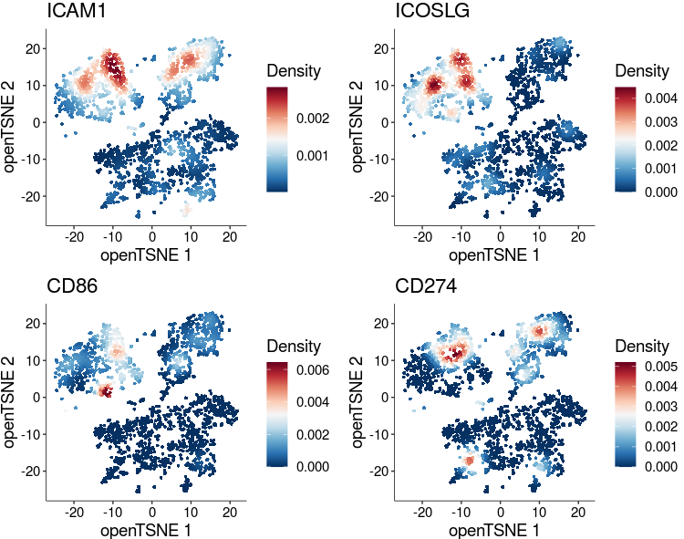
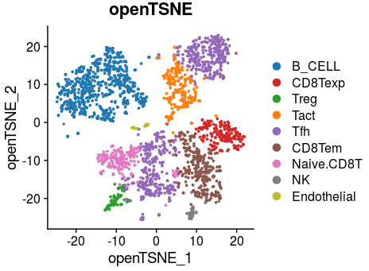

# scRNA of human AITL data analysis

In this pipeline, we showed the detail codes of scRNA-seq analyzing in human AITL , including quality control, dimension reducing, population clustering, differentiation genes expression identifying, trajectory constructing, dynamics expression genes identification and pathways enrichments. To make reproducible results from our code, the raw data and processed data were totally submitted. Besides, we generate Markdowns files to record all steps. 

## 1.  identify the population of scRNA in human AITL

~~~R
AITL_patient.d <- Read10X(data.dir = "/mnt/data/user_data/zlu/01_job/WZW_AITL_scRNAseq/paper_data/GSE197188_AITL_LN_1patient_scRNAseq/matrix")
AITL_patient <- CreateSeuratObject(counts = AITL_patient.d$'Gene Expression', min.cells = 3, min.features = 200,project = "AITL_patient")
library(reticulate)
library(ReductionWrappers)
library(s2a)
AITL_patient <- AITL_patient %>%
    NormalizeData(verbose = FALSE) %>%
    FindVariableFeatures(selection.method = "vst", nfeatures = 4000) %>% 
    ScaleData(verbose = TRUE)
AITL_patient_seurat <- AITL_patient %>% 
    RunPCA(pc.genes = AITL_patient_seurat@var.genes, npcs = 30, verbose = FALSE) %>% 
    RunUMAP(dims = 1:25) %>% 
    RunTSNE(dims = 1:25) %>% 
    FindNeighbors(dims = 1:25) %>% 
    FindClusters(resolution = c(0.1,0.2,0.4,1)) %>%
    DoopenTSNE(reduction_save = "openTSNE",dims_use = 1:25)
AITL_patient_seurat[["ADT"]] <- CreateAssayObject(counts = AITL_patient.d$'Antibody Capture'[,colnames(AITL_patient_seurat)])
AITL_patient_seurat <- AITL_patient_seurat %>%
    NormalizeData(verbose = FALSE, assay = "ADT") %>%
    FindVariableFeatures(selection.method = "vst", nfeatures = 4000, assay = "ADT") %>% 
    ScaleData(verbose = TRUE, assay = "ADT")
mcsaveRDS(AITL_patient_seurat,"/mnt/data/user_data/xiangyu/workshop/scRNA/10X_52_WZW_AML_rhoag17_20220824_3samples/output/AITL_patient.rds", mc.cores = 20)

AITL_patient_seurat <- mcreadRDS("/mnt/data/user_data/xiangyu/workshop/scRNA/10X_52_WZW_AML_rhoag17_20220824_3samples/output/AITL_patient.rds", mc.cores = 20)
p1 <- DimPlot(object = AITL_patient_seurat, reduction = "tsne",label=TRUE,repel=TRUE,group.by="RNA_snn_res.1") +NoLegend()+labs(title="AITL_patient_seurat tsne")
p2 <- DimPlot(object = AITL_patient_seurat, reduction = "pca",label=TRUE,repel=TRUE,group.by="RNA_snn_res.1") +NoLegend()+labs(title="AITL_patient_seurat pca")
p3 <- DimPlot(object = AITL_patient_seurat, reduction = "openTSNE",label=TRUE,repel=TRUE,group.by="RNA_snn_res.1") +NoLegend()+labs(title="AITL_patient_seurat openTSNE")
p5 <- DimPlot(object = AITL_patient_seurat, reduction = "umap",label=TRUE,repel=TRUE,group.by="RNA_snn_res.1") +NoLegend()+labs(title="AITL_patient_seurat umap")
plot_grid(p1,p2,p3,p5,ncol=2)

B_CELL <- c("CD79A","CD79B","MZB1","MS4A1")
CD14_Mono <- c("CD14", "F13A1")
CD16_Mono <- c("FCGR3A","MS4A7")
CLP <- c("MEF2A","FLT3")
DC  <- c("SIGLEC7", "CD300C", "KLK1", "CLEC9A")
Endothelial <- c("CLDN5")
Neutrophil <- c("S100A8","S100A9","CSF3R")
NK <- c("CD160", "NKG7")
T_CELL <- c("CD3D","CD3G","CD3E","CD4","CD8A")
Sel_marker <- c(B_CELL,CD14_Mono,CD16_Mono,CLP,DC,Endothelial,Neutrophil,NK,T_CELL)
DotPlot(AITL_patient_seurat, features = unique(Sel_marker), cols=c("#ffffff", "#B30000"),scale = TRUE,
    col.min = 0,col.max = 5,group.by="RNA_snn_res.1") + RotatedAxis()

AITL_patient_seurat$Cell_annotation <- as.character(AITL_patient_seurat$RNA_snn_res.1)
AITL_patient_seurat$Cell_annotation[which(AITL_patient_seurat$Cell_annotation=="0")] <- "B_CELL"
AITL_patient_seurat$Cell_annotation[which(AITL_patient_seurat$Cell_annotation=="1")] <- "Tfh"
AITL_patient_seurat$Cell_annotation[which(AITL_patient_seurat$Cell_annotation=="2")] <- "Tfh"
AITL_patient_seurat$Cell_annotation[which(AITL_patient_seurat$Cell_annotation=="3")] <- "CD8Tem"
AITL_patient_seurat$Cell_annotation[which(AITL_patient_seurat$Cell_annotation=="4")] <- "B_CELL"
AITL_patient_seurat$Cell_annotation[which(AITL_patient_seurat$Cell_annotation=="5")] <- "Tact"
AITL_patient_seurat$Cell_annotation[which(AITL_patient_seurat$Cell_annotation=="6")] <- "CD8Texp"
AITL_patient_seurat$Cell_annotation[which(AITL_patient_seurat$Cell_annotation=="7")] <- "Naive.CD8T"
AITL_patient_seurat$Cell_annotation[which(AITL_patient_seurat$Cell_annotation=="8")] <- "Treg"
AITL_patient_seurat$Cell_annotation[which(AITL_patient_seurat$Cell_annotation=="9")] <- "B_CELL"
AITL_patient_seurat$Cell_annotation[which(AITL_patient_seurat$Cell_annotation=="10")] <- "NK"
AITL_patient_seurat$Cell_annotation[which(AITL_patient_seurat$Cell_annotation=="11")] <- "B_CELL"
AITL_patient_seurat$Cell_annotation[which(AITL_patient_seurat$Cell_annotation=="12")] <- "Tfh"
AITL_patient_seurat$Cell_annotation[which(AITL_patient_seurat$Cell_annotation=="13")] <- "Endothelial"

DotPlot(AITL_patient_seurat, features = c("CD4-TotalSeqC","CD8-TotalSeqC","CD3-TotalSeqC","CD138-TotalSeqC","CD279-TotalSeqC","CD20-TotalSeqC","CD21-TotalSeqC","CD163-TotalSeqC","CD278-TotalSeqC"), cols=c("#ffffff", "#B30000"),scale = TRUE, col.min = 0,col.max = 5,group.by="RNA_snn_res.1",assay="ADT") + RotatedAxis()
Global_T <- c("CD3E","CD3D","CD8A","CD4")
Naive <- c("IL7R","CCR7","LEF1")
Effector_Memory <- c("FGFBP2","KLRD1")
Exhausted_activated <- c("LAG3","HAVCR2","PDCD1")
Tregs <- c("FOXP3","IL2RA","CTLA4")
Activated <- c("IFNG","FOS","JUN")
Tfh <- c("BCL6")
B_CELL <- c("CD79A","MS4A1")
Endothelial <- c("CLDN5")
NK <- c("TYROBP","NCAM1","CD160")
Sel_g <- c(Global_T,Naive,Effector_Memory,Exhausted_activated,Tregs,Activated,Tfh,B_CELL,Endothelial,NK)
AITL_patient_seurat$Cell_annotation <- factor(AITL_patient_seurat$Cell_annotation,levels=c("Naive.CD8T","CD8Tem","CD8Texp","Treg","Tact","Tfh","B_CELL","Endothelial","NK"))
DotPlot(AITL_patient_seurat, features = unique(Sel_g), cols=c("#ffffff", "#B30000"),scale = TRUE,
    col.min = 0,col.max = 5,group.by="Cell_annotation") + RotatedAxis()

p1 <- DimPlot(object = AITL_patient_seurat, reduction = "tsne",label=TRUE,repel=TRUE,group.by="Cell_annotation") +NoLegend()+labs(title="AITL_patient_seurat tsne")
p2 <- DimPlot(object = AITL_patient_seurat, reduction = "pca",label=TRUE,repel=TRUE,group.by="Cell_annotation") +NoLegend()+labs(title="AITL_patient_seurat pca")
p3 <- DimPlot(object = AITL_patient_seurat, reduction = "openTSNE",label=TRUE,repel=TRUE,group.by="Cell_annotation") +NoLegend()+labs(title="AITL_patient_seurat openTSNE")
p5 <- DimPlot(object = AITL_patient_seurat, reduction = "umap",label=TRUE,repel=TRUE,group.by="Cell_annotation") +NoLegend()+labs(title="AITL_patient_seurat umap")
plot_grid(p1,p2,p3,p5,ncol=2)

mcsaveRDS(AITL_patient_seurat,"/mnt/data/user_data/xiangyu/workshop/scRNA/10X_52_WZW_AML_rhoag17_20220824_3samples/output/AITL_patient.rds", mc.cores = 20)
~~~

## 2. Figure7 making.

~~~R
AITL_patient_seurat <- mcreadRDS("/mnt/data/user_data/xiangyu/workshop/scRNA/10X_52_WZW_AML_rhoag17_20220824_3samples/output/AITL_patient.rds", mc.cores = 20)
library(Nebulosa)
aa <- jdb_palette("brewer_yes")
p1 <- plot_density(AITL_patient_seurat, c("ICAM1"), slot = NULL, joint = FALSE, reduction = "openTSNE",
 dims = c(1, 2), method = c("ks"), adjust = 1, size = 1, shape = 16, combine = TRUE) + 
scale_colour_gradientn(colours = colorRampPalette(aa)(100))
p2 <- plot_density(AITL_patient_seurat, c("ICOSLG"), slot = NULL, joint = FALSE, reduction = "openTSNE",
 dims = c(1, 2), method = c("ks"), adjust = 1, size = 1, shape = 16, combine = TRUE) + 
scale_colour_gradientn(colours = colorRampPalette(aa)(100))
p3 <- plot_density(AITL_patient_seurat, c("CD86"), slot = NULL, joint = FALSE, reduction = "openTSNE",
 dims = c(1, 2), method = c("ks"), adjust = 1, size = 1, shape = 16, combine = TRUE) + 
scale_colour_gradientn(colours = colorRampPalette(aa)(100))
p4 <- plot_density(AITL_patient_seurat, c("CD274"), slot = NULL, joint = FALSE, reduction = "openTSNE",
 dims = c(1, 2), method = c("ks"), adjust = 1, size = 1, shape = 16, combine = TRUE) + 
scale_colour_gradientn(colours = colorRampPalette(aa)(100))
plot <- plot_grid(p1,p2,p3,p4,nrow=2)
ggsave("/mnt/data/user_data/xiangyu/workshop/scRNA/10X_52_WZW_AML_rhoag17_20220824_3samples/result/AITL_patient.project.svg", plot=plot,width = 11, height = 9,dpi=1080)
~~~

## 3. Ex. Figure 5 making.

~~~R
AITL_patient_seurat <- mcreadRDS("/mnt/data/user_data/xiangyu/workshop/scRNA/10X_52_WZW_AML_rhoag17_20220824_3samples/output/AITL_patient.rds", mc.cores = 20)
library(paletteer)
library(ggsci)
pal <- jdb_palette("corona")
pal <- pal[1:length(unique(AITL_patient_seurat$Cell_annotation))]
names(pal) <- unique(AITL_patient_seurat$Cell_annotation)
p1 <- DimPlot(object = AITL_patient_seurat, reduction = "openTSNE",repel=TRUE,label=FALSE,group.by="Cell_annotation",cols= pal) +labs(title="openTSNE")
ggsave("/mnt/data/user_data/xiangyu/workshop/scRNA/10X_52_WZW_AML_rhoag17_20220824_3samples/result/Ex.Figure5.hsa.scRNA_landscape.svg", plot=p1,width = 8, height = 6,dpi=1080)
~~~

